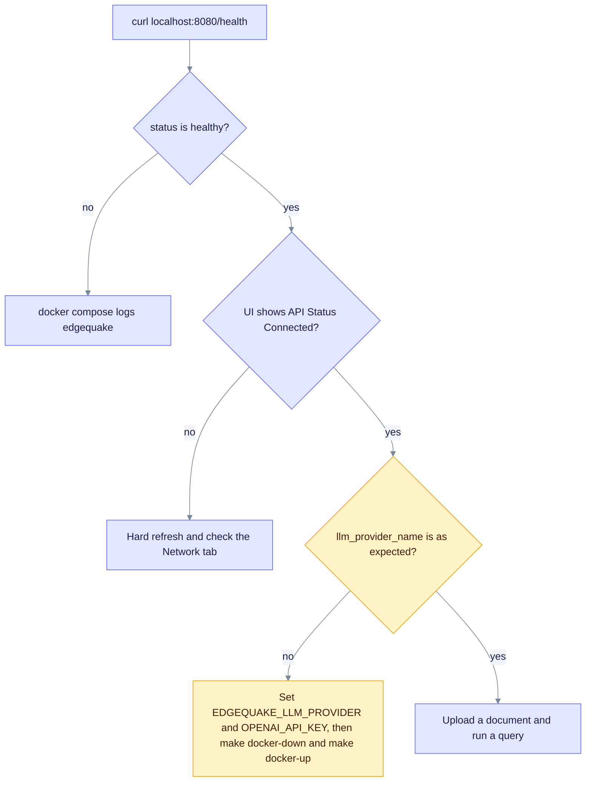

> Historical note, 2026-02-09; may not match current code. Prefer: [Docker quick reference](DOCKER_QUICK_START.md) · [Troubleshooting](../troubleshooting/common-issues.md)

This page shows how to confirm that the stack works. The fixes themselves are described in the [Docker deployment summary](DOCKER_DEPLOYMENT_SUMMARY.md).

## Status today (v0.32.2)

- Use `scripts/verify-docker-setup.sh` for local setup checks.
- Use the health and port checks below against the current stack.
- The checks that used `docker exec edgequake env` no longer work. The API image is distroless (`gcr.io/distroless/cc-debian12:nonroot`), so it has no shell and no `env` binary. Use `docker inspect` instead, as shown in Step 4.
- The root `verify_docker.sh` still uses `docker exec edgequake env`. Treat it as out of date.

## Decision tree

Run the checks in this order. Stop at the first "no" and follow its fix.



Caption: most failures show up at the first two checks, so start there.

## How to test

### Step 1: Check the services

```bash
make docker-up
sleep 20   # give the API time to start
curl -s http://localhost:8080/health | python3 -m json.tool
```

Expected: `"status": "healthy"`, and `llm_provider_name` shows the provider you configured.

### Step 2: Open the UI

1. Open `http://localhost:3000`.
2. Hard-refresh the page (Cmd+Shift+R on macOS) to clear cached JavaScript.
3. Check the status panel. It should show **API Status: Connected** and **LLM Provider: <name>**.

### Step 3: Create a tenant and run a query

1. Click **Create New Tenant** in the sidebar. Enter a name and click **Create**.
2. Select the tenant. Under **Quick Actions**, click **Upload Documents**. Choose a PDF, for example from `zz_test_docs/`, and wait for the status **Completed**.
3. Open **Query Knowledge**. Ask a question about the document, then check:
   - the answer comes from the configured provider,
   - entities were extracted and linked,
   - the graph view shows the relationships.

### Step 4: Check the API environment without exec

The API image has no shell, so `docker exec` cannot print its environment. Read the container config instead. This prints only the variable names:

```bash
docker inspect edgequake --format '{{range .Config.Env}}{{println .}}{{end}}' | cut -d= -f1 | grep -E '^(OPENAI_API_KEY|EDGEQUAKE_LLM_PROVIDER)$'
```

Expected: both names are listed. The values stay out of your terminal.

## Scripted checks

- `scripts/verify-docker-setup.sh` checks the local setup.
- The root `verify_docker.sh` and `test_docker_e2e.py` are the 2026-02-09 scripts. Read Step 4 above before you reuse them.

## Troubleshooting

### The UI still shows "Disconnected"

Hard-refresh the browser. In the Network tab, check that the page calls the API URL you expect (`http://localhost:8080` by default).

### The health check shows the wrong provider

Compose defaults `EDGEQUAKE_LLM_PROVIDER` to `ollama`. An `OPENAI_API_KEY` alone does not switch the provider. Set both variables in your shell, then restart the stack:

```bash
export EDGEQUAKE_LLM_PROVIDER=openai
export OPENAI_API_KEY="sk-your-key-here"
make docker-down && make docker-up
```

### CORS errors in the browser console

Check the browser console and the backend logs for the failing request:

```bash
docker compose -f edgequake/docker/docker-compose.yml logs edgequake --tail=50
```

## Expected behavior

| Check | Before the fix (2026-02-09) | After the fix |
|-------|-----------------------------|---------------|
| UI API status | Disconnected (red) | Connected (green) |
| UI LLM provider | Unavailable (red) | OpenAI, or the configured provider |
| API calls from the UI | Failing silently | Working |
| Document upload | Not reachable | Working |
| Query and entity extraction | Not reachable | Working |
| Graph visualization | Not reachable | Working |

## Date and status

**Date**: February 9, 2026. **Status on that date**: verified, with all services running and connected. Re-run the steps above before you rely on that result for a newer version.
