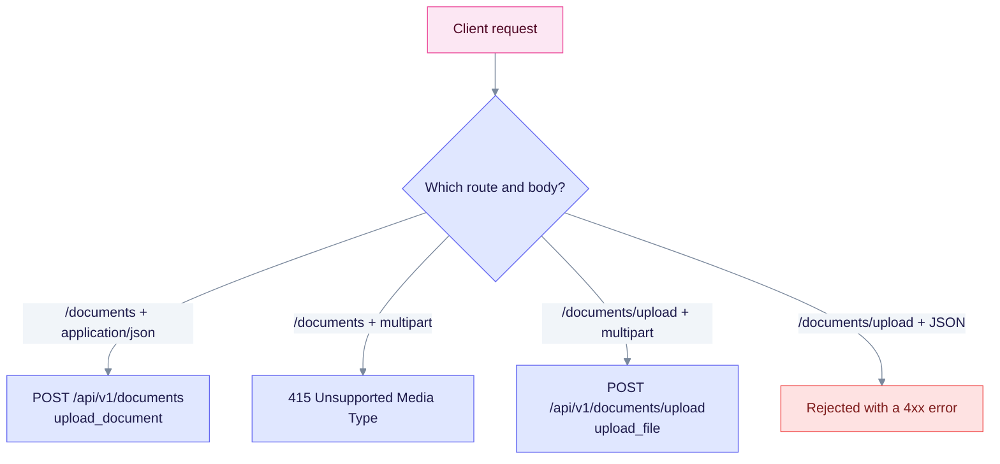

> Historical note, date unknown (pre-v0.32); may not match current code. Prefer: [Upload errors](../troubleshooting/common-issues.md#1-document-upload-errors) · [Upload quick reference](../api-reference/document-upload-quick-reference.md)

## Problem statement

Users reported errors when they tried to upload documents with the REST API:

```bash
curl -X POST http://localhost:8080/api/v1/documents \
  -H "Content-Type: multipart/form-data" \
  -F "file=@document.pdf"
```

Errors seen:

- "Expected request with `Content-Type: application/json`"
- "Failed to parse the request body as JSON: invalid number at line 1 column 2"
- "missing field `content`"

## Status today (v0.32.2)

The rule still holds: a JSON body goes to `POST /api/v1/documents`, and a file goes to `POST /api/v1/documents/upload`. The routes are defined in `edgequake/crates/edgequake-api/src/routes.rs`.

| Endpoint | Body | Handler |
|----------|------|---------|
| `POST /api/v1/documents` | JSON (`content`, `title`) | `upload_document` |
| `POST /api/v1/documents/upload` | multipart (`file`) | `upload_file` |
| `POST /api/v1/documents/upload/batch` | multipart | `upload_files_batch` |
| `POST /api/v1/documents/pdf` | multipart (PDF) | `upload_pdf_document` |
| `POST /api/v1/documents/scan` | directory scan | `scan_directory` |

Choose the endpoint by body type:



Caption: the same mistake that caused this issue, multipart on the JSON route, is the one case that returns 415.

## Root cause

**The issue was a documentation mismatch.** The README and tutorials showed multipart uploads on `/api/v1/documents`. That endpoint only accepts JSON. File uploads belong on `/api/v1/documents/upload`.

## Solution implemented

### 1. Documentation fixes

- **README**: the file upload example now calls `/api/v1/documents/upload`.
- **`docs/api-reference/rest-api.md`**: split into two sections, one for JSON and one for multipart.
- **`docs/tutorials/document-ingestion.md`** and **`docs/tutorials/pdf-ingestion.md`**: curl examples now use `/documents/upload`.
- **`docs/troubleshooting/common-issues.md`**: new section 1, "Document Upload Errors", with the two error messages and a correct and wrong example for each.

### 2. New quick reference

**`docs/api-reference/document-upload-quick-reference.md`** has a decision tree, the upload methods, the common errors and a summary table.

### 3. Tests

Two tests in `edgequake/crates/edgequake-api/tests/e2e_documents.rs` guard the routing:

- `test_upload_document_rejects_multipart`: multipart on `/api/v1/documents` returns `415 Unsupported Media Type`.
- `test_upload_endpoint_accepts_multipart`: multipart on `/api/v1/documents/upload` is accepted.

## Expected behavior

Upload responses (as of v0.32.2):

| Endpoint | Content-Type | Result |
|----------|--------------|--------|
| `/api/v1/documents` | `application/json` | Accepted: `202 Accepted` for a new document, `200 OK` for a duplicate |
| `/api/v1/documents` | `multipart/form-data` | `415 Unsupported Media Type` |
| `/api/v1/documents/upload` | `multipart/form-data` | Accepted: `202 Accepted` for a new document, `200 OK` for a duplicate |
| `/api/v1/documents/upload` | `application/json` | Rejected with a 4xx error |

The `202` and `200` codes come from `document_admission.rs` (`ADMISSION_ACCEPTED_STATUS` is `202 Accepted`). The test `test_upload_endpoint_accepts_multipart` asserts `201 Created`, and its comment says the same. Check that test before you rely on the exact success code.

## Impact

- **Before**: users could not upload documents and got unclear error messages.
- **After**: each upload type has one documented endpoint, and the troubleshooting page lists both error messages with their fixes.

## References

- **Issue**: "Can't import documents"
- **Files changed**: 7 (6 docs and 1 test file)
- **New guide**: `document-upload-quick-reference.md`

## Lessons learned

1. **Documentation must match implementation.** Inconsistent docs cause user confusion.
2. **Distinct endpoints prevent ambiguity.** Separate JSON and file routes are easier to use correctly.
3. **Examples get copied.** Every curl example must work as written.
4. **Troubleshooting pages save time.** Listing the exact error messages helps users fix problems themselves.
5. **Tests document correct use.** Tests that show the right endpoint prevent regressions.
