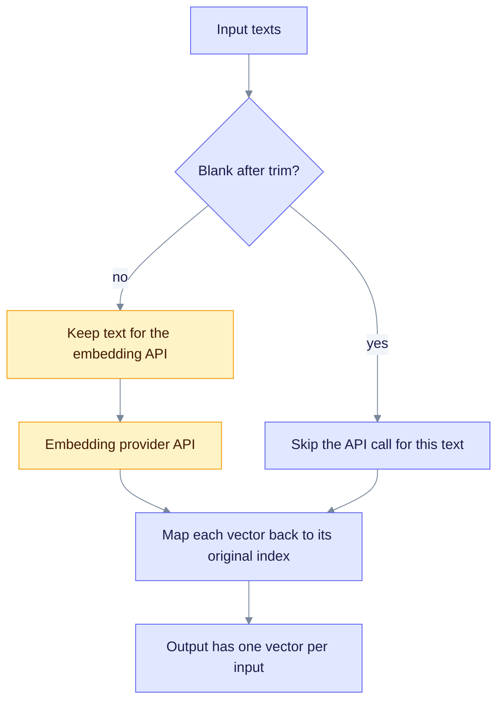

> Historical note, 2026-02-10; may not match current code. Prefer: [Troubleshooting](../troubleshooting/common-issues.md) · [Roles](../providers/roles.md)

**Date**: 2026-02-10
**Issue**: Pipeline processing failed: Embedding error: API error: '$.input' is invalid
**Status on that date**: Fixed in commit `5b6bcd6a`.

## Status today (v0.32.2): not verified in the pinned crate

The fix changed the embedding providers in the workspace's own `edgequake-llm` source. Those providers now live in the external `edgequake-llm` crate, which `edgequake/Cargo.lock` pins at 0.10.9.

In `edgequake-llm` 0.10.9 I did not find the fix in the `embed` functions of `ollama.rs`, `gemini.rs`, `jina.rs`, `mock.rs` or `openai.rs`. There is no per-text filter and no zero-vector padding (`vec![0.0; dim]`). The pipeline's chunkers do skip whitespace-only segments before embedding (`edgequake-pipeline/src/chunker/page_aware.rs` and `markdown_pack.rs`), which lowers the risk but does not replace the provider-side filter.

Before you rely on this fix, send a document with blank segments through a current build and check the logs.

## Problem

When documents were processed, the pipeline sometimes failed with:

```
Pipeline processing failed: Embedding error: API error: '$.input' is invalid. Please check the AP...
```

Embedding providers (OpenAI, Ollama, and others) received arrays that contained empty or whitespace-only strings. The API rejected the whole request.

### Root cause

The embedding pipeline sent every text string to the API without filtering. That included:

- empty strings (`""`),
- whitespace-only strings (`"   "`, `"\n"`, `"\t"`),
- strings that became empty after `.trim()`.

External APIs (OpenAI, Gemini, Jina, and others) reject empty strings in the input array.

## Solution (as shipped on 2026-02-10)

The intended behavior is shown in the diagram below. Each provider did three things.



Caption: blank texts never reach the provider, but the output still has one vector per input, in the original order.

1. **Filter invalid inputs** before the API call:

   ```rust
   let valid_texts: Vec<(usize, &String)> = texts
       .iter()
       .enumerate()
       .filter(|(_, text)| !text.trim().is_empty())
       .collect();
   ```

2. **Handle the all-empty case** without calling the API:

   ```rust
   if valid_texts.is_empty() {
       return Ok(vec![vec![0.0; self.embedding_dimension]; texts.len()]);
   }
   ```

3. **Map results back to the original indices**:

   ```rust
   let mut result = vec![vec![0.0; self.embedding_dimension]; texts.len()];
   for ((orig_idx, _), embedding) in valid_texts.iter().zip(api_embeddings) {
       result[*orig_idx] = embedding;
   }
   ```

### Providers changed in commit `5b6bcd6a`

The commit touched seven provider files: `azure_openai.rs`, `gemini.rs`, `jina.rs`, `lmstudio.rs`, `mock.rs`, `ollama.rs` and `openai.rs`. Those files are now in the external `edgequake-llm` crate, not in this repo. See the status note above.

## Edge cases

| Input case | Intended behavior |
|------------|-------------------|
| All strings valid | Normal processing; all strings are embedded |
| Some strings empty | Empty strings get zero vectors; the others are processed normally |
| All strings empty | Return one zero vector per input, with the embedding dimension |
| Whitespace only | Treated as empty; gets a zero vector |
| Mixed valid and invalid | Valid strings are embedded; invalid ones get zero vectors |

## Testing

### Unit tests

The 2026-02-10 run reported 201 passing tests:

```bash
cd edgequake
# Historical command from 2026-02 (crate layout has since changed).
# Prefer: cargo test -p edgequake-pipeline --lib
cargo test --workspace --lib
# Result on that date: ok. 201 passed; 0 failed; 0 ignored
```

### Manual testing

1. Start the backend:

   ```bash
   make dev
   ```

2. Upload a document that used to fail.
3. Check the backend log:

   ```bash
   tail -f /tmp/edgequake-backend.log
   ```

Expected: no "Embedding error" lines, and the document status shows "Completed".

## Performance impact

- The extra `filter()` pass over the input is negligible.
- Fewer strings go to the API when some are blank, so there are fewer calls to pay for.
- The output array always matches the input array in length.

## Code quality

On that date: clippy reported no warnings, all 201 tests passed, and every provider used the same pattern.

## Future improvements

1. Log a warning when many blank strings are filtered. It may point to a data-quality problem.
2. Count how often filtering happens, as a metric.
3. Check for empty chunks earlier, during chunking or extraction, so they never reach the embedder.

## Related errors this fix targets

- OpenAI: `$.input is invalid`
- Ollama: `invalid input`
- Gemini: `empty text not allowed`

## Verification checklist (2026-02-10)

- [x] Providers filter blank strings (see the status note: re-check in the pinned crate)
- [x] Results map back to the correct indices
- [x] Zero vectors are returned for blank inputs
- [x] Output array size matches the input array size
- [x] Tests passed on that date
- [x] Clippy clean on that date
- [x] Documentation updated
