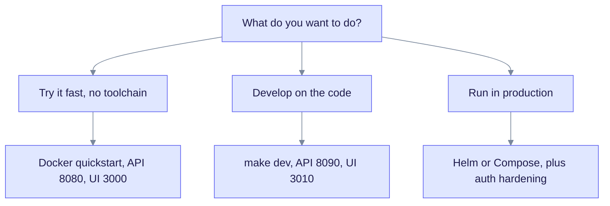

> **Released: v0.32.2** (schema 168) · **On main: v0.33.0 in progress** (schema 169, SPEC-163 provider onboarding) · [Providers](../providers/index.md)

# Getting Started

This section takes you from nothing to a first answer from your own documents. It is for developers and operators who are new to EdgeQuake.

## Choose an install path

There are three supported paths. Pick the one that matches your goal.



Read the chart from the top. Each branch ends at the install path and the ports it uses.

| Path | Needs | Ports | Guide |
|------|-------|-------|-------|
| Docker quickstart | Docker | API 8080, UI 3000 | [Installation, option 2](installation.md#option-2-prebuilt-images-docker-only) |
| `make dev` (from source) | Docker, Rust, Node.js, pnpm | API 8090, UI 3010 (moves up if taken) | [Installation, option 1](installation.md#option-1-full-stack-from-source-make-dev) |
| Helm or Compose in production | A cluster or host, a secrets plan | Your choice | [Deployment](../operations/deployment.md), [Runtime auth hardening](../operations/runtime-auth-hardening.md) |

## Fastest start

This script checks for Docker, downloads the Compose file, asks which model provider you want, generates a JWT secret and a secrets key, and starts the stack. Set `EDGEQUAKE_VERSION=0.32.2` to pin the image version; the default is `latest`.

```bash
curl -fsSL https://raw.githubusercontent.com/raphaelmansuy/edgequake/edgequake-main/quickstart.sh | sh
```

Run it without prompts by passing flags:

```bash
sh quickstart.sh --yes --provider ollama
```

The script supports `--provider ollama|openai|omlx|anthropic|lmstudio`, `--base-url`, `--model` and `--embed-model`. Run `sh quickstart.sh --help` for the full list.

## Steps after install

1. [Quick Start](quick-start.md): upload a document, wait for it to finish, and ask a question.
2. [Providers](../providers/index.md): connect Ollama, OpenAI, Anthropic, LM Studio, oMLX or any OpenAI-compatible server.
3. [Concepts](../concepts/index.md): learn what a knowledge graph is and how the query modes differ.

## Check your setup

Run `edgequake doctor` to check the local environment. It reads environment variables only and does not connect to the database. It reports five checks:

| Check | Passes when |
|-------|-------------|
| `database` | `DATABASE_URL` is set |
| `llm_provider` | Informational only; shows the configured provider |
| `secrets_key` | `EDGEQUAKE_SECRETS_KEY` is set, or dev mode is on |
| `jwt_secret` | The secret has 32 or more characters and is not the public default, or dev mode is on |
| `bind` | The `EDGEQUAKE_HOST` variable is `127.0.0.1` or `localhost`, or dev mode is on. Unset counts as `0.0.0.0`, so this check fails outside dev mode |

Add `--json` for machine-readable output. Exit code 0 means all checks passed, 1 means the database check failed, and 2 means another check failed.

For a live view of the running server, call `GET /health`. It reports schema state, the active providers and a `security_posture` block.

> `edgequake doctor` and the stored provider Connections come with SPEC-163. They are on `main` and ship with v0.33.0. The v0.32.2 images do not include them. See [Upgrade to v0.33.0](../operations/upgrade-to-0.33.0.md).
