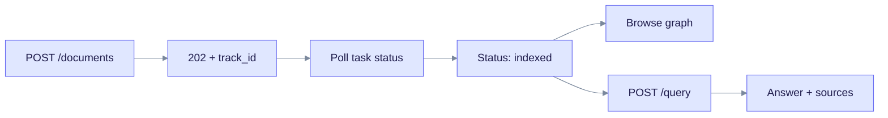
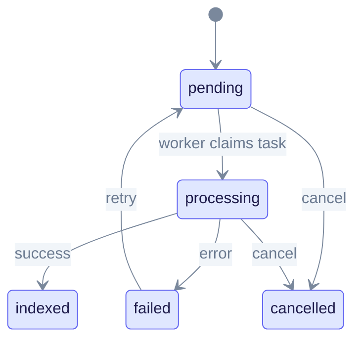

> **Released: v0.32.2** · Contract: [OpenAPI snapshot](../../edgequake_webui/openapi/openapi.snapshot.json) · Ops: [Ingestion cancel and fairness](../ingestion-cancel-and-fairness.md)

# Quick Start

This guide takes you from a running EdgeQuake to your first answer in about 10 minutes. It is for developers who want to see the REST API work end to end. You need a running stack first; see [Installation](installation.md).

## What you will do

1. Upload a short text document.
2. Wait until the server finishes indexing it.
3. Look at the entities and relationships it found.
4. Ask questions in three query modes.



Read the chart left to right. Upload returns at once with a `track_id`. Query only works well after the task reaches `indexed`.

## Before you start

Set the API address. Use `8080` for the Docker quickstart and `8090` for `make dev`:

```bash
export API=http://localhost:8080   # make dev: http://localhost:8090
curl -s "$API/health" | jq '{status, llm_provider_name}'
```

Expected output:

```json
{
  "status": "healthy",
  "llm_provider_name": "ollama"
}
```

If `status` is `degraded`, read `components` in the full `/health` output. It tells you which part is down. The most common cause is a model provider that is not running.

### Authentication headers

The Docker quickstart and `make dev` both turn on dev mode (`EDGEQUAKE_DEV_MODE=true`). The API is open and you need no headers. Do not use dev mode in production.

If auth is on, log in and keep the token in a header variable:

```bash
TOKEN=$(curl -s -X POST "$API/api/v1/auth/login" \
  -H "Content-Type: application/json" \
  -d '{"username":"admin","password":"YOUR_PASSWORD"}' | jq -r .access_token)
AUTH="Authorization: Bearer $TOKEN"
# Or use an API key:  AUTH="X-API-Key: $EDGEQUAKE_MASTER_API_KEY"
```

When dev mode is on, set `AUTH="Accept: application/json"` so the commands below still work. See [Runtime auth hardening](../operations/runtime-auth-hardening.md).

## Step 1: Upload a document

An upload is asynchronous. The server stores the text, queues a task, and returns HTTP 202 with a `document_id` and a `track_id`. It does not return entity counts at this point.

```bash
RESPONSE=$(curl -s -X POST "$API/api/v1/documents" \
  -H "Content-Type: application/json" -H "$AUTH" \
  -d '{
    "title": "Marie Curie Biography",
    "content": "Marie Curie was a Polish-French physicist and chemist who conducted pioneering research on radioactivity. She was the first woman to win a Nobel Prize, and the only person to win Nobel Prizes in two different sciences (Physics in 1903, Chemistry in 1911). Curie discovered two elements: polonium and radium. She worked at the University of Paris with her husband Pierre Curie. Their daughter, Irene Joliot-Curie, also won a Nobel Prize in Chemistry in 1935."
  }')
echo "$RESPONSE" | jq
TRACK_ID=$(echo "$RESPONSE" | jq -r .track_id)
DOC_ID=$(echo "$RESPONSE" | jq -r .document_id)
```

Expected output (IDs differ, and `queue_position` and `eta_seconds` may also appear):

```json
{
  "document_id": "7c1e0e5a-0000-0000-0000-000000000000",
  "status": "pending",
  "task_id": "...",
  "track_id": "f6fa9cad-bbff-4892-a855-3bd7d70da044"
}
```

If you upload identical content twice, the second call returns HTTP 200 with `"status": "duplicate_processing"` and a `duplicate_of` field. No new task starts.

You can also upload in the web UI. Open the UI (port 3000 for Docker, 3010 for `make dev`), go to **Documents**, and use the upload button. The page shows live progress.

## Step 2: Wait for indexing

A task moves through these states:



Read the diagram from `pending`. Three states end the run: `indexed` (success), `failed` and `cancelled`. A retry puts a failed task back in the queue.

Poll until the status is no longer `pending` or `processing`:

```bash
while true; do
  STATUS=$(curl -s -H "$AUTH" "$API/api/v1/tasks/$TRACK_ID" | jq -r .status)
  echo "task status: $STATUS"
  case "$STATUS" in indexed|failed|cancelled) break ;; esac
  sleep 3
done
```

Expected output:

```text
task status: pending
task status: processing
task status: indexed
```

If the final status is `failed`, read the reason:

```bash
curl -s -H "$AUTH" "$API/api/v1/tasks/$TRACK_ID" | jq '{status, error_message, retry_count}'
```

Other ways to follow progress:

| Method | Endpoint |
|--------|----------|
| Poll | `GET /api/v1/ingestion/{track_id}/progress` |
| Poll | `GET /api/v1/documents/{document_id}`; the document shows `display_status` (`completed` when done) |
| WebSocket | `ws://HOST:PORT/ws/progress/{track_id}` |
| Server-sent events (PDF only) | `GET /api/v1/documents/pdf/progress/stream/{track_id}` |

To stop a task, call `POST /api/v1/tasks/{track_id}/cancel`. See [Ingestion cancel and fairness](../ingestion-cancel-and-fairness.md).

## Step 3: Look at the graph

The graph lives under `/api/v1/graph`. Entity names are stored in upper case with underscores.

```bash
curl -s -H "$AUTH" "$API/api/v1/graph/entities" \
  | jq '.items[:5] | map({entity_name, entity_type, degree})'
```

Example output (the exact entities and values depend on your model):

```json
[
  { "entity_name": "MARIE_CURIE", "entity_type": "PERSON", "degree": 5 },
  { "entity_name": "RADIUM", "entity_type": "CONCEPT", "degree": 1 }
]
```

List relationships:

```bash
curl -s -H "$AUTH" "$API/api/v1/graph/relationships" \
  | jq '.items[:3] | map({src_id, tgt_id, keywords, description})'
```

Count what the workspace holds. The default workspace has a fixed ID:

```bash
curl -s -H "$AUTH" \
  "$API/api/v1/workspaces/00000000-0000-0000-0000-000000000003/stats" \
  | jq '{document_count, entity_count, relationship_count, chunk_count}'
```

## Step 4: Ask a question

The default mode is `mix`. Set `mode` to choose another one. The reply holds the text in `answer` and the evidence in `sources`.

```bash
curl -s -X POST "$API/api/v1/query" \
  -H "Content-Type: application/json" -H "$AUTH" \
  -d '{"query": "Who discovered radium and when did she win Nobel Prizes?"}' \
  | jq '{mode, answer, sources: (.sources | length)}'
```

Try the other modes on the same data:

| Mode | Question style | Example `query` |
|------|----------------|-----------------|
| `local` | About one entity | "What is radium?" |
| `global` | Broad themes | "Summarize the Curie family achievements" |
| `naive` | Plain text search, no graph | "Who won Nobel Prizes?" |

```bash
curl -s -X POST "$API/api/v1/query" \
  -H "Content-Type: application/json" -H "$AUTH" \
  -d '{"query": "What is radium?", "mode": "local"}' | jq -r .answer
```

For the other modes (`hybrid`, `mix`, `bypass`) and how to choose, see [Hybrid retrieval](../concepts/hybrid-retrieval.md). To stream tokens as they arrive, call `POST /api/v1/query/stream`.

## Step 5: See it in the UI

1. Open the UI.
2. Choose **Knowledge Graph** in the left sidebar.
3. Zoom, drag, and click a node to read its details.

Use **Query** in the sidebar to chat with the same data.

## What happened behind the scenes

```mermaid
%%{init: {"theme":"base","themeVariables":{"primaryColor":"#E0E7FF","primaryBorderColor":"#6366F1","primaryTextColor":"#1E1B4B","secondaryColor":"#D1FAE5","secondaryBorderColor":"#10B981","secondaryTextColor":"#064E3B","tertiaryColor":"#FEF3C7","tertiaryBorderColor":"#F59E0B","tertiaryTextColor":"#6B7A90","lineColor":"#7A889C","clusterBkg":"rgba(99,102,241,0.07)","clusterBorder":"#A5B4FC","noteBkgColor":"#FEF9C3","noteTextColor":"#422006","textColor":"#6B7A90","titleColor":"#6B7A90","signalColor":"#7A889C","signalTextColor":"#6B7A90","loopTextColor":"#6B7A90","edgeLabelBackground":"#F1F5F9","actorLineColor":"#94A3B8"}}}%%
%% eq-theme:v1
flowchart LR
    A["Admit 202 + track_id"] --> B["Chunk text"]
    B --> C["Extract entities and relations"]
    C --> D["Embed chunks, entities, relations"]
    D --> E["Merge duplicates and write graph"]
    E --> F["Task: indexed"]
```



A worker claims the task, splits the text into chunks, and asks the model to list entities and relationships. EdgeQuake then embeds the results, merges near-duplicate entities, and writes everything to PostgreSQL. PDFs run in two tasks: convert to Markdown first, then ingest. Chunk size adapts to document length; see [Entity extraction](../concepts/entity-extraction.md).

## Quick reference

| Endpoint | Method | Purpose |
|----------|--------|---------|
| `/health` | GET | Server and provider status |
| `/api/v1/documents` | POST | Upload text (returns 202) |
| `/api/v1/documents` | GET | List documents |
| `/api/v1/documents/{id}` | GET | One document and its `display_status` |
| `/api/v1/tasks/{track_id}` | GET | Task status |
| `/api/v1/tasks/{track_id}/cancel` | POST | Cancel a task |
| `/api/v1/ingestion/{track_id}/progress` | GET | Stage-level progress |
| `/api/v1/query` | POST | Ask a question |
| `/api/v1/graph/entities` | GET | List entities |
| `/api/v1/graph/relationships` | GET | List relationships |
| `/api/v1/workspaces/{id}/stats` | GET | Counts for one workspace |

## Troubleshooting

| Symptom | What to do |
|---------|------------|
| Task stays `failed` or the graph is empty | Check `error_message` on the task. Check the model provider with `curl -s $API/api/v1/config/effective \| jq .llm`. For Ollama, run `ollama list`. |
| `401 Unauthorized` | Auth is on. Log in and send `Authorization: Bearer ...` or `X-API-Key`. |
| Uploads feel slow | Local providers run one ingest task per tenant by default. See the [FAQ](../faq.md#why-do-bulk-uploads-feel-excessively-slow-spec-122--361--365) and `GET /api/v1/pipeline/queue-metrics`. |
| Empty query results | Confirm the task is `indexed`. Then check `GET /api/v1/documents` and the workspace stats above. |

## Next steps

1. [Document ingestion tutorial](../tutorials/document-ingestion.md)
2. [Architecture overview](../architecture/overview.md)
3. [Query modes](../deep-dives/query-modes.md)
4. [Cookbook](../cookbook.md)
5. [Runtime auth hardening](../operations/runtime-auth-hardening.md)
