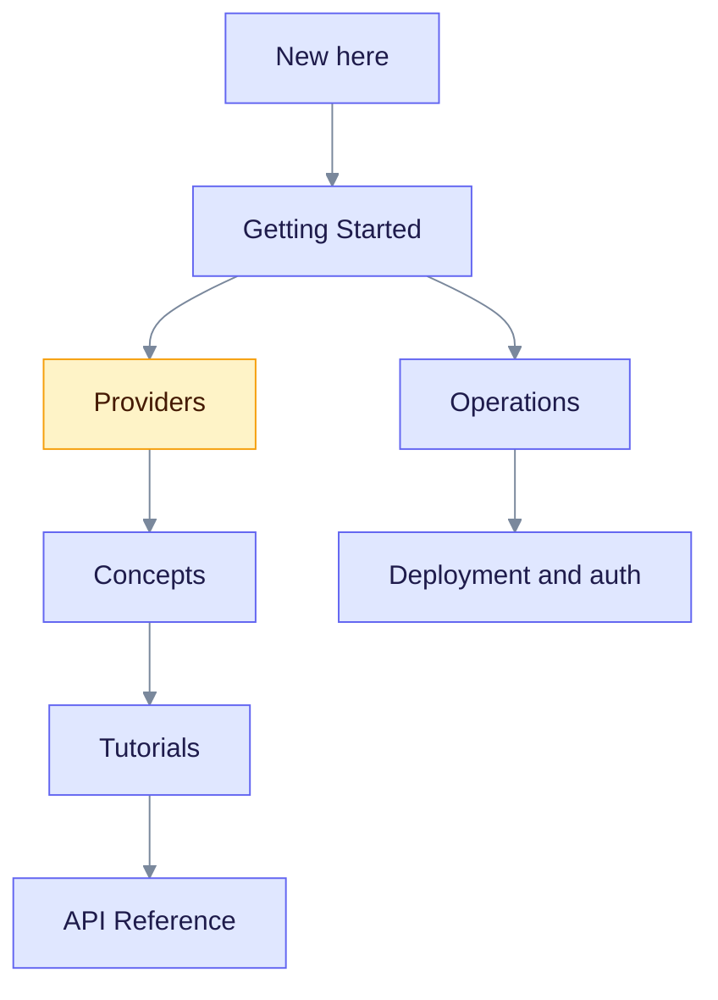

> **Released: v0.32.2** · Contract: [OpenAPI snapshot](../edgequake_webui/openapi/openapi.snapshot.json) · Ops: [Ingestion cancel and fairness](ingestion-cancel-and-fairness.md)

EdgeQuake turns your documents into a knowledge graph and answers questions from it. It is written in Rust and stores everything in PostgreSQL. These pages are for developers and operators.

## Where to start

Follow the arrows from the top. Operators can branch from Getting Started to Operations.

## Explore the documentation

- [Getting Started](getting-started/index.md): install EdgeQuake, run your first pipeline, understand the basics.
- [Providers](providers/index.md): connect Ollama, OpenAI, Anthropic, LM Studio, oMLX and other servers.
- [Core Concepts](concepts/index.md): knowledge graphs, entity extraction, query modes, and decision extraction (preview).
- [Architecture](architecture/index.md): the crates and the storage layer.
- [Tutorials](tutorials/index.md): step-by-step guides.
- [API Reference](api-reference/index.md): guided REST overlays. The full contract is the OpenAPI snapshot.
- [Deep Dives](deep-dives/index.md): progress streaming, PDF processing, storage.
- [Operations](operations/index.md): Docker, deployment, auth, upgrades, release process.
- [SDKs](sdks/README.md): official clients. SDK versions differ from the product version.
- [Integrations](integrations/index.md): Open WebUI, LangChain, plain HTTP.
- [Comparisons](comparisons/index.md): LightRAG, GraphRAG, traditional RAG.
- [Security](security/index.md): auth defaults and hardening.
- [Troubleshooting](troubleshooting/index.md): common issues, claim and lease, cancel versus failed.
- [Changelog](../CHANGELOG.md): release history.
