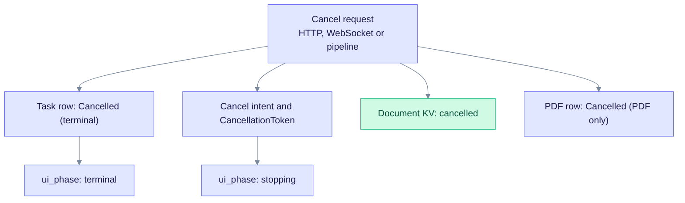
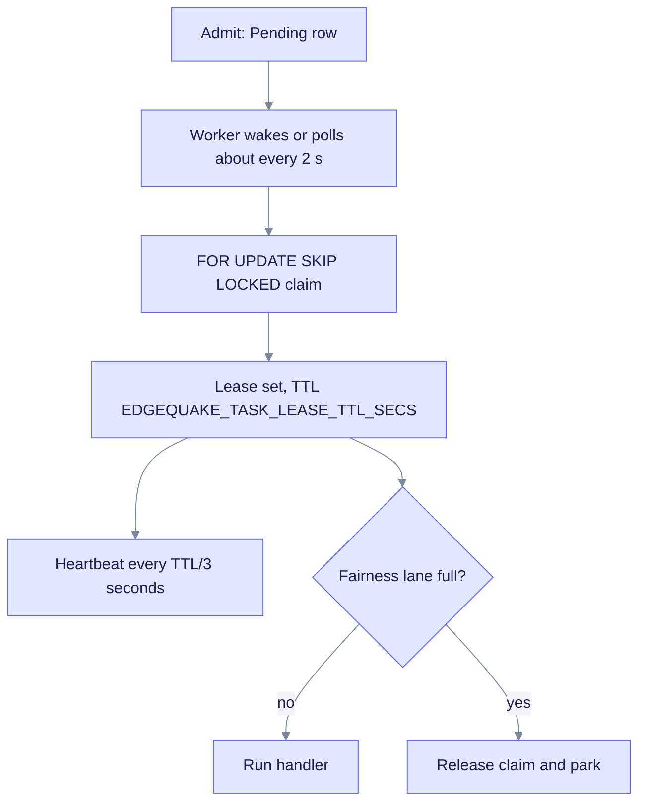

> **Product: v0.32.2** · Contract: [OpenAPI snapshot](../edgequake_webui/openapi/openapi.snapshot.json) · Spec ops: this document (SPEC-057 SSOT)

# Ingestion cancel, fairness, and restart semantics

This page explains how the task worker cancels ingestion, shares workers between tenants, and recovers after a restart. Operators use it to tune concurrency. UI developers use it to show cancel and progress states. The rules come from the SPEC-057 remediation (P0 to P4).

## Cancel a task (canonical)

The canonical endpoint is:

```http
POST /api/v1/tasks/{track_id}/cancel
```

Every cancel entry point runs the same steps:

1. The task row becomes `Cancelled` through `apply_task_row_cancel`. This is terminal, so there is no automatic retry.
2. `CancellationRegistry` records a cancel intent and signals any in-flight `CancellationToken`.
3. The linked document KV entry becomes `cancelled` with `failure_class=cancelled` (`sync_doc_cancelled_for_task`).
4. Pending or fairness-parked copies with the same `track_id` are dropped on dequeue, so they are never claimed.
5. For a PDF, the PDF row becomes `Cancelled`, not `Failed`.



One cancel request fans out to the task, the document and, for PDFs, the PDF row. The UI shows **Stopping…** until the document reaches a terminal state.

Other entry points, which share the same logic:

| Path | Behavior |
|------|----------|
| `DELETE /api/v2/workspaces/{workspace_id}/jobs/{job_id}` | Same as task cancel |
| `DELETE /api/v1/documents/pdf/{pdf_id}/cancel` | Task cancel, PDF set to `cancelled`, document KV sync |
| `POST /api/v1/pipeline/cancel` | Cancels all registered in-flight tasks and syncs document KV |
| WebSocket `{ "type": "cancel", "track_id": "..." }` | Task cancel and document KV sync |

The UI should call the canonical endpoint and show **Stopping…** until the status is terminal.

Cancellation is cooperative. Vision conversion, LLM extraction and embedding calls abort at their next `.await` checkpoint. Expect a short delay while the current HTTP call is dropped.

### Status SSOT (SPEC-057 P4)

Document list and detail responses include presentation fields from `IngestionStatusMapper`.

| Field | Meaning |
|-------|---------|
| `display_status` | Badge key (`cancelled`, `failed`, `completed`, `extracting`, `converting`, ...). Prefer it over deriving a badge from `status` or `current_stage` |
| `ui_phase` | `idle`, `running`, `stopping` or `terminal`. When it is `stopping`, show **Stopping…** even if `display_status` is still a stage such as `extracting` |

Rules:

- A cancel intent on a document that is not yet terminal gives `ui_phase=stopping`.
- A terminal cancel (task, document, PDF or `failure_class=cancelled`) gives `display_status=cancelled` and `ui_phase=terminal`.
- A PDF `Completed` status does not override an in-flight document stage. It only means the convert step produced an artifact.

## Tenant fairness (no requeue storm)

Fairness shares workers across tenants. It uses two per-tenant lanes and gives priority at claim time. It is concurrency fairness, not a latency SLA and not a weighted share (SPEC-057 INV-06).

| Lane | Task types | Env var | Local cap (Ollama, LM Studio) |
|------|-----------|---------|-------------------------------|
| Workers | Pool size | `WORKER_THREADS` | 4 |
| Ingest | `PdfProcessing`, `Insert`, `Upload`, `Scan`, `Reindex`, `KnowledgeInjection` | `MAX_TASKS_PER_TENANT` | **1** (protects the LLM and vision model) |
| Lifecycle | `Deletion`, `BatchDeletion`, `WorkspaceWipe` | `MAX_LIFECYCLE_TASKS_PER_TENANT` | 4 (database and graph work, separate from ingest) |

Local providers (`ollama` and `lmstudio`) clamp ingest to 1 and workers to 4, unless `EDGEQUAKE_ALLOW_LOCAL_HIGH_CONCURRENCY=1` is set. Do not set that flag just to unblock deletes. Deletes use the lifecycle lane.

The clamp uses the runtime extract provider. It checks `EDGEQUAKE_EXTRACT_PROVIDER`, then `EDGEQUAKE_DEFAULT_EXTRACT_PROVIDER`, `EDGEQUAKE_DEFAULT_LLM_PROVIDER` and `EDGEQUAKE_LLM_PROVIDER`. A hybrid setup with an OpenAI LLM and Ollama extraction therefore still gets the local clamp.

### How a claim is decided

1. A worker claims the next Pending row with `FOR UPDATE SKIP LOCKED`.
2. It asks for the tenant's lane permit. If the lane is full, it sets a durable `fairness_hold_until` on the task, releases the claim and parks in a background waiter.
3. `claim_next` skips rows with an active hold, so parked tasks do not waste claim cycles.
4. Claims prefer tenants under their lane cap, counting active leases plus active holds. Within a workspace, FIFO order applies. Under-cap tenants go ahead of older tasks from tenants at the cap.
5. Global byte admission runs after the fairness permit.

### Park and wake

- Reclaiming an already parked row re-marks `fairness_hold_until`, so expiry does not restart a reclaim storm.
- On wake, the waiter stages the permit by `track_id`, clears the hold and sends one queue wake. The worker takes the handoff.
- If a task is cancelled or skipped after the claim, its permit is dropped, so the lane does not leak.
- The worker keeps serving other tenants' ready work, and the other lane for the same tenant.

**Multi-replica note.** The durable hold and `claim_next` work across replicas. The park set, semaphores and handoff map are per process. Lane accounting is therefore best effort across replicas until durable lane counters exist.

## Convert then ingest (SPEC-057 P2)

PDF admission enqueues `TaskType::PdfProcessing`, which only converts. When the Markdown is stored and the PDF is `Completed`, the worker enqueues `TaskType::Insert` for knowledge graph ingest. Insert has its own lease, timeout and fairness permit.

```mermaid
%%{init: {"theme":"base","themeVariables":{"primaryColor":"#E0E7FF","primaryBorderColor":"#6366F1","primaryTextColor":"#1E1B4B","secondaryColor":"#D1FAE5","secondaryBorderColor":"#10B981","secondaryTextColor":"#064E3B","tertiaryColor":"#FEF3C7","tertiaryBorderColor":"#F59E0B","tertiaryTextColor":"#6B7A90","lineColor":"#7A889C","clusterBkg":"rgba(99,102,241,0.07)","clusterBorder":"#A5B4FC","noteBkgColor":"#FEF9C3","noteTextColor":"#422006","textColor":"#6B7A90","titleColor":"#6B7A90","signalColor":"#7A889C","signalTextColor":"#6B7A90","loopTextColor":"#6B7A90","edgeLabelBackground":"#F1F5F9","actorLineColor":"#94A3B8"}}}%%
%% eq-theme:v1
flowchart LR
    A["POST /api/v1/documents/pdf<br/>admit track_id"] --> B["PdfProcessing task<br/>convert to Markdown"]
    B -->|"markdown barrier: PDF Completed"| C["Insert task<br/>chunk, extract, embed, store"]
    C --> D["Document display_status: completed"]
```



The markdown barrier separates the two tasks. A PDF can show `Completed` while its document is still extracting.

| Phase | Task type | Timeout metadata key | PDF row on success |
|-------|-----------|----------------------|--------------------|
| Convert | `pdf_processing` | `metadata.processing_timeout_secs` from `LargeDocumentProfile::convert_timeout_secs` | `Completed`, with Markdown stored |
| Ingest | `insert` | `metadata.processing_timeout_secs` from `LargeDocumentProfile::ingest_timeout_secs` | Unchanged. Convert output is kept |

Cancel rules for the two-task chain:

- HTTP and WebSocket cancel share `cancel_track_with_doc_and_pdf_chain`. It cancels the task row, the document KV entry and the linked Convert and Insert tasks.
- Cancelling convert, or cancelling the PDF while Insert is in flight, cancels both linked Pending or Processing tasks for the same `pdf_id`.
- Once convert has completed, cancelling ingest leaves the PDF `Completed`, because the markdown barrier is kept.
- The document KV stage continues through Insert until ingest finishes. PDF `Completed` only means the convert artifact exists.

## Restart semantics (SPEC-057 P1 claim / lease)

Postgres task rows are the delivery source of truth. The in-memory channel is only a wake signal. Workers never process work from a channel payload without a database claim.



Each claim gets a lease. The heartbeat refreshes it while the handler runs. A fairness park releases the claim before it waits.

- Lease TTL is `EDGEQUAKE_TASK_LEASE_TTL_SECS`. The default is 120 seconds and the minimum is 30.
- The heartbeat runs every TTL/3 seconds. That is 40 seconds at the default, with a 5-second minimum.

At boot, the status of unfinished tasks depends on `EDGEQUAKE_STARTUP_AUTO_RESUME`:

| Status at boot | Default (unset or on) | `EDGEQUAKE_STARTUP_AUTO_RESUME=0` |
|----------------|-----------------------|-----------------------------------|
| **Pending** | Left Pending, claimable through `claim_next` | Left Pending, unchanged |
| **Processing** (stale, or this process) | Set back to Pending (reclaimable) | Set to Failed with "Interrupted, use Reprocess" |
| **Cancelled** | Never claimed | Never claimed |

Cancel intents are process-local. After a restart, the `Cancelled` database status is the source of truth. Interrupted Processing tasks stay eligible for Reprocess.

## Multi-replica delivery (SPEC-057 P3)

| Env | Role |
| --- | ---- |
| `EDGEQUAKE_REPLICAS` | Intended API and worker process count (default `1`) |
| `EDGEQUAKE_TASK_DELIVERY` | `local` (default), `bridged` or `notify_only` |

When `EDGEQUAKE_REPLICAS` is greater than 1 and delivery is `local`, boot fails. Set `bridged` or `notify_only`. Those two modes only wake workers. Correctness comes from `claim_next` and the lease.

## Observability

`GET /api/v1/pipeline/queue-metrics` reports:

- `tenant_park_waiters`, with the split `tenant_park_waiters_ingest` and `tenant_park_waiters_lifecycle`
- `cancel_intent_count` and `cancel_intent_total`
- `max_tasks_per_tenant` and `max_lifecycle_tasks_per_tenant`
- `store_contention`, a nested object with pool utilization and compensation quarantine

High `tenant_park_waiters` means fairness is holding work. That is expected under the local LLM clamp.

### Store contention and compensate DLQ (SPEC-057 P3)

| Signal | Source | Critical action |
| ------ | ------ | --------------- |
| `store_contention.db_pool_utilization` | sqlx pool size and idle connections | Scale the pool or reduce ingest |
| `store_contention.compensation_quarantine_total` | Process counter, and Prometheus `edgequake_compensation_quarantine_total` | Inspect the KV dead-letter keys `compensation_quarantine:{document_id}:*` |
| Queue `pressure=critical` | Pending depth | Scale `WORKER_THREADS` |

`/ready` returns 503 when store contention is critical. The thresholds match queue-metrics. Defaults:

- `EDGEQUAKE_DB_POOL_UTIL_WARN=0.75` and `EDGEQUAKE_DB_POOL_UTIL_CRITICAL=0.90`
- `EDGEQUAKE_COMPENSATION_QUARANTINE_WARN=1` and `EDGEQUAKE_COMPENSATION_QUARANTINE_CRITICAL=5`

The full list of observability variables is in [OBSERVABILITY](OBSERVABILITY.md#environment-variables).

**Park waiters versus compensate.** High `tenant_park_waiters` is a fairness effect. A rising `compensation_quarantine_total` means merge cleanup failed. Check the AGE and pgvector delete errors and the DLQ KV records. Park waiters are not the cause.
