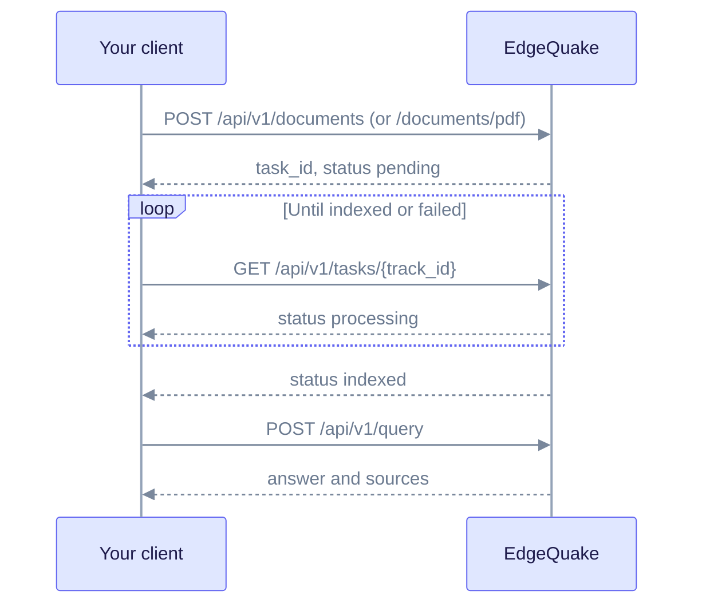

# Integration: Custom clients

Use this page when no SDK fits, or when you need routes the SDKs do not wrap yet, such as Connections and the provider test. For day-to-day work, prefer an [official SDK](../sdks/README.md). The examples use the base URL `http://localhost:8080`.

## Headers

| Header | When to send it |
|--------|-----------------|
| `Authorization: Bearer <jwt-or-key>` | Auth is enabled |
| `X-API-Key: <key>` | An API key, as an alternative to Bearer |
| `X-Workspace-ID` | To scope documents and queries to a workspace |
| `X-Tenant-ID` | Multi-tenant deployments |
| `Content-Type: application/json` | JSON bodies |
| `X-EdgeQuake-Confirm: delete-all-documents` | Bulk delete of all documents |

The full conventions are in the [REST API reference](../api-reference/rest-api.md#conventions).

## Health

```bash
curl -s http://localhost:8080/health
curl -s http://localhost:8080/ready
```

## Upload and wait

Text uploads return a task you can poll with `track_id`:

```bash
curl -s -X POST http://localhost:8080/api/v1/documents \
  -H "Content-Type: application/json" \
  -H "X-Workspace-ID: $WORKSPACE_ID" \
  -d '{"content":"Marie Curie won two Nobel Prizes.","title":"Notes"}'
# 202 { "document_id", "task_id", "track_id", "status":"pending" }

curl -s http://localhost:8080/api/v1/tasks/$TRACK_ID
# status: pending | processing | indexed | failed | cancelled
```

PDF uploads return a `pdf_id` and a `task_id` that starts with `pdf-`. The `task_id` is the progress key. The `track_id` is only a client correlation ID, echoed back if you send one. Poll the PDF status route instead:

```bash
curl -s -X POST http://localhost:8080/api/v1/documents/pdf \
  -H "X-Workspace-ID: $WORKSPACE_ID" \
  -F "file=@paper.pdf" -F "title=Paper"
# 200 { "pdf_id", "document_id", "status", "task_id":"pdf-...", "message" }

curl -s http://localhost:8080/api/v1/documents/pdf/$PDF_ID
```

Details are in the [document upload quick reference](../api-reference/document-upload-quick-reference.md).



## Query

```bash
curl -s -X POST http://localhost:8080/api/v1/query \
  -H "Content-Type: application/json" \
  -H "X-Workspace-ID: $WORKSPACE_ID" \
  -d '{"query":"How many Nobel Prizes?","mode":"mix","max_results":10}'
```

The query body accepts these fields: `query`, `mode`, `max_results`, `enable_rerank`, `llm_provider`, `llm_model` and `document_filter`. There is no `top_k` on this endpoint.

For streaming, call `POST /api/v1/query/stream`. It sends SSE JSON events, each with a `type` of `context`, `token`, `thinking`, `done` or `error`.

## Connections (v0.33.0)

No SDK wraps these routes yet. They need admin rights.

```bash
curl -s -X POST http://localhost:8080/api/v1/providers/test \
  -H "Authorization: Bearer $TOKEN" \
  -H "Content-Type: application/json" \
  -d '{"shape":"ollama","base_url":"http://127.0.0.1:11434","model":"gemma3:latest"}'

curl -s -X POST http://localhost:8080/api/v1/connections \
  -H "Authorization: Bearer $TOKEN" \
  -H "Content-Type: application/json" \
  -d '{"slug":"my-ollama","display_name":"Ollama","api_shape":"ollama","base_url":"http://127.0.0.1:11434","locality":"local"}'
```

The test call checks a provider before you save it. Full reference: [Connections](../api-reference/connections.md). For the URL rules, see [Provider security](../providers/security.md).

## Bulk delete

`DELETE /api/v1/documents` deletes every document in the workspace. Send the confirmation header. When the server requires it, a request without the header returns `400`.

```bash
curl -s -X DELETE http://localhost:8080/api/v1/documents \
  -H "X-Workspace-ID: $WORKSPACE_ID" \
  -H "X-EdgeQuake-Confirm: delete-all-documents"
```

A successful call returns `202` with a `wipe_track_id`. Progress arrives over the WebSocket, not by polling.

## Status fields

- For UI badges, prefer `display_status` and `ui_phase` over the raw `status` field.
- A task succeeds with the status **`indexed`**, not `completed`.
- A document is reported as `completed` when it is ready. See [lifecycle](../api-reference/extended-api.md#lifecycle).

## OpenAPI

Interactive docs are at `http://localhost:8080/swagger-ui/`. The snapshot for v0.32.2 is [`openapi.snapshot.json`](../../edgequake_webui/openapi/openapi.snapshot.json). Connections appear only in the current source until the next snapshot.

Related: [Integrations](index.md), [MCP](mcp.md), [REST API](../api-reference/rest-api.md).
