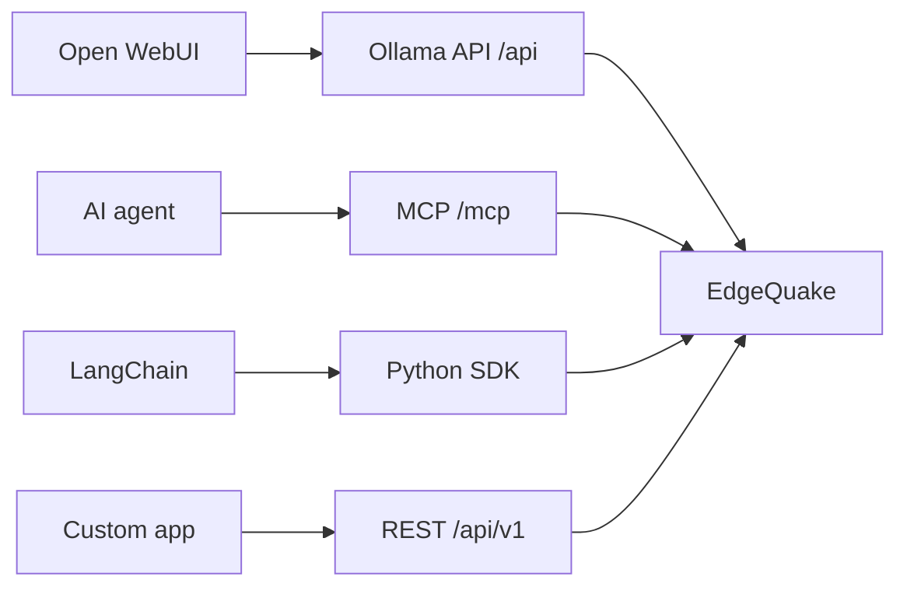

# Integrations

This section shows how to plug EdgeQuake into other tools. It is for developers who already run EdgeQuake and want a chat UI, an agent, a LangChain chain or a thin HTTP client. Product pin: **v0.32.2**.

Prefer an [official SDK](../sdks/README.md) when one exists. Fall back to the [REST API](../api-reference/index.md) for everything else (including v0.33.0 Connections).

Read it left to right: each tool talks to EdgeQuake through a different front door. The knowledge graph and storage are the same underneath.

## Pages

| Integration | Use it when |
|-------------|-------------|
| [Open WebUI](open-webui.md) | You want a ChatGPT-style UI on top of Graph-RAG |
| [LangChain](langchain.md) | You build Python RAG chains |
| [MCP](mcp.md) | An AI agent should search and (optionally) ingest through tools |
| [Custom clients](custom-clients.md) | No SDK fits, or you need Connections / provider test |

Related: [SDK overview](../sdks/README.md), [API reference](../api-reference/index.md), [Getting started](../getting-started/quick-start.md).
