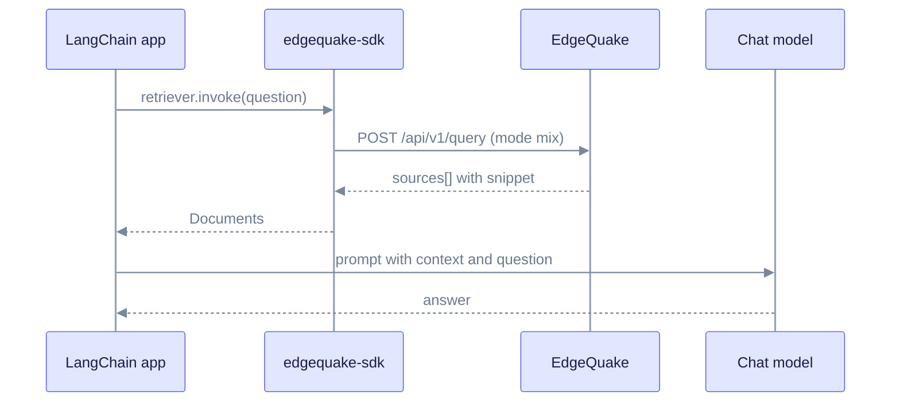

# Integration: LangChain

Use EdgeQuake from [LangChain](https://langchain.com/) Python apps. Use it as a retriever that feeds your own LLM, or let EdgeQuake write the answer. Install the official SDK with `pip` rather than writing HTTP calls by hand.

## Prerequisites

```bash
pip install edgequake-sdk langchain langchain-core langchain-openai
curl -s http://localhost:8080/health   # status healthy or degraded
```

This guide follows the SDK source in `sdks/python/` (version 0.4.0 in its `pyproject.toml`). If the published package differs, check that `client.query.execute` and `client.pdf.upload` exist in the version you install.

Ingest documents and wait until `display_status` is `completed` before you query.

## Query response shape

`POST /api/v1/query` returns `answer`, `sources[]`, `mode` and `stats`. Each source has `snippet`, `score`, `document_id`, `file_path` and `reference_id`. There are no top-level `chunks` or `entities` arrays.

Map `sources[].snippet` to the LangChain `Document.page_content` field.

## Retriever

The SDK's `query.execute` takes keyword arguments such as `query` and `mode`.

```python
from typing import List

from edgequake import EdgeQuake
from langchain_core.callbacks import CallbackManagerForRetrieverRun
from langchain_core.documents import Document
from langchain_core.retrievers import BaseRetriever


class EdgeQuakeRetriever(BaseRetriever):
    """Graph-RAG retriever backed by edgequake-sdk."""

    base_url: str = "http://localhost:8080"
    workspace_id: str | None = None
    query_mode: str = "mix"

    def _get_relevant_documents(
        self,
        query: str,
        *,
        run_manager: CallbackManagerForRetrieverRun,
    ) -> List[Document]:
        client = EdgeQuake(
            base_url=self.base_url,
            workspace_id=self.workspace_id,
        )
        result = client.query.execute(query=query, mode=self.query_mode)

        documents: List[Document] = []
        for src in result.sources:
            content = getattr(src, "snippet", None) or ""
            if not content:
                continue
            documents.append(
                Document(
                    page_content=content,
                    metadata={
                        "document_id": getattr(src, "document_id", None),
                        "score": getattr(src, "score", None),
                        "file_path": getattr(src, "file_path", None),
                        "reference_id": getattr(src, "reference_id", None),
                        "query_mode": self.query_mode,
                    },
                )
            )
        return documents
```

```python
retriever = EdgeQuakeRetriever(query_mode="mix")
docs = retriever.invoke("What are the key findings?")
for doc in docs:
    print(doc.page_content[:120], doc.metadata.get("score"))
```

### Modes

The server accepts `naive`, `local`, `global`, `hybrid`, `mix` and `bypass`. The SDK type hint lists only the first four, so a type checker may flag `mix`. The call still works. See [Query modes](../deep-dives/query-modes.md).

### Arguments that the server ignores

The SDK also sends `top_k` and `rerank`. The server does not read them. The REST query reads `max_results` and `enable_rerank` instead. See [Custom clients](custom-clients.md#query).

## Full answer from EdgeQuake

```python
from edgequake import EdgeQuake

client = EdgeQuake(base_url="http://localhost:8080")
result = client.query.execute(query="What is the main topic?", mode="mix")
print(result.answer)
for src in result.sources:
    print(getattr(src, "score", None), getattr(src, "snippet", "")[:80])
```

### Streaming

`client.query.stream(...)` yields SSE JSON events. Each event has a `type` of `context`, `token`, `thinking`, `done` or `error`.

## RAG chain with your own LLM

The retriever feeds context to a chat model that you run. EdgeQuake only retrieves.



```python
from langchain_core.output_parsers import StrOutputParser
from langchain_core.prompts import ChatPromptTemplate
from langchain_core.runnables import RunnablePassthrough
from langchain_openai import ChatOpenAI

retriever = EdgeQuakeRetriever(query_mode="mix")
llm = ChatOpenAI(model="gpt-5-nano", temperature=0)

prompt = ChatPromptTemplate.from_template(
    "Answer using only this context:\n\n{context}\n\nQuestion: {question}\n\nAnswer:"
)

def format_docs(docs):
    return "\n\n".join(d.page_content for d in docs)

chain = (
    {"context": retriever | format_docs, "question": RunnablePassthrough()}
    | prompt
    | llm
    | StrOutputParser()
)

print(chain.invoke("Summarize the risk factors"))
```

## Upload and wait

```python
from pathlib import Path

from edgequake import EdgeQuake

client = EdgeQuake(base_url="http://localhost:8080")
doc = client.documents.upload(content="Marie Curie discovered radium.", title="Biography")
pdf = client.pdf.upload(Path("/path/to/paper.pdf"), title="Paper")
print(doc.track_id, pdf.task_id)
```

Poll the task until it is `indexed`:

```python
status = client.tasks.get(doc.track_id)
print(status.status)  # pending, processing, indexed, failed or cancelled
```

Related: [Python SDK](../sdks/python/README.md), [REST query](../api-reference/rest-api.md#query), [Custom clients](custom-clients.md).
