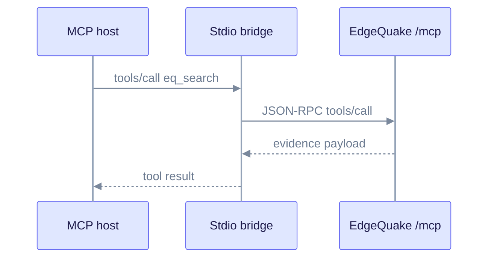
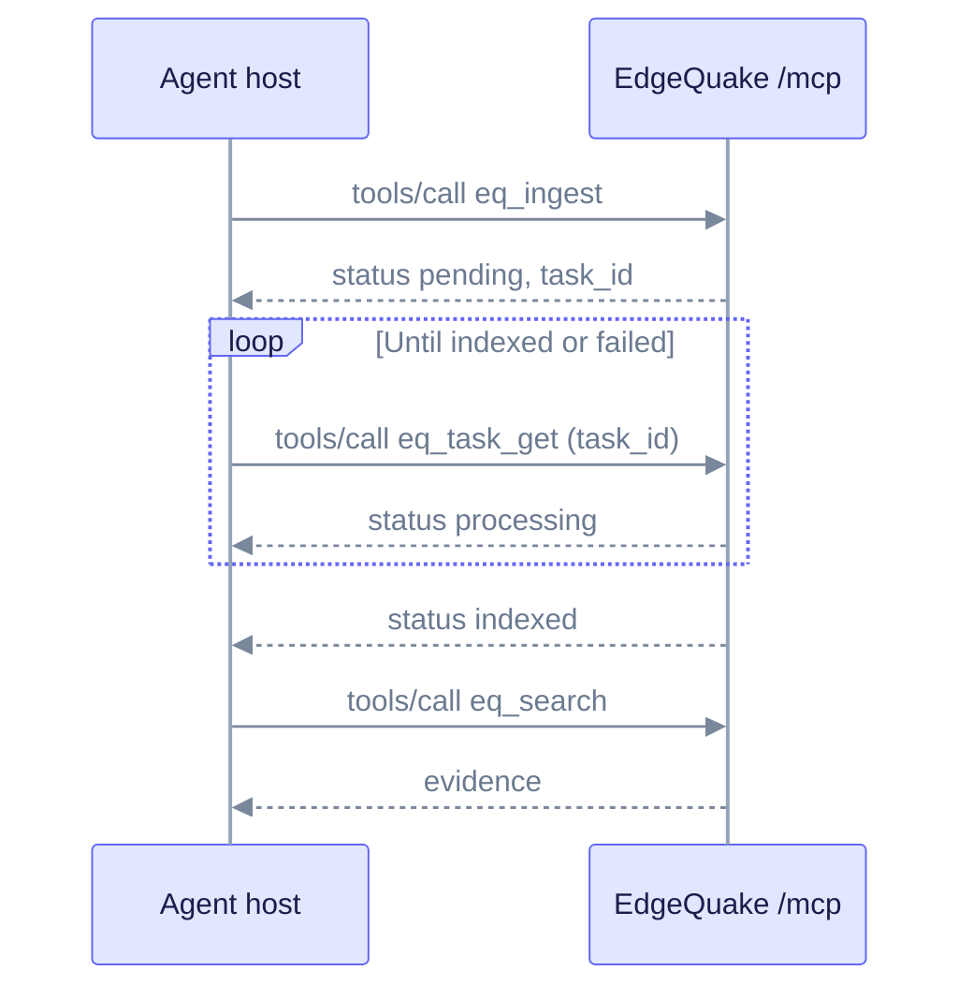

# MCP integration

This page explains how AI agents use EdgeQuake through the [Model Context Protocol](https://modelcontextprotocol.io). It is for people who connect Cursor, Claude Desktop or another MCP host to a running EdgeQuake server. Product pin: **v0.32.2**.

EdgeQuake exposes a JSON-RPC MCP gateway at **`POST /mcp`** (alias `POST /api/v1/mcp`). A separate Node package, **`@edgequake/mcp-server`**, runs over stdio and forwards to that gateway. Desktop hosts can use it without speaking HTTP.

## How a tool call flows



Read it top to bottom. The host calls a tool, the bridge forwards JSON-RPC to EdgeQuake, and the result is evidence, not a free-form LLM answer.

## Gateway (server)

| Item | Value |
|------|-------|
| Endpoint | `POST /mcp` (also `/api/v1/mcp`) |
| Auth | Bearer JWT or API key when auth is enabled. The transport handshake is public. Tools still enforce workspace scope. |
| Body limit | 1 MiB |
| Protocol header | `MCP-Protocol-Version: 2026-07-28` (the stdio bridge sends this) |
| Workspace | `X-Workspace-Id` header, or the authenticated user's default |

### Discovery

These routes need no auth:

- `GET /.well-known/oauth-protected-resource`
- `GET /.well-known/oauth-protected-resource/mcp`
- `GET /.well-known/oauth-authorization-server`
- `GET /.well-known/openid-configuration`
- `GET /.well-known/mcp/server.json`
- OAuth token endpoints under `/oauth/*`

Behind a reverse proxy, set `EDGEQUAKE_PUBLIC_URL` (and optionally `EDGEQUAKE_OAUTH_ISSUER_URL`) so the discovery URLs are correct. See [API keys and MCP](../security/authentication/api-keys-and-mcp.md).

### Profile

`EDGEQUAKE_MCP_PROFILE` controls which tools the server advertises.

| Value | Tools |
|-------|-------|
| `query` | Read-only: list, search, fetch, retrieve, entities, workspaces |
| `control` (default) | Query tools plus ingest, upload, delete, download, assets and graph image |
| `memory` | Same as `control` |

### Read tools

Available whenever the profile allows queries:

| Tool | Purpose |
|------|---------|
| `eq_document_list` | List documents in the workspace |
| `eq_document_get` | Get one document. It may not be ready until indexed. |
| `eq_search` | Search |
| `eq_fetch` | Fetch a document view. Start with `view=toc`. |
| `eq_retrieve` | Retrieve context |
| `eq_entity_search`, `eq_entity_get`, `eq_neighborhood` | Graph |
| `eq_workspace_list`, `eq_workspace_stats` | Workspaces |
| `eq_task_get` | Poll asynchronous work |

### Write tools

Available only with the `control` or `memory` profile:

| Tool | Purpose |
|------|---------|
| `eq_ingest` | Ingest text. Returns `pending` and a `task_id`. |
| `eq_upload_begin`, `eq_upload_write`, `eq_upload_commit`, `eq_upload_abort` | Chunked upload |
| `eq_document_delete`, `eq_workspace_delete` | Delete. `confirm: true` is required. |
| `eq_document_download`, `eq_asset_get`, `eq_graph_image` | Bytes and pictures |

The legacy names `edgequake_search`, `edgequake_fetch` and `edgequake_retrieve` map to the `eq_*` tools.

> **Note:** Tools return evidence. Do not treat them as an LLM "answer" endpoint.

### Ingest lifecycle

Ingestion is asynchronous. A document is searchable only after its task reports `indexed`.



## Stdio bridge

The package is **`@edgequake/mcp-server`** version **0.3.0**. Its binary is `edgequake-mcp`. It starts a stdio MCP server and forwards every tool call to your gateway.

```bash
npm install -g @edgequake/mcp-server
# or: npx -y @edgequake/mcp-server
```

Typical host configuration, for example in a Cursor `mcp.json`:

```json
{
  "mcpServers": {
    "edgequake": {
      "command": "npx",
      "args": ["-y", "@edgequake/mcp-server"],
      "env": {
        "EDGEQUAKE_BASE_URL": "http://localhost:8080",
        "EDGEQUAKE_DEFAULT_WORKSPACE": "<workspace-id>"
      }
    }
  }
}
```

| Variable | Purpose | Default |
|----------|---------|---------|
| `EDGEQUAKE_BASE_URL` | Gateway base URL | `http://localhost:8080` |
| `EDGEQUAKE_API_KEY` | API key, sent as `Authorization: Bearer`. Needed when auth is enabled. | none |
| `EDGEQUAKE_DEFAULT_WORKSPACE` | Workspace, sent as `X-Workspace-Id` | none |
| `EDGEQUAKE_DEFAULT_TENANT` | Tenant, sent as `X-Tenant-ID` | none |

The bridge depends on `edgequake-sdk` `^0.1.0` from npm. The SDK source in this repository is newer (0.4.0), so check the version your install resolves. The gateway tool table above is the source of truth. Read the gateway tools in `edgequake/crates/edgequake-api/src/mcp/gateway/tools.rs` if you need the exact arguments.

## Good agent habits

1. Call `eq_document_list` before you say what is in the workspace.
2. Prefer `eq_search`, then `eq_fetch` with `view=toc`, before larger fetches.
3. Treat `ALL_CAPS` names as entity slugs. Show them to users in Title Case.
4. If `truncation.truncated` is true, follow `next_cursor`.
5. Do not say a document is searchable until `eq_task_get` reports `indexed`.

Related: [Custom clients](custom-clients.md), [API reference](../api-reference/index.md), [Authentication](../security/authentication/index.md).
