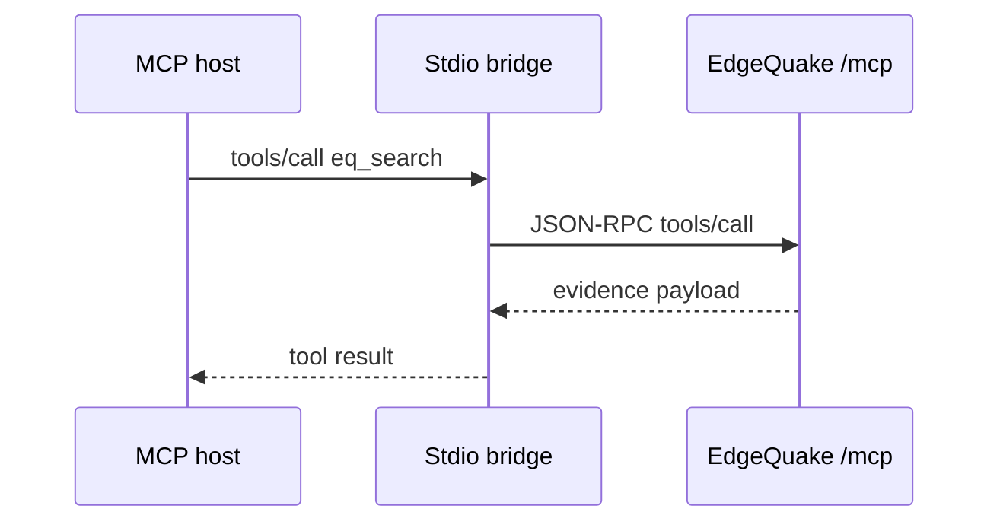

# MCP integration

This page explains how AI agents talk to EdgeQuake through the [Model Context Protocol](https://modelcontextprotocol.io). It is for people wiring Cursor, Claude Desktop or another MCP host to a running EdgeQuake server. Product pin: **v0.32.2**.

EdgeQuake exposes a JSON-RPC MCP gateway at **`POST /mcp`** (alias `POST /api/v1/mcp`). A separate Node package, **`@edgequake/mcp-server`** (stdio), proxies that gateway so desktop hosts can connect without speaking HTTP themselves.



Read it top to bottom: the host calls a tool, the bridge forwards JSON-RPC to EdgeQuake, and the result is evidence (not a free-form LLM answer).

## Gateway (server)

| Item | Value |
|------|-------|
| Endpoint | `POST /mcp` (also `/api/v1/mcp`) |
| Auth | Bearer JWT or API key when auth is enabled. Public for the transport handshake; tools still enforce workspace scope. |
| Body limit | 1 MiB |
| Protocol header | `MCP-Protocol-Version: 2026-07-28` (the stdio bridge sends this) |
| Workspace | `X-Workspace-Id` (bridge) or the authenticated user's default |

Discovery (no auth required for the documents themselves):

- `GET /.well-known/oauth-protected-resource`
- `GET /.well-known/oauth-protected-resource/mcp`
- `GET /.well-known/oauth-authorization-server`
- `GET /.well-known/openid-configuration`
- `GET /.well-known/mcp/server.json`
- OAuth token endpoints under `/oauth/*`

Set `EDGEQUAKE_PUBLIC_URL` (and optionally `EDGEQUAKE_OAUTH_ISSUER_URL`) so discovery URLs are correct behind a reverse proxy. See [API keys and MCP](../security/authentication/api-keys-and-mcp.md).

### Profile

`EDGEQUAKE_MCP_PROFILE` controls which tools are advertised:

| Value | Tools |
|-------|-------|
| `query` | Read-only: list, search, fetch, retrieve, entities, workspaces |
| `control` (default) | Query tools plus ingest, upload, delete, download, assets, graph image |
| `memory` | Same as `control` |

### Tools (gateway)

Read tools (always when profile allows query):

| Tool | Purpose |
|------|---------|
| `eq_document_list` | List documents in the workspace |
| `eq_document_get` | One document (may be not ready until indexed) |
| `eq_search` | Search |
| `eq_fetch` | Fetch a document view (`view=toc` first) |
| `eq_retrieve` | Retrieve context |
| `eq_entity_search`, `eq_entity_get`, `eq_neighborhood` | Graph |
| `eq_workspace_list`, `eq_workspace_stats` | Workspaces |
| `eq_task_get` | Poll async work |

Write tools (`control` / `memory` only):

| Tool | Purpose |
|------|---------|
| `eq_ingest` | Ingest text (returns `pending` + `task_id`) |
| `eq_upload_begin`, `eq_upload_write`, `eq_upload_commit`, `eq_upload_abort` | Chunked upload |
| `eq_document_delete`, `eq_workspace_delete` | Deletes (`confirm: true` required) |
| `eq_document_download`, `eq_asset_get`, `eq_graph_image` | Bytes and pictures |

Legacy aliases `edgequake_search`, `edgequake_fetch`, `edgequake_retrieve` map to the `eq_*` names.

**Important:** tools return evidence. Do not treat them as an LLM "answer" endpoint. Ingest is async: poll `eq_task_get` until `indexed` or `failed`.

## Stdio bridge

Package: **`@edgequake/mcp-server`** version **0.3.0** (bin `edgequake-mcp`). It opens a stdio MCP server and forwards every tool call to your EdgeQuake gateway.

```bash
npm install -g @edgequake/mcp-server
# or: npx @edgequake/mcp-server
```

Typical host config (environment):

| Variable | Purpose |
|----------|---------|
| `EDGEQUAKE_URL` | Base URL, for example `http://localhost:8080` |
| `EDGEQUAKE_API_KEY` or `EDGEQUAKE_JWT` | Auth |
| `EDGEQUAKE_WORKSPACE_ID` | Default workspace (`X-Workspace-Id`) |

The bridge depends on npm `edgequake-sdk ^0.1.0` today while SDK source is 0.4.0 — pin what works for your install. The in-repo `mcp/README.md` tool list is stale; trust the gateway tool table above.

## Good agent habits

1. Call `eq_document_list` before claiming what is in the workspace.
2. Prefer `eq_search` → `eq_fetch(view=toc)` before larger fetches.
3. Treat `ALL_CAPS` names as entity slugs; show Title Case to users.
4. If `truncation.truncated` is true, follow `next_cursor`.
5. Never say a document is searchable before `eq_task_get` reports `indexed`.

Related: [Custom clients](custom-clients.md), [API reference](../api-reference/index.md), [Authentication](../security/authentication/index.md).
