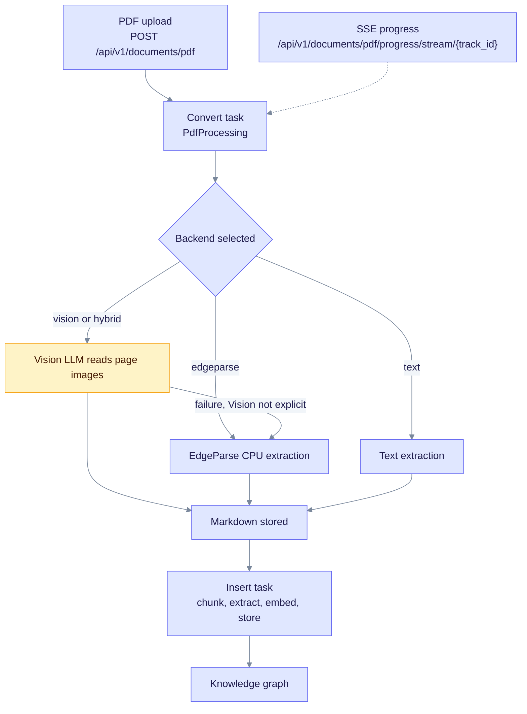

# LinkedIn Post — EdgeQuake v0.4.0

> **Historical document.** Marketing snapshot for **v0.4.0**. Current product is **v0.32.2**. For up-to-date PDF vision, cancel/progress, and ops guidance see [PDF Processing](deep-dives/pdf-processing.md), [PDF Ingestion](tutorials/pdf-ingestion.md), and [CHANGELOG](../CHANGELOG.md). Not part of the living docs nav.

> **Maintainer note (current behavior, v0.32.2).** The post below describes v0.4.0. Current code differs in three places:
>
> - `extraction_method` is now `text`, `vision`, `hybrid` or `edgeparse`. There is no `ocr` value (enum in `edgequake/crates/edgequake-storage/src/pdf_storage.rs`).
> - Uploads default `enable_vision` to true, so vision is no longer opt-in (`edgequake/crates/edgequake-api/src/handlers/pdf_upload/upload.rs`). The `enable_vision` multipart field still exists.
> - A vision failure falls back to EdgeParse only when Vision was not explicitly selected. Explicit Vision never degrades silently (`edgequake/crates/edgequake-pdf/src/fallback.rs`).

**Title:** Why your RAG pipeline struggles with PDFs — and how we fixed it with LLM Vision

---

Most RAG pipelines fail on PDFs in the same predictable way.

Text extraction works fine for clean, born-digital documents. Then you hit a scanned invoice, a multi-column research paper, a financial report with merged table cells — and the extracted text is either empty, scrambled, or structurally broken. Garbage in, garbage out. The entire knowledge graph downstream inherits that corruption.

We felt this problem firsthand while building EdgeQuake, an open-source Graph-RAG framework in Rust. Standard pdfium text extraction handled simple documents well. But production document sets are never simple.

So we asked a different question: **what if the PDF page were read the way a human reads it?**

---

**Introducing EdgeQuake v0.4.0: PDF → LLM Vision Pipeline**

Instead of extracting character codes, we now render each PDF page to a high-resolution image and send it to a multimodal LLM. The model reads the page as a human would — interpreting layout, reconstructing tables, understanding multi-column text, and handling scanned documents that have no extractable text at all.

What shipped in this release:

→ **Vision-based extraction** — GPT-4o, Claude, Gemini Vision, or any OpenAI-compatible vision model reads page images directly

→ **Handles what text extraction can't** — scanned PDFs, mixed layouts, handwritten annotations, complex tables with merged cells

→ **Zero-config pdfium** — the pdfium binary is now embedded in the package; no `PDFIUM_DYNAMIC_LIB_PATH` environment variable, no manual downloads, no CI headaches

→ **Opt-in, cost-controlled** — vision mode is disabled by default; enable per-request with `enable_vision=true` so you only pay for LLM calls on documents that need it

→ **Graceful fallback** — if the vision model is unavailable or fails, extraction automatically falls back to pdfium text mode; nothing breaks silently

→ **Full traceability** — each extracted block carries an `extraction_method` field (`vision`, `text`, or `ocr`) so you can audit exactly how every piece of content was produced

→ **Real-time progress** — live extraction progress surfaced in the WebUI via SSE streaming

The result: documents that used to produce garbled or empty content now produce clean, structured Markdown — ready for entity extraction, graph construction, and semantic search.

---

If you're building knowledge systems on top of documents, the quality of your PDF extraction is the foundation everything else sits on. We've been obsessing over this for months and this release feels like the step-change we needed.

EdgeQuake is fully open-source (Apache 2.0). The PDF pipeline works with any OpenAI-compatible provider — cloud or local (Ollama with gemma4 vision works well for air-gapped environments).

🔗 github.com/raphaelmansuy/edgequake

Happy to answer questions about the implementation — the interaction between Rust async, pdfium rendering, and vision LLM streaming was genuinely interesting to get right.

#RAG #LLM #AI #OpenSource #Rust #PDF #KnowledgeGraph #DocumentProcessing #GenAI

---

*Post body is about 3,040 characters with Markdown stripped. That is slightly over LinkedIn's 3,000-character limit, so trim a line or two before posting.*

## Maintainer flow (not part of the post)

How a PDF moves through the current pipeline, from upload to graph:

The convert step produces the Markdown, then a separate insert task builds the graph. The SSE progress endpoint is keyed by `track_id`.
