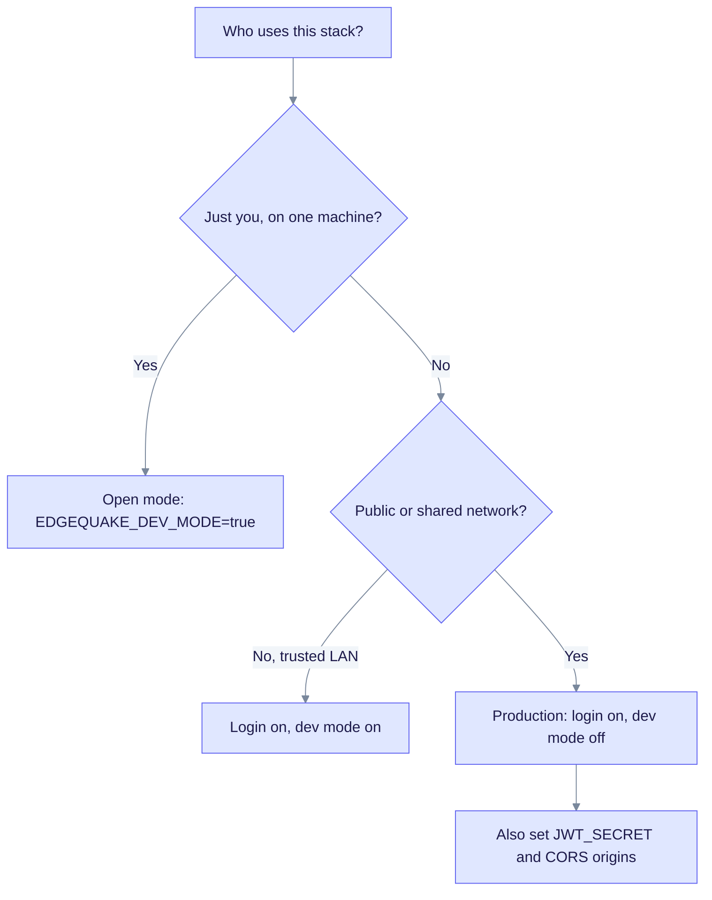

# Enable login (auth quickstart)

This page is for operators who want users to sign in. It explains which settings turn authentication on, how the first admin is created, and what to check when the API refuses to start. For production hardening (master API keys, SSO, CORS), continue to [Runtime auth hardening](runtime-auth-hardening.md).

## Pick a mode

Authentication is on by default. Identity lives in PostgreSQL. The quickstart Compose file turns it off so a demo works without a login.



The further along the chart you go, the more settings the API requires. Production mode refuses to start with a weak `JWT_SECRET`. It also needs a CORS list when `DATABASE_URL` points at a remote host.

| Mode | Settings | Admin created for you? |
|------|----------|------------------------|
| **Open (demo)** | `EDGEQUAKE_DEV_MODE=true` (Compose default) | No. There is no login. |
| **Login, dev mode on** | `EDGEQUAKE_AUTH_ENABLED=true` with dev mode on | No. The bootstrap admin is skipped while dev mode is on. Create a user with the master API key. |
| **Production** | `EDGEQUAKE_AUTH_ENABLED=true`, `EDGEQUAKE_DEV_MODE=false`, `JWT_SECRET`, `EDGEQUAKE_CORS_ORIGINS`, bootstrap admin password | Yes, if `EDGEQUAKE_BOOTSTRAP_ADMIN_PASSWORD` is set. |

An explicit `EDGEQUAKE_AUTH_ENABLED` (or `AUTH_ENABLED`) always wins over `EDGEQUAKE_DEV_MODE`. If neither is set, `EDGEQUAKE_AUTH_DISABLED=true` turns auth off, then dev mode turns it off, and otherwise auth is on.

## Turn on login with Docker Compose

`docker-compose.quickstart.yml` does not pass `EDGEQUAKE_CORS_ORIGINS` to the API. Production mode needs it because the database host (`postgres`) is not local. Add it with a small override file.

1. Create `docker-compose.auth.yml` next to the quickstart file:

```yaml
services:
  api:
    environment:
      EDGEQUAKE_CORS_ORIGINS: http://localhost:3000
```

2. Set the variables and start the stack with both files:

```bash
export EDGEQUAKE_DEV_MODE=false
export EDGEQUAKE_AUTH_ENABLED=true
export JWT_SECRET="$(openssl rand -hex 32)"
export EDGEQUAKE_BOOTSTRAP_ADMIN_USERNAME=admin
export EDGEQUAKE_BOOTSTRAP_ADMIN_PASSWORD='use-a-long-unique-password'
export EDGEQUAKE_BOOTSTRAP_ADMIN_EMAIL=admin@example.com   # optional
export NEXT_PUBLIC_DISABLE_DEMO_LOGIN=true                 # hide "skip login"
docker compose -f docker-compose.quickstart.yml -f docker-compose.auth.yml up -d
```

The Compose file passes `EDGEQUAKE_AUTH_ENABLED` to the web UI as `NEXT_PUBLIC_AUTH_ENABLED`, so you do not set that yourself. For a real hostname, set `EDGEQUAKE_CORS_ORIGINS` to the exact URL users type in the browser.

3. Sign in at <http://localhost:3000/login>. With `make dev-auth`, use <http://localhost:3010/login>.

The API creates the admin on startup when auth is on, dev mode is off, and no user with a usable password exists. Upgrades from before v0.15 import old `auth:user:*` records into PostgreSQL automatically.

## Local development

| Command | Result |
|---------|--------|
| `make dev` | Auth off (`EDGEQUAKE_DEV_MODE=true`). Backend on 8090, UI on 3010 by default. |
| `make dev-auth` | Auth on, demo login hidden. |

## Troubleshooting

| Symptom | Cause | Fix |
|---------|-------|-----|
| API exits 1: `JWT_SECRET is the insecure default` or `shorter than 32 bytes` | Dev mode is off and the secret is weak | Set `JWT_SECRET` to 32 or more random bytes. |
| API exits 1: `EDGEQUAKE_CORS_ORIGINS is required in production` | Dev mode is off, database is not local, no CORS list | Set `EDGEQUAKE_CORS_ORIGINS` (see the override above). |
| API exits 1: `Authentication disabled with non-local DATABASE_URL` | Auth off and dev mode off on a remote database | Turn auth on, or set dev mode for a local-only demo. |
| Login page shows but no user can sign in | Dev mode is on, so no admin was created | Set dev mode off and restart, or create a user with the master API key (see [Runtime auth hardening](runtime-auth-hardening.md#create-a-user-with-the-master-key)). |
| Warning: `no login-capable users exist` | No bootstrap password was set | Set `EDGEQUAKE_BOOTSTRAP_ADMIN_PASSWORD` and restart. |

## See also

- [Runtime auth hardening](runtime-auth-hardening.md)
- [Ingestion cancel and fairness](../ingestion-cancel-and-fairness.md): how cancel and restart behave.
- [GitHub #288](https://github.com/raphaelmansuy/edgequake/issues/288): secure-by-default background.
