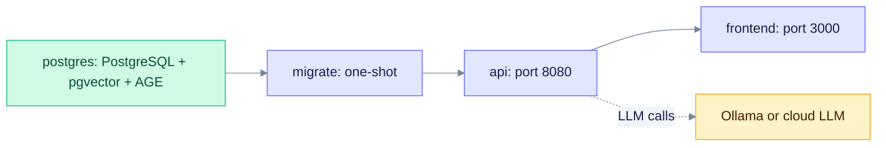
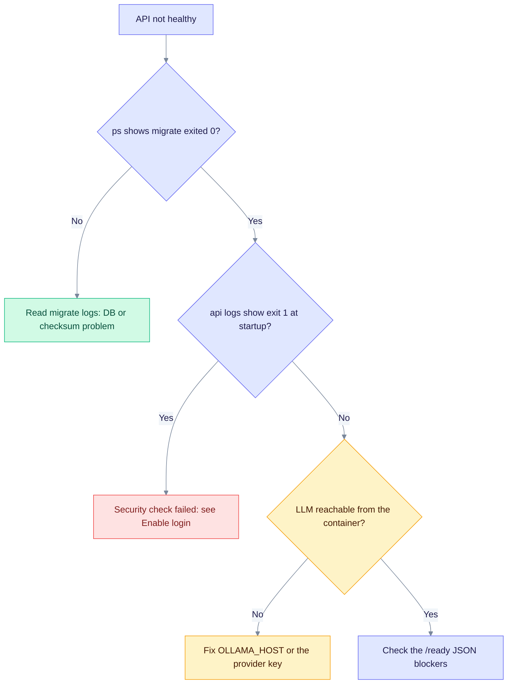

# Docker quickstart

This page is for anyone who wants EdgeQuake running in minutes. You need only Docker. You do not need Rust, Node.js or a local build. For a production deployment, read [Deployment](deployment.md) next.

## What starts

The quickstart file `docker-compose.quickstart.yml` runs four containers from prebuilt GHCR images.



An arrow means "must be ready first". `migrate` runs `edgequake migrate` once and exits. The API waits for it to finish. The web UI waits for a healthy API. The LLM runs outside the stack.

Ports bind to `127.0.0.1` only. Put a reverse proxy in front for remote access.

## Start it

### Option A: one command (no clone)

```bash
curl -fsSL https://raw.githubusercontent.com/raphaelmansuy/edgequake/edgequake-main/docker-compose.quickstart.yml \
  | docker compose -f - up -d
```

### Option B: download, then start

```bash
curl -fsSL https://raw.githubusercontent.com/raphaelmansuy/edgequake/edgequake-main/docker-compose.quickstart.yml \
  -o docker-compose.quickstart.yml
docker compose -f docker-compose.quickstart.yml up -d
curl http://localhost:8080/health
```

### Option C: guided wizard

`quickstart.sh` asks which provider you want and writes the settings for you. It needs a terminal, unless you pass `--yes`. Download it first so its prompts can read your keyboard:

```bash
curl -fsSL https://raw.githubusercontent.com/raphaelmansuy/edgequake/edgequake-main/quickstart.sh -o quickstart.sh
sh quickstart.sh

# Non-interactive:
sh quickstart.sh --yes --provider ollama

# Flags: [--yes] [--provider ollama|openai|omlx|anthropic|lmstudio] [--base-url URL] [--model ID] [--embed-model ID]
```

### Option D: with a clone

```bash
git clone https://github.com/raphaelmansuy/edgequake.git && cd edgequake
make stack
```

### Pin a version

`EDGEQUAKE_VERSION` defaults to `latest`. For anything long-lived, pin it:

```bash
EDGEQUAKE_VERSION=0.32.2 docker compose -f docker-compose.quickstart.yml up -d
```

## Open it

| Service | URL |
|---------|-----|
| Web UI | <http://localhost:3000> |
| REST API | <http://localhost:8080> |
| Swagger UI | <http://localhost:8080/swagger-ui> |
| Health | <http://localhost:8080/health> |

The API image is distroless, so there is no shell. Compose runs `edgequake healthcheck` (`GET /live`). To read the API logs, use `docker compose logs api`. You cannot use `docker exec` to open a shell.

## Choose an LLM provider

The default is Ollama on your host (`http://host.docker.internal:11434`).

```bash
# Ollama (default). Run it on the host first.
ollama serve &
ollama pull gemma4:e4b
docker compose -f docker-compose.quickstart.yml up -d

# OpenAI
EDGEQUAKE_LLM_PROVIDER=openai OPENAI_API_KEY=sk-... \
  docker compose -f docker-compose.quickstart.yml up -d

# Any OpenAI-compatible server (LM Studio, vLLM, ...)
EDGEQUAKE_LLM_PROVIDER=openai OPENAI_API_KEY=your-key OPENAI_BASE_URL=http://host.docker.internal:1234/v1 \
  docker compose -f docker-compose.quickstart.yml up -d
```

Inside a container, `localhost` means the container itself. Use `host.docker.internal` to reach a server on your machine.

Provider guides, the role matrix and how to save keys in the database are in [Providers](../providers/index.md).

## Compose settings you are likely to change

| Variable | Default | Meaning |
|----------|---------|---------|
| `EDGEQUAKE_VERSION` | `latest` | Image tag for the API, web UI and PostgreSQL. |
| `EDGEQUAKE_POSTGRES_TAG` | same as version | PostgreSQL image tag, for example `0.32.2-pg16`. |
| `EDGEQUAKE_LLM_PROVIDER` | `ollama` | LLM provider. |
| `EDGEQUAKE_LLM_MODEL` | empty | Model. Empty means the provider default. |
| `EDGEQUAKE_EMBEDDING_PROVIDER` / `EDGEQUAKE_EMBEDDING_MODEL` | empty | Embedding provider and model. Empty follows the LLM provider. |
| `EDGEQUAKE_VISION_PROVIDER` / `EDGEQUAKE_VISION_MODEL` | follow the LLM | Used for PDF to Markdown conversion. |
| `OPENAI_API_KEY`, `ANTHROPIC_API_KEY`, `GEMINI_API_KEY`, `MISTRAL_API_KEY` | empty | Cloud keys. |
| `OLLAMA_HOST` | `http://host.docker.internal:11434` | Ollama address. |
| `OLLAMA_CONTEXT_LENGTH` | `32768` | Ollama context window in tokens. |
| `EDGEQUAKE_DEV_MODE` | `true` | Open API, no login. Not for production. |
| `EDGEQUAKE_AUTH_ENABLED` | `false` | See [Enable login](auth-quickstart.md). |
| `JWT_SECRET`, `EDGEQUAKE_SECRETS_KEY` | default / empty | Set both before you leave demo mode. |
| `EDGEQUAKE_PORT` | `8080` | Host port for the API. |
| `FRONTEND_PORT` | `3000` | Host port for the web UI. |
| `POSTGRES_PASSWORD` | `edgequake_secret` | Change it for anything shared. |

The complete list is in [Configuration](configuration.md) and the [env reference](env-reference.md).

This file forwards the `EDGEQUAKE_LLM_*` pair, the embedding and vision variables, and `OPENAI_BASE_URL`. It does not forward `EDGEQUAKE_DEFAULT_LLM_PROVIDER` or `EDGEQUAKE_DEFAULT_LLM_MODEL`, so set the `EDGEQUAKE_LLM_*` variables when you use this file. (`make dev` uses the `EDGEQUAKE_DEFAULT_*` pair instead.)

The API also reads LightRAG-style aliases such as `MODEL_PROVIDER`, `CHAT_MODEL` and `EMBEDDING_MODEL`. This file does not forward them into the container, so use the `EDGEQUAKE_*` names here.

## Manage the stack

```bash
docker compose -f docker-compose.quickstart.yml ps           # status
docker compose -f docker-compose.quickstart.yml logs -f api  # logs
docker compose -f docker-compose.quickstart.yml restart api  # restart one service
docker compose -f docker-compose.quickstart.yml pull && docker compose -f docker-compose.quickstart.yml up -d   # update
docker compose -f docker-compose.quickstart.yml down         # stop, keep data
docker compose -f docker-compose.quickstart.yml down -v      # stop and delete data
```

Data lives in the `edgequake-pg-data` volume. The Makefile targets `make stack-down`, `stack-logs`, `stack-status`, `stack-restart` and `stack-pull` do the same things.

## Images

All images are multi-arch (`linux/amd64` and `linux/arm64`) and are published to GitHub Container Registry for each `vX.Y.Z` tag.

| Image | Tags |
|-------|------|
| `ghcr.io/raphaelmansuy/edgequake` | `latest`, `X.Y.Z` |
| `ghcr.io/raphaelmansuy/edgequake-frontend` | `latest`, `X.Y.Z` |
| `ghcr.io/raphaelmansuy/edgequake-postgres` | `latest`, `X.Y.Z` (PG18), `X.Y.Z-pg16`, `X.Y.Z-pg17`, `X.Y.Z-pg18`, `latest-pgNN` |

PostgreSQL extension pins: pgvector 0.8.5 on all majors. Apache AGE 1.6.0 on PG16, 1.7.0 on PG17 and 1.8.0 on PG18 (the default).

Pin the PostgreSQL major like this:

```bash
EDGEQUAKE_VERSION=0.32.2 EDGEQUAKE_POSTGRES_TAG=0.32.2-pg16 \
  docker compose -f docker-compose.quickstart.yml up -d
```

Changing the PostgreSQL major on an existing volume is not a simple image swap. Read [Upgrading](upgrading.md) first.

## Troubleshooting



Follow the first answer that matches what you see. Each end point names where to look next.

| Symptom | Cause | Fix |
|---------|-------|-----|
| API never healthy, `migrate` failed | PostgreSQL not ready, or a schema problem | `docker compose -f docker-compose.quickstart.yml logs migrate`. See [Upgrading, recovery](upgrading.md#7-recovery-symptom-cause-fix). |
| API exits right after start | A fatal security check (weak `JWT_SECRET`, missing CORS) | Run with `EDGEQUAKE_DEV_MODE=true`, or follow [Enable login](auth-quickstart.md#troubleshooting). |
| `/ready` returns 503 | Schema or index not ready | `curl -s localhost:8080/ready`. The JSON lists the blockers. |
| Entity extraction fails with "Network error" | Ollama is not running or is unreachable | `curl http://localhost:11434/api/tags` on the host. Do not set `OLLAMA_HOST` to `localhost`. |
| Port already in use | Another service owns 8080 or 3000 | `EDGEQUAKE_PORT=8081 FRONTEND_PORT=3001 docker compose -f docker-compose.quickstart.yml up -d` |
| Want a clean slate | Old data is in the volume | `docker compose -f docker-compose.quickstart.yml down -v` deletes the data, then run `up -d` again. |

To run the preflight checks inside the container, use `docker compose -f docker-compose.quickstart.yml exec api edgequake doctor`. It needs no shell, only the `edgequake` binary. Add `--json` for JSON output. It checks `DATABASE_URL`, the secrets key, `JWT_SECRET` and the bind host.

## Next steps

- [Configuration](configuration.md): models, embedding dimensions and timeouts.
- [Deployment](deployment.md): TLS, secrets and scaling.
- [Enable login](auth-quickstart.md)
- [REST API reference](../api-reference/index.md)
