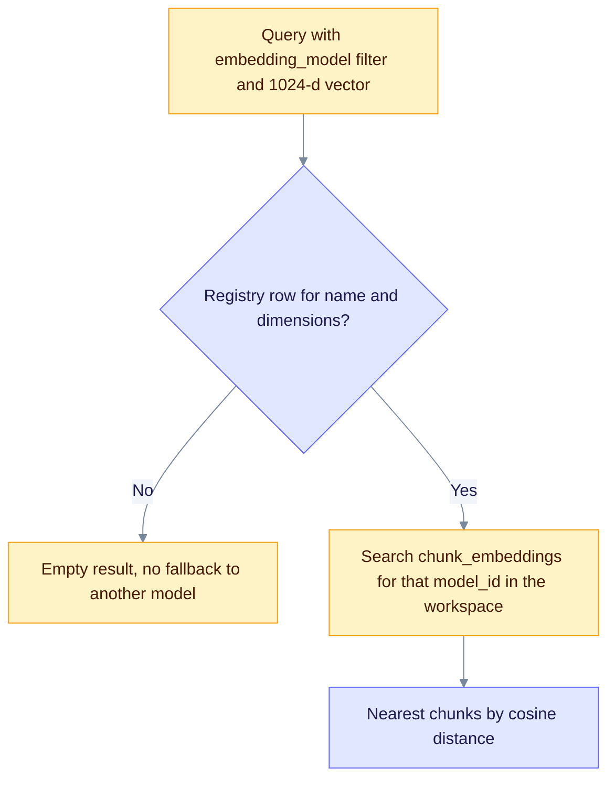
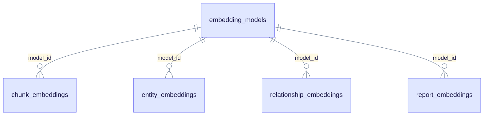

# Embedding registry audit & backfill

> **Product: v0.32.0+** · Related: [Embedding models deep dive](/docs/deep-dives/embedding-models/)

Typed approximate nearest-neighbour (ANN) search is keyed by `embedding_models(name, dimensions)`. If vectors were ingested under `mistral-embed@1024`, but the process environment or the preferred filter points at `text-embedding-3-small`, query ANN returns nothing. EdgeQuake does **not** search another model's vector space. Fix the registry rows and their stamps instead.

## How typed search finds vectors



The search never falls through to another model. A wrong name at the right dimension returns nothing, which is why a registry mismatch looks like an empty index.



Every vector family points at one registry row through `model_id`. A backfill changes which row a vector points at. It never re-embeds anything.

## 1. List registry + per-workspace counts

Replace the demo workspace ID as needed. `…0003` is the common local demo workspace.

```sql
-- Registry rows
SELECT name, dimensions, created_at
FROM embedding_models
ORDER BY name, dimensions;

-- Chunk embedding counts by model for one workspace
SELECT em.name, em.dimensions, COUNT(*) AS chunk_rows
FROM chunk_embeddings ce
JOIN embedding_models em ON em.id = ce.model_id
WHERE ce.workspace_id = '00000000-0000-0000-0000-000000000003'
GROUP BY em.name, em.dimensions
ORDER BY chunk_rows DESC;

-- Entity embedding counts (relationship_embeddings and report_embeddings use the same join)
SELECT em.name, em.dimensions, COUNT(*) AS entity_rows
FROM entity_embeddings ee
JOIN embedding_models em ON em.id = ee.model_id
WHERE ee.workspace_id = '00000000-0000-0000-0000-000000000003'
GROUP BY em.name, em.dimensions
ORDER BY entity_rows DESC;
```

## 2. Detect common mismatches

| Symptom | Likely cause |
| ------- | ------------ |
| Rows under `text-embedding-3-small` or `''`, but vectors are 1024-d | The environment default was stamped at ingest, but the real embedder was `mistral-embed` |
| Query is empty even though the workspace embedder is correct | The preferred filter name does not match the registry `name` at that dimension |
| Empty Compose `EDGEQUAKE_EMBEDDING_MODEL=` | The value must resolve through `embedding_model_key_from_env()`, not an empty string |

## 3. Backfill (explicit rename, no cross-model search)

Run a backfill only when you have confirmed that the vectors came from the target model at the target dimensions. The example below moves a mistaken `text-embedding-3-small@1024` stamp to `mistral-embed@1024` for one workspace.

```sql
BEGIN;

-- Ensure the destination registry row exists
INSERT INTO embedding_models (name, dimensions)
VALUES ('mistral-embed', 1024)
ON CONFLICT (name, dimensions) DO NOTHING;

-- Point chunk rows at the destination model ID (workspace-scoped)
UPDATE chunk_embeddings ce
SET model_id = (
  SELECT id FROM embedding_models
  WHERE name = 'mistral-embed' AND dimensions = 1024
)
WHERE ce.workspace_id = '00000000-0000-0000-0000-000000000003'
  AND ce.model_id IN (
    SELECT id FROM embedding_models
    WHERE name IN ('text-embedding-3-small', '')
      AND dimensions = 1024
  );

-- Repeat for entity_embeddings, relationship_embeddings, and report_embeddings
-- with the same workspace_id and source model_id filter.

COMMIT;
```

> **Watch for primary-key conflicts.** Each vector table has a primary key on `(model_id, chunk_id)` or `(model_id, entity_id)`. If the destination model already has a row for the same chunk or entity, the `UPDATE` fails and the transaction aborts. Run `ROLLBACK;`, resolve the overlapping rows, and try again.

After the backfill, re-check the counts in section 1. Leave orphan registry rows alone if other workspaces still use them. Do not delete registry rows globally without a fleet audit.

## 4. Verify ANN with the preferred filter

With `EDGEQUAKE_VECTOR_BACKEND=typed_embeddings` (the default), a `query_filtered` call (or an Ask in the UI) that sets `MetadataFilter.embedding_model = 'mistral-embed'` with a 1024-d query vector must return hits. The same query with a wrong name at that dimension must return nothing.

The automated proof is:

```bash
cargo test -p edgequake-storage --features postgres --test e2e_typed_ann_model_name_hit_vs_miss
```

## 5. Demo audit snapshot (local)

Run the section 1 queries against `DATABASE_URL` when it is available. On a local demo database (2026-10-07), workspace `…0003` had only `text-embedding-3-small` registry rows (768 and 1024 dimensions). Its chunk and entity counts sat under that name, with **no** `mistral-embed` row.

Do **not** rename rows to `mistral-embed` unless you have confirmed that the vectors came from that model. Mixed dimensions under one logical name still need a fleet decision before any backfill.

A preferred workspace model that is not registered at the query dimension returns empty ANN. It does not fall through to `text-embedding-3-small`. Named-entity Ask still works through graph label and seed admission. General chunk RAG needs a correct registry stamp or a rebuild.
