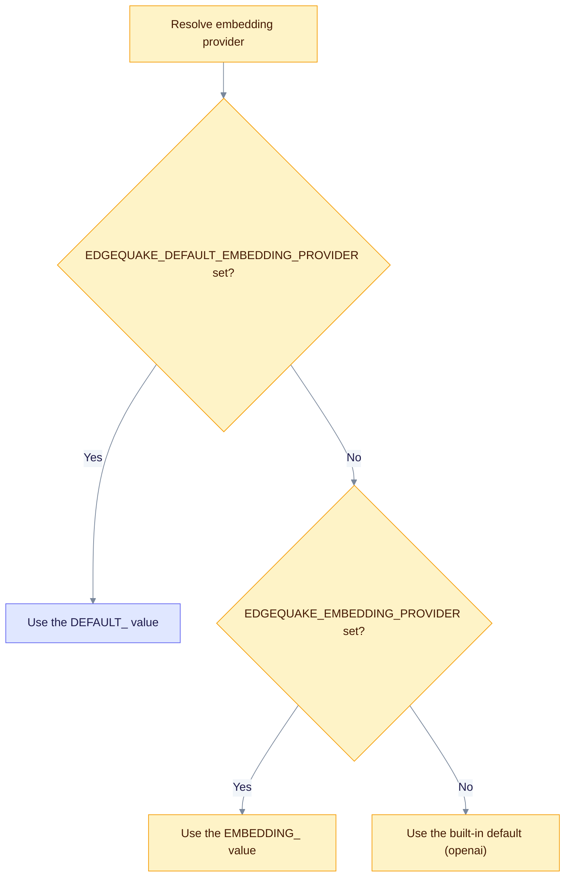

# Environment variable reference

Use this page to look up a variable name, its default, and what it controls. For how settings combine, ranges and examples, see the [configuration reference](configuration.md).

> **Maintained by hand.** `make spec163-env-docs` does not overwrite this page. It checks that every variable in `edgequake/env_registry.toml` appears here, and fails if one is missing. When you add a variable to the registry, add a row here too.

## Embedding variable precedence

Workspace defaults check the `EDGEQUAKE_DEFAULT_EMBEDDING_*` names first. The boot-time embedding override reads only the `EDGEQUAKE_EMBEDDING_*` names. Set both to the same value so the two paths agree. The same order applies to the model and dimension variables.

## Providers and models

| Variable | Default | Purpose |
| -------- | ------- | ------- |
| `EDGEQUAKE_LLM_PROVIDER` | `openai` | Process default LLM provider id. |
| `EDGEQUAKE_DEFAULT_LLM_PROVIDER` | unset | Wins over `EDGEQUAKE_LLM_PROVIDER` when both are set. |
| `EDGEQUAKE_LLM_MODEL` | `gpt-4.1-mini` | Process default chat model. |
| `EDGEQUAKE_DEFAULT_LLM_MODEL` | unset | Wins over `EDGEQUAKE_LLM_MODEL` when both are set. |
| `EDGEQUAKE_EMBEDDING_PROVIDER` | `openai` | Embedding provider. It can differ from the LLM provider. |
| `EDGEQUAKE_DEFAULT_EMBEDDING_PROVIDER` | unset | Wins over `EDGEQUAKE_EMBEDDING_PROVIDER` in workspace defaults. |
| `EDGEQUAKE_EMBEDDING_MODEL` | `text-embedding-3-small` | Embedding model id. |
| `EDGEQUAKE_DEFAULT_EMBEDDING_MODEL` | unset | Wins over `EDGEQUAKE_EMBEDDING_MODEL` in workspace defaults. |
| `EDGEQUAKE_EMBEDDING_DIMENSION` | detected from the model | Vector size, used when the catalog has no card for the model. |
| `EDGEQUAKE_DEFAULT_EMBEDDING_DIMENSION` | unset | Wins over `EDGEQUAKE_EMBEDDING_DIMENSION` in workspace defaults. |
| `EDGEQUAKE_MODELS_CONFIG` | unset | Path to a `models.toml` that replaces the bundled catalog. |
| `OLLAMA_HOST` | `http://localhost:11434` | Ollama base URL. |
| `OLLAMA_EMBEDDING_HOST` | `OLLAMA_HOST` | Separate Ollama host for embeddings. |
| `LMSTUDIO_HOST` | `http://localhost:1234` | LM Studio base URL. The name is `LMSTUDIO_HOST`, not `LM_STUDIO_BASE_URL`. |
| `OMLX_HOST` | unset | oMLX base URL. |
| `OPENAI_API_KEY` | unset | OpenAI API key. |
| `OPENAI_BASE_URL` | `https://api.openai.com/v1` | OpenAI base URL. |
| `OPENAI_COMPATIBLE_BASE_URL` | unset | Generic OpenAI-shaped server. |
| `OPENAI_COMPATIBLE_API_KEY` | unset | API key for the OpenAI-compatible server. |
| `ANTHROPIC_API_KEY` | unset | Anthropic API key. |
| `ANTHROPIC_BASE_URL` | unset | Anthropic or Anthropic-shaped base URL. |
| `MISTRAL_API_KEY` | unset | Mistral API key. |
| `GEMINI_API_KEY` or `GOOGLE_API_KEY` | unset | Gemini API key. |
| `GOOGLE_CLOUD_PROJECT`, `GOOGLE_CLOUD_REGION` | unset, `us-central1` | Vertex AI project and region. Tokens come from GCP identity. |

Provider-specific details are in [Providers](../providers/index.md) and [Configuration](configuration.md#llm-providers-and-models).

## Vision (PDF to Markdown)

| Variable | Default | Purpose |
| -------- | ------- | ------- |
| `EDGEQUAKE_VISION_PROVIDER` | `ollama` (when no LLM variable is set) | Provider for PDF page vision. |
| `EDGEQUAKE_VISION_MODEL` | provider default (`gemma4:latest` for Ollama) | Vision model. |
| `EDGEQUAKE_VISION_TIMEOUT_SECS` | `600` in Compose | Per-call vision timeout. |

## Server and logging

| Variable | Default | Purpose |
| -------- | ------- | ------- |
| `HOST` | `0.0.0.0` | API bind address. |
| `PORT` | `8080` | API port. |
| `RUST_LOG` | `edgequake=info,...` | Log filter. |
| `EDGEQUAKE_LOG_FORMAT` | `plain` | `json` for structured logs. |
| `EDGEQUAKE_LOG_SPAN_EVENTS` | off | `1` or `true` logs span close events. |
| `WORKER_THREADS` | 4 times CPU count, at least 4 | Background task workers. |

## Database

| Variable | Default | Purpose |
| -------- | ------- | ------- |
| `DATABASE_URL` | none (required) | PostgreSQL connection string. There is no in-memory mode. |
| `DATABASE_READ_URL` | unset | Read replica for the query pool. |
| `EDGEQUAKE_DB_POOL_SIZE_QUERY` | `16` | Query pool maximum. |
| `EDGEQUAKE_DB_POOL_SIZE_INGEST` | `12` | Ingest pool maximum. |
| `EDGEQUAKE_DB_POOL_SIZE_QUEUE` | `4` | Task queue pool maximum. |
| `EDGEQUAKE_DB_POOL_SIZE_ADMIN` | `2` | Admin and migrate pool maximum. |
| `EDGEQUAKE_DB_POOL_INSTANCE_COUNT` | `1` | Replica count for the boot budget check. |
| `EDGEQUAKE_DB_POOL_BUDGET_MODE` | `warn` | `warn` or `fail` when the pools exceed the connection budget. |
| `DATABASE_POOL_SIZE` | `32` | Sizes the interactive read-path limiter. |
| `EDGEQUAKE_DOCUMENTS_READ_TIMEOUT_MS` | `2500` | Deadline for catalog reads. Expired reads return 503 `read_path_busy`. |

## Ingestion and extraction

| Variable | Default | Purpose |
| -------- | ------- | ------- |
| `EDGEQUAKE_CHUNK_TIMEOUT_SECS` | `180` cloud, `600` local | Per-chunk LLM timeout. |
| `EDGEQUAKE_CHUNK_MAX_RETRIES` | `3` | Attempts per chunk. |
| `EDGEQUAKE_CHUNK_RETRY_DELAY_MS` | `1000` | First retry backoff. |
| `EDGEQUAKE_MAX_CONCURRENT_EXTRACTIONS` | `16` cloud, `1` local | Parallel extraction calls per document. |
| `EDGEQUAKE_ALLOW_LOCAL_HIGH_CONCURRENCY` | `0` | `1` lifts the caps that apply to local providers. |
| `EDGEQUAKE_LLM_TIMEOUT_SECS` | `600` cloud, `900` local | HTTP timeout for LLM calls. |
| `EDGEQUAKE_LLM_MAX_TOKENS` | `16384` | Maximum response tokens. |
| `EDGEQUAKE_EXTRACTION_MODE` | `llm` | Fleet default extraction mode: `llm` or `decision`. |
| `EDGEQUAKE_EXTRACTION_LANGUAGE` | `English` | Default extraction language. A workspace can override it. |
| `EDGEQUAKE_CITATION_REQUIRE` | `1` | Merged items must carry source chunk IDs. |
| `EDGEQUAKE_CONTEXTUAL_CHUNK` | `0` | Add a context preamble to each chunk. |

## Workers, tasks and replicas

| Variable | Default | Purpose |
| -------- | ------- | ------- |
| `MAX_TASKS_PER_TENANT` | about three quarters of workers | Ingest tasks per tenant. `0` disables the cap. |
| `MAX_LIFECYCLE_TASKS_PER_TENANT` | same as the ingest cap | Delete and reprocess lane cap. |
| `EDGEQUAKE_TASK_LEASE_TTL_SECS` | `120` (minimum `30`) | Claim lease for a task. |
| `EDGEQUAKE_REPLICAS` | `1` | Intended API process count. |
| `EDGEQUAKE_TASK_DELIVERY` | `local` | `local`, `bridged` or `notify_only`. Required when replicas is above 1. |
| `EDGEQUAKE_STARTUP_AUTO_RESUME` | on | Reclaim interrupted tasks at boot. `0` marks them Failed. |
| `TASK_PROCESSING_TIMEOUT_SECS` | per-document profile | Overrides the convert and ingest timeouts. |

## Caches and data layer

| Variable | Default | Purpose |
| -------- | ------- | ------- |
| `EDGEQUAKE_MIGRATION_MODE` | `verify` | `off`, `verify` or `automatic`. |
| `EDGEQUAKE_LLM_CACHE` | `1` | Master switch for the keyword and answer caches. |
| `EDGEQUAKE_PROMPT_CACHE` | `1` | Provider prompt-cache hints. |
| `EDGEQUAKE_PROMPT_CACHE_TTL` | `5m` | Anthropic and Bedrock cache TTL: `5m` or `1h`. |
| `EDGEQUAKE_NATIVE_GRAPH_WRITES` | `1` | Native AGE upserts. `0` uses Cypher MERGE. |
| `EDGEQUAKE_HNSW_EF_CONSTRUCTION` | `128` | HNSW build parameter for new indexes. |
| `EDGEQUAKE_HNSW_ITERATIVE_SCAN` | `relaxed_order` | pgvector iterative scan mode. |

## Security and authentication

| Variable | Default | Purpose |
| -------- | ------- | ------- |
| `EDGEQUAKE_AUTH_ENABLED` | on | Explicit auth on or off. Wins over dev mode. |
| `EDGEQUAKE_DEV_MODE` | `false` | Open API for local use. |
| `JWT_SECRET` | insecure default | JWT HMAC secret, at least 32 bytes. Fatal at boot if weak and dev mode is off. |
| `JWT_EXPIRY_SECONDS` | `900` | Access token lifetime. |
| `EDGEQUAKE_SECRETS_KEY` | unset | 32-byte envelope key for stored connection secrets. |
| `EDGEQUAKE_SETUP_TOKEN` | unset | Required header for `POST /api/v1/setup/initialize` when set. |
| `EDGEQUAKE_CORS_ORIGINS` | unset | Comma-separated allowed origins. |
| `EDGEQUAKE_RATE_LIMIT_ENABLED` | `false` | Turn on rate limiting. |
| `EDGEQUAKE_STRICT_STARTUP` | `false` | Turn startup warnings into fatal errors. |

Full guides: [Enable login](auth-quickstart.md) and [Runtime auth hardening](runtime-auth-hardening.md).

## Observability (Langfuse)

| Variable | Default | Purpose |
| -------- | ------- | ------- |
| `LANGFUSE_PUBLIC_KEY`, `LANGFUSE_SECRET_KEY` | unset | With both set, trace export turns on. |
| `LANGFUSE_BASE_URL` | `https://cloud.langfuse.com` | Langfuse UI and OTLP base URL. |
| `EDGEQUAKE_LANGFUSE_API` | `auto` | `auto`, `otlp` or `ingestion`. |

## Decision extraction (preview)

| Variable | Default | Purpose |
| -------- | ------- | ------- |
| `EDGEQUAKE_DECISION_ENABLED` | on | `0` locks decision extraction off. `workspace` lets each workspace opt in. |
| `EDGEQUAKE_DECISION_MODEL` | `tev1:0.8b` | Default decision model tag. |
| `EDGEQUAKE_DECISION_BASE_URL` | `http://localhost:11434` | Decision Ollama URL. It does not follow `OLLAMA_HOST`. |
| `EDGEQUAKE_DECISION_PACK_SIZE` | `4` | Questions per request (1 to 16). |
| `EDGEQUAKE_DECISION_TIMEOUT_SECS` | `600` | Per-request timeout. |

Details: [Configuration: decision extraction](configuration.md#decision-extraction-spec-160-preview).

## Web UI

| Variable | Default | Purpose |
| -------- | ------- | ------- |
| `EDGEQUAKE_API_URL` | set by `make dev` | API URL the Web UI server uses at runtime. |
| `EDGEQUAKE_HEALTH_POLL_MS` | unset | Health poll interval. Unset means one probe on load. |
| `NEXT_PUBLIC_AUTH_ENABLED`, `NEXT_PUBLIC_DISABLE_DEMO_LOGIN` | build-time | Login UI switches in custom builds. |
