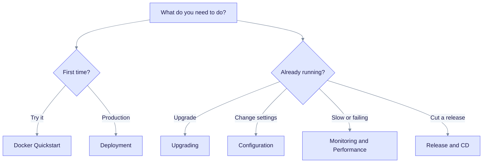

# Operations

This section is for people who run EdgeQuake: platform engineers, SREs, and anyone who owns a deployment. Start here to find the right page for your task.

> **Current release: v0.33.0** · Schema train **169** · Contract: OpenAPI

## Operating rules

These rules keep a deployment predictable:

- **The API does not change the schema at startup by default.** `EDGEQUAKE_MIGRATION_MODE` defaults to `verify`, which only checks. Run `edgequake migrate` first (see [Upgrading](upgrading.md)).
- **Use readiness probes, not sleeps.** `/live` means the process is up. `/ready` means it can take traffic.
- **Fail closed.** An invalid or missing workspace context returns an error, not a guess.
- **Pin the Rust toolchain.** Local builds and CI then give the same result.
- **Keep heavy checks out of the fast loop.** Coverage and full E2E run separately from the quick gates.

## Find your page

How to read it: pick the branch that matches your situation. Each leaf is a page in the table below.

## Pages

| I want to... | Page |
|--------------|------|
| Run the full stack in one command | [Docker Quickstart](docker-quickstart.md) |
| Pick an image option (API only, prebuilt, source) | [Docker deployment options](docker-deployment-options.md) |
| Deploy to bare metal, Compose, Kubernetes or GCP | [Deployment](deployment.md) |
| Look up an environment variable | [Configuration](configuration.md) and the [env reference](env-reference.md) |
| Choose and connect an LLM provider | [Providers](../providers/index.md) |
| Turn on login | [Enable login](auth-quickstart.md) |
| Harden authentication for production | [Runtime auth hardening](runtime-auth-hardening.md) |
| Upgrade the database and images | [Upgrading](upgrading.md) |
| Watch health, metrics and logs | [Monitoring](monitoring.md) |
| Make ingestion and queries faster | [Performance tuning](performance-tuning.md) |
| Fix stalled local extraction (Ollama, LM Studio) | [Local extract reliability](local-extract-reliability.md) |
| Debug missing metadata or lineage | [Metadata debugging](metadata-debugging.md) |
| Fix empty vector search after an embedding change | [Embedding registry backfill](embedding-registry-backfill.md) |
| Repair the entity spine or edge index (SPEC-098) | [Entity spine ensure](spec098-entity-spine-ensure.md) |
| Send traces to Langfuse 3.1.x | [Langfuse 3.1.x](langfuse-3.1.md) |
| Cut a release | [Release and CD](release-and-cd.md) and the [pre-delivery checklist](pre-delivery-checklist.md) |
| Read what changed in a release | [Upgrade to v0.33.0](upgrade-to-0.33.0.md), [v0.32.2](upgrade-to-0.32.2.md), [v0.32.1](upgrade-to-0.32.1.md) |
| Use decision extraction (preview) | [Decision extraction](../concepts/decision-extraction.md) |
| Understand cancel, lease and fairness | [Ingestion cancel and fairness](../ingestion-cancel-and-fairness.md) |
