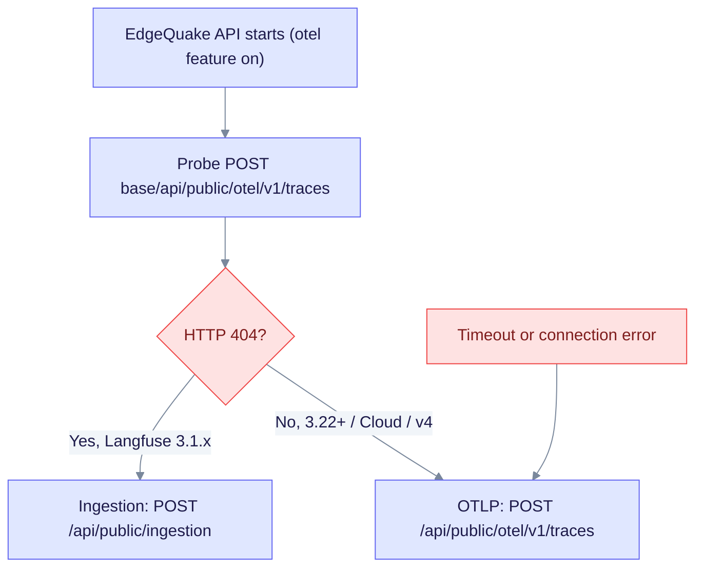

# EdgeQuake + Langfuse 3.1.x

This page explains how to send EdgeQuake RAG traces to a **self-hosted Langfuse 3.1.x** instance, including 3.1.1. It is for operators who run Langfuse 3.1 and cannot upgrade yet. Langfuse 3.1 has no OTLP trace endpoint, so EdgeQuake falls back to the legacy native ingestion API.

Langfuse added OTLP (`POST /api/public/otel/v1/traces`) in [v3.22.0](https://github.com/langfuse/langfuse/releases/tag/v3.22.0). Langfuse 3.1.x returns HTTP 404 on that path. EdgeQuake's default `EDGEQUAKE_LANGFUSE_API=auto` probes the path once at startup. It uses the native ingestion API (`POST /api/public/ingestion`) only when the probe gets a 404.



The probe runs once per API start. A timeout or connection error also selects OTLP, so check `api_resolved` after every restart (see section 4).

This is a **compatibility bridge**. Langfuse Cloud sunsets trace events on the ingestion API on **2026-11-16**, and self-hosted Langfuse v4 `events_only` rejects it. Prefer upgrading Langfuse to **3.22 or later**, or use the in-repo v4 Compose file or Helm chart.

Operator references: [OBSERVABILITY.md](../OBSERVABILITY.md) · [Kubernetes](../../deploy/kubernetes/README.md#existing-langfuse-31x) · SPEC-124.

---

## 1. Point EdgeQuake at this Langfuse

Create a project in **that** Langfuse instance and copy **its** keys. A `pk-lf-` / `sk-lf-` pair is valid only on the host that issued it.

| Variable | 3.1 requirement |
|----------|-----------------|
| `LANGFUSE_BASE_URL` | Origin of the 3.1 UI/API, with no trailing path. **Never leave it empty**, because an empty value falls back to Langfuse Cloud. Alias: `LANGFUSE_HOST`. |
| `LANGFUSE_PUBLIC_KEY` | `pk-lf-…` from this instance |
| `LANGFUSE_SECRET_KEY` | `sk-lf-…` from this instance (never logged, never shown in the UI) |
| `LANGFUSE_PROJECT_ID` | Optional. Used for settings deep links. If unset, EdgeQuake fetches it once from `GET /api/public/projects`. |
| `EDGEQUAKE_LANGFUSE_API` | **`auto`** (default). Use `ingestion` only to skip the probe. Do **not** set `otlp` against 3.1.x. |

Restart the API after you change these. `export_active: true` only means the keys are present. Always check `base_url` and `api_resolved`.

---

## 2. Local: isolated Langfuse 3.1.1 (this repo)

This stack does not replace `make langfuse-up`, which runs Langfuse v4 on port `:3310`. Langfuse 3.1.1 runs as a separate Compose project on port `:3320`.

```bash
# Start Langfuse 3.1.1 (the worker restarts after the web Prisma migrations)
make langfuse-3.1-up

# In repo-root .env (unquoted; make backend-bg sources it):
LANGFUSE_PUBLIC_KEY=pk-lf-edgequake-311
LANGFUSE_SECRET_KEY=sk-lf-edgequake-311-dev
LANGFUSE_BASE_URL=http://localhost:3320
LANGFUSE_PROJECT_ID=edgequake-local-311
# EDGEQUAKE_LANGFUSE_API=auto

make kill-app && make backend-bg   # or: make dev
```

| Item | Value |
|------|-------|
| UI | http://localhost:3320 |
| Headless keys | `pk-lf-edgequake-311` / `sk-lf-edgequake-311-dev` |
| Project id | `edgequake-local-311` |

Stop the stack with `make langfuse-3.1-down` (volumes are kept). Wipe it with `make langfuse-3.1-reset CONFIRM=yes`. The reset does not touch the v4 stack on `:3310`.

Run the unfakable proof (version pin, OTLP 404, and a real exporter write):

```bash
make spec124-langfuse-3.1-e2e
```

OTLP itself starts at **Langfuse 3.22.0**, not 3.2.x. Local pins and current Cloud:

```bash
make spec124-langfuse-3.22-e2e    # 3.22.0 UI :3330 — route exists + auto-probe=Otlp
make spec124-langfuse-3.225-e2e   # 3.225.5 UI :3340 — OTLP persist (current 3.x)
make spec124-langfuse-cloud-e2e   # current Cloud (LANGFUSE_* in .env)
make spec124-langfuse-matrix      # 3.1.1 + 3.22.0 + 3.225.5 + Cloud
```

The 3.22.0 release's first OTLP protobuf parser raises `Invalid time value` on current OpenTelemetry timestamps. Persistence is proven on **3.225.5** and Cloud, not on the 3.22.0 tag.

---

## 3. Existing self-hosted 3.1.x (Docker, VM, or Kubernetes)

Use the same three secrets and base URL. Set them on the EdgeQuake API process, not on Langfuse.

**Docker or systemd:**

```bash
export LANGFUSE_BASE_URL=http://langfuse.internal.example:3000
export LANGFUSE_PUBLIC_KEY=pk-lf-...
export LANGFUSE_SECRET_KEY=sk-lf-...
export EDGEQUAKE_LANGFUSE_API=auto
```

The Compose files in this repo (`docker-compose.yml`, the quickstart, API-only, and prebuilt files) pass `EDGEQUAKE_LANGFUSE_API` through when it is set.

**Kubernetes or Helm.** Use in-cluster DNS. Never use `localhost` inside the API pod.

```yaml
# deploy/kubernetes/helm/edgequake/values.yaml  (api.langfuse)
api:
  langfuse:
    baseUrl: "http://langfuse-web.langfuse.svc.cluster.local:3000"  # your 3.1 Service
    projectId: "your-project-id"
    existingSecret: edgequake-langfuse-secret   # LANGFUSE_PUBLIC_KEY + LANGFUSE_SECRET_KEY
    api: auto   # Helm → EDGEQUAKE_LANGFUSE_API (ConfigMap)
```

The Kind and Helm setup in this repo still pins Langfuse v4 for SPEC-138. To point Helm at a customer-managed 3.1 instance, keep `api: auto`, use that instance's keys, and confirm `api_resolved` is `ingestion`. Full Helm notes are in [deploy/kubernetes/README.md](../../deploy/kubernetes/README.md#existing-langfuse-31x).

---

## 4. Verify (do not skip)

Confirm the instance is 3.1.x and has no OTLP route:

```bash
curl -sS "$LANGFUSE_BASE_URL/api/public/health" | jq .version
# expect 3.1.x

curl -sS -o /dev/null -w '%{http_code}\n' \
  -X POST "$LANGFUSE_BASE_URL/api/public/otel/v1/traces" \
  -u "$LANGFUSE_PUBLIC_KEY:$LANGFUSE_SECRET_KEY" \
  -H 'Content-Type: application/x-protobuf'
# expect 404
```

Confirm that EdgeQuake resolved **ingestion** (after an API restart):

```bash
curl -sS http://localhost:8080/api/v1/settings/langfuse \
  | jq '{export_active, base_url, api, api_resolved, project_id}'
```

| Field | Healthy 3.1 wiring |
|-------|--------------------|
| `export_active` | `true` |
| `base_url` | **your** 3.1 origin, not `https://cloud.langfuse.com` |
| `api` | `auto` (requested) |
| `api_resolved` | **`ingestion`** |

The same facts appear in `GET /health` under `operational.observability` as `langfuse_api` and `langfuse_api_resolved`. The Settings page's **Langfuse Observability** card shows `Transport: ingestion (auto)`.

Then run a query or ingest a document. In the 3.1 UI, LLM calls appear as **GENERATION** and everything else as **SPAN**. The `retriever`, `embedding`, and `chain` types are not first-class in 3.1.1, so they appear as SPAN. Rich types need OTLP on 3.22 or later.

If the Cost column shows `$0.00`, Langfuse's model catalogue is the cause. EdgeQuake never emits cost attributes. Optional: run `make langfuse-sync-prices`.

---

## 5. Troubleshooting

| Symptom | Cause | Fix |
|---------|-------|-----|
| `api_resolved` is `otlp` on a 3.1 host | The probe did not see a 404. A proxy or ingress may have swallowed the path, or the probe timed out. | Route `/api/public/otel/v1/traces` to Langfuse so it returns 404. Or set `EDGEQUAKE_LANGFUSE_API=ingestion`. |
| Traces go to Cloud, not on-prem | `LANGFUSE_BASE_URL` is empty or unset | Set the in-cluster or internal URL. An empty value means Cloud. |
| HTTP 401 on ingestion | Keys come from a different Langfuse | Recreate the keys in **this** project. |
| `export_active: true` but the UI is empty | The worker raced Prisma on first boot | Restart `langfuse-worker` after the web service is ready. `make langfuse-3.1-up` does this for the repo stack. |
| Forced `otlp` against 3.1 | `EDGEQUAKE_LANGFUSE_API=otlp` | Unset it or set `auto`. |
| Illegal `{retriever,embedding,chain}-create` | Old exporter | Current code maps those types to `span-create` only. |

---

## 6. Upgrade path

When Langfuse is **3.22 or later** (or Cloud, or the in-repo v4 stack), leave `EDGEQUAKE_LANGFUSE_API=auto`. The probe no longer gets a 404, so `api_resolved` becomes `otlp`. No EdgeQuake code change is required.
