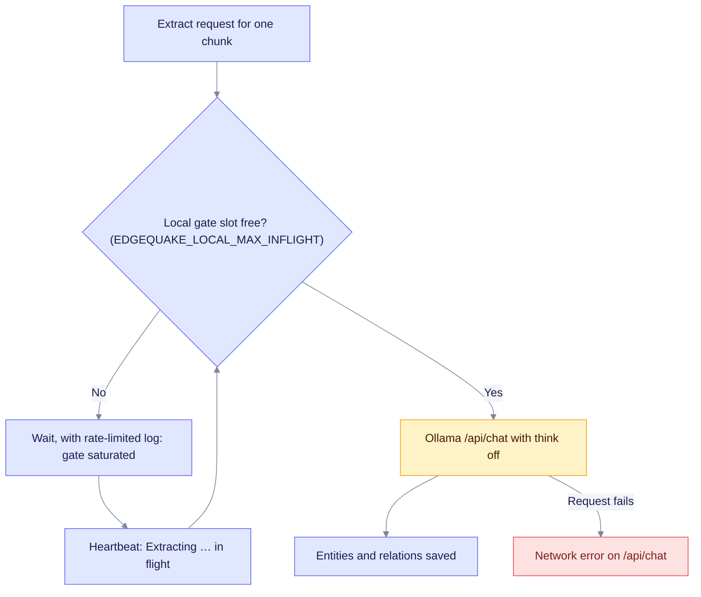

# Local extract reliability (Ollama / LM Studio)

Use this runbook when knowledge-graph extraction stalls with `Network error … /api/chat` or `Local inference gate saturated`. Both symptoms appear when a single-slot Ollama runner (`-np 1`) receives more requests than it can serve at once.

## How requests queue



A single slot serializes extraction. Waiting shows up as heartbeats, not as connection errors. A `Network error` means the request to Ollama failed at the connection level.

## Recommended local profile

| Knob | Value | Why |
|------|-------|-----|
| `OLLAMA_CONTEXT_LENGTH` | `8192` | Avoids the cost of a 128k runner for extraction |
| `EDGEQUAKE_MAX_CONCURRENT_EXTRACTIONS` | `1` | Matches the Ollama serial slot. The Makefile sets it only for cloud providers (default `32`), so set it yourself for local runs. |
| `EDGEQUAKE_PROVIDER_BUDGET` / `EDGEQUAKE_LOCAL_MAX_INFLIGHT` | `1` | The gate admits one in-flight chat |
| `EDGEQUAKE_EXTRACT_REASONING_EFFORT` | `none` | Turns thinking off for extraction (`think: false` on Ollama) |
| Extract model | `gemma4:latest` (or cloud) | Prefer over 35B for bulk PDFs |

When Ollama or LM Studio is the default provider, `make dev` and `make backend-bg` export `OLLAMA_CONTEXT_LENGTH`, `EDGEQUAKE_PROVIDER_BUDGET`, `EDGEQUAKE_LOCAL_MAX_INFLIGHT`, and `EDGEQUAKE_EXTRACT_REASONING_EFFORT` for you. They do not set `EDGEQUAKE_MAX_CONCURRENT_EXTRACTIONS`.

## Unblock a stuck document

1. Restart the backend so the think-off and admission settings take effect:

   ```bash
   make stop
   export OLLAMA_CONTEXT_LENGTH=8192
   export EDGEQUAKE_MAX_CONCURRENT_EXTRACTIONS=1
   export EDGEQUAKE_PROVIDER_BUDGET=1
   export EDGEQUAKE_EXTRACT_REASONING_EFFORT=none
   make backend-bg   # or make dev
   ```

2. Prefer a smaller extract model for the workspace (Settings → models) if it still uses `qwen3.6:35b*`.
3. Cancel the stuck track under Documents → Active run, then requeue or re-upload the document.
4. Confirm health. The backend port defaults to `8090`; check `make status` if you changed it:

   ```bash
   curl -s http://localhost:8090/health | jq .providers
   ```

## Success signals

- `Network error` is rare when you extract one document at a time against a healthy Ollama.
- Gate saturation shows as waiting plus a heartbeat (`Extracting … in flight`), not as connection storms.
- Extraction requests to Ollama send `"think": false`. The test `e2e_extract_ollama_qwen_sends_think_false` checks this flag.
