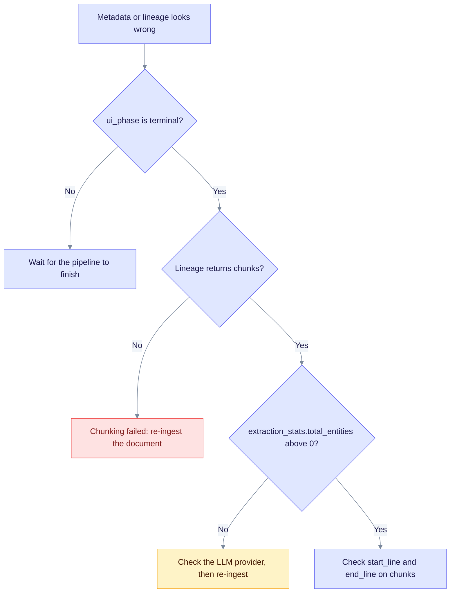

> **Product: v0.32.2** · Contract: OpenAPI · Spec ops: [Ingestion cancel & fairness](../ingestion-cancel-and-fairness.md)

# Metadata Debugging Guide

Use this guide when a document's metadata, lineage, chunks or entities look wrong. It gives the checks to run in order, the common failure modes, and how to repair each one. It is written for operators and developers who debug the ingestion pipeline.

## Diagnostic checklist

Work through these checks in order. Stop at the first one that fails.

1. Read `display_status` and `ui_phase`, not the raw `status` alone.
2. Confirm the document is terminal (`completed`, `failed` or `cancelled`).
3. For PDFs, separate convert (`pdf_processing`) from ingest (`insert`).
4. Confirm the metadata KV entry exists.
5. Confirm chunks are stored with position data.
6. Confirm the lineage KV entry is populated.
7. Confirm entities reference valid chunk IDs.
8. Confirm model names are recorded.

The decision tree below maps the first checks to the API calls in the sections that follow.



Each leaf names the next check. Only the terminal state is safe to debug, because a running document still changes.

## Document status SSOT (SPEC-057 P4)

The document list and detail JSON include presentation fields from `IngestionStatusMapper`. Use these fields instead of re-deriving state from the legacy `status` and `current_stage` fields.

| Field | Meaning |
| ----- | ------- |
| `display_status` | Badge key, for example `cancelled`, `failed`, `completed`, `converting` or `extracting`. |
| `ui_phase` | `idle`, `running`, `stopping` or `terminal`. Show **Stopping…** when the value is `stopping`. |

### Convert vs ingest

PDF admission runs convert only (`TaskType::PdfProcessing`). After the markdown is stored and the PDF row is `Completed`, a separate insert task runs knowledge-graph extraction.

So a PDF that shows `Completed` has finished conversion only. The document KV may still show `extracting` while ingest runs.

### Cancel terminals

| Terminal | Task row | Doc KV | PDF row (when applicable) |
| -------- | -------- | ------ | ------------------------- |
| Cancelled | `Cancelled` | `cancelled`, `failure_class=cancelled` | `Cancelled` (not `Failed`) |
| Interrupted (boot, no auto-resume) | `Failed` | Reprocess-eligible | unchanged |
| Completed | ingest done | `completed` | `Completed` + markdown |

Cancel API: `POST /api/v1/tasks/{track_id}/cancel`. Full semantics: [Ingestion cancel & fairness](../ingestion-cancel-and-fairness.md).

## Quick diagnostics

### Check document status

```bash
curl -s http://localhost:8080/api/v1/documents/{document_id} | jq '.display_status'
```

Expected: `"completed"`. `"failed"` means the pipeline stopped with an error. If `ui_phase` is still `running`, wait and check again.

### Check metadata exists

```bash
curl -s http://localhost:8080/api/v1/documents/{document_id}/metadata | jq 'keys'
```

Expected: an array of keys that includes `document_type` and `sha256_checksum` for uploaded PDFs.

### Check chunk count

```bash
curl -s http://localhost:8080/api/v1/documents/{document_id}/lineage | jq '.chunks | length'
```

Expected: a number above 0. If it is 0, chunking failed or the chunks were not stored.

### Check entity count

```bash
curl -s http://localhost:8080/api/v1/lineage/documents/{document_id} | jq '.extraction_stats'
```

Expected: `total_entities` above 0. If it is 0, entity extraction failed. Check the LLM provider.

## Common issues

### Issue 1: Missing metadata fields

**Symptom**: `/api/v1/documents/{id}/metadata` returns empty or minimal fields.

**Cause**: The document was ingested by an older build, before the lineage fields were written.

**Diagnosis**:

```bash
curl -s http://localhost:8080/api/v1/documents/{document_id}/metadata | jq 'keys'
```

**Fix**: Re-ingest the document. New ingestion writes `document_type` and `sha256_checksum`. PDFs also get `pdf_id`.

### Issue 2: Chunks without line numbers

**Symptom**: `start_line` and `end_line` are `null` in the chunk lineage response.

**Cause**: The chunk was created before position tracking existed, or the chunking strategy does not track lines.

**Diagnosis**:

```bash
curl -s http://localhost:8080/api/v1/chunks/{chunk_id}/lineage | jq '{start_line, end_line}'
```

**Fix**: Re-ingest the document. Position data is set during chunking.

### Issue 3: Entity extraction failed

**Symptom**: The document shows `Completed` but has 0 entities.

**Cause**: The LLM provider was unavailable during processing.

**Diagnosis**:

```bash
# Check if Ollama is running and which models it has
curl -s http://localhost:11434/api/tags | jq '.models[].name'

# Check backend logs for extraction errors
grep -i "entity.*error\|extraction.*fail" /tmp/edgequake-backend.log
```

**Fix**:

1. Make sure the LLM provider is running:

   ```bash
   ollama serve &
   ollama pull gemma4:latest
   ```

2. Re-upload the document, or call `POST /api/v1/documents/reprocess` for documents that failed.

### Issue 4: Missing model name in extraction metadata

**Symptom**: `extraction_metadata.model` is `null` or missing in the chunk lineage response.

**Cause**: Likely an older build, or an extraction that did not complete (see Issue 3).

**Diagnosis**:

```bash
curl -s http://localhost:8080/api/v1/chunks/{chunk_id}/lineage | jq '.extraction_metadata'
```

The chunk lineage response has no top-level `llm_model` or `embedding_model` fields. Read the model from `extraction_metadata.model`.

**Fix**: Re-ingest the document.

### Issue 5: Broken PDF to document link

**Symptom**: The document has no `pdf_id`, although it was uploaded as a PDF.

**Cause**: The document was processed before the PDF and document were linked.

**Diagnosis**:

```bash
curl -s http://localhost:8080/api/v1/documents/{document_id}/metadata | jq '.pdf_id'
```

**Fix**: Re-upload the PDF. Admission writes `pdf_id` into the document metadata.

### Issue 6: Lineage not persisted

**Symptom**: `/api/v1/documents/{id}/lineage` returns no lineage, or the lineage KV entry does not exist.

**Cause**: `enable_lineage_tracking` was `false` when the document was processed.

**Note**: The pipeline default is `enable_lineage_tracking: true`. Check the value in your configuration if you turned it off.

---

## Backend logs

### Log locations

| Service  | Location                       |
| -------- | ------------------------------ |
| Backend  | `/tmp/edgequake-backend.log`   |
| Frontend | `/tmp/edgequake-frontend.log`  |

These paths apply when you start the stack with `make dev-bg`.

### Useful log searches

```bash
# Find extraction errors
grep -i "extract.*error\|extract.*fail" /tmp/edgequake-backend.log

# Find metadata storage events
grep -i "metadata.*store\|metadata.*set" /tmp/edgequake-backend.log

# Find chunk storage events
grep -i "chunk.*store\|chunk.*upsert" /tmp/edgequake-backend.log

# Find lineage persistence events
grep -i "lineage.*persist\|lineage.*store" /tmp/edgequake-backend.log

# Check processing times
grep -i "processing.*complete\|pipeline.*finish" /tmp/edgequake-backend.log
```

### Enable debug logging

```bash
export RUST_LOG=debug
make dev
```

For more granular control:

```bash
export RUST_LOG="edgequake_api=debug,edgequake_pipeline=debug,edgequake_core=info"
```

---

## Verification commands

### Verify the full lineage chain

Use this script to check a document's complete lineage:

```bash
#!/bin/bash
DOC_ID=$1

echo "=== Document Status ==="
curl -s "http://localhost:8080/api/v1/documents/$DOC_ID" | jq '{display_status, ui_phase}'

echo -e "\n=== Metadata ==="
curl -s "http://localhost:8080/api/v1/documents/$DOC_ID/metadata" | jq '{document_type, sha256_checksum, pdf_id}'

echo -e "\n=== Lineage Summary ==="
curl -s "http://localhost:8080/api/v1/documents/$DOC_ID/lineage" | jq '{chunks: (.chunks | length), entities: (.entities | length)}'

echo -e "\n=== Extraction Stats ==="
curl -s "http://localhost:8080/api/v1/lineage/documents/$DOC_ID" | jq '.extraction_stats'

echo -e "\n=== First Chunk Lineage ==="
CHUNK_ID="${DOC_ID}-chunk-0"
curl -s "http://localhost:8080/api/v1/chunks/$CHUNK_ID/lineage" | jq '{start_line, end_line, entity_count, extraction_model: .extraction_metadata.model}'
```

The first chunk ID follows the pattern `{document_id}-chunk-0`.

### Validate API health

```bash
curl -s http://localhost:8080/health | jq
```

Expected:

```json
{
  "status": "healthy",
  "storage_mode": "postgresql",
  "components": {
    "kv_storage": true,
    "vector_storage": true,
    "graph_storage": true,
    "llm_provider": true
  }
}
```

---

## Repair strategies

### Strategy 1: Re-ingest the document

Delete the document and upload it again. This is the simplest fix for missing metadata.

```bash
# Delete the document
curl -X DELETE http://localhost:8080/api/v1/documents/{document_id}

# Upload it again
curl -X POST http://localhost:8080/api/v1/documents/upload \
  -F "file=@/path/to/document.pdf"
```

### Strategy 2: Check provider configuration

```bash
# Verify the active LLM provider
curl http://localhost:8080/health | jq '.llm_provider_name'

# Verify Ollama models are available
curl http://localhost:11434/api/tags | jq '.models[].name'

# If you use OpenAI, confirm the key is set (do not print it)
[ -n "$OPENAI_API_KEY" ] && echo "OPENAI_API_KEY is set"
```

### Strategy 3: Check the database

```bash
# Check that the PostgreSQL container is running
docker ps | grep edgequake-postgres

# Restart the database if needed
make db-stop && make db-start && sleep 5

# Restart the stack
make stop && make dev-bg
```

---

## Performance monitoring

### Query latency

Track lineage query performance:

```bash
# Time a lineage query
time curl -s http://localhost:8080/api/v1/documents/{document_id}/lineage > /dev/null
```

As a rule of thumb, aim for a P95 under 200 ms. This is a guideline, not an enforced limit. If queries are slower, check:

- The number of chunks in the document
- The number of entities in the graph
- PostgreSQL connection pool utilization

### Storage size

```bash
# Count documents
curl -s http://localhost:8080/api/v1/documents | jq '.total'

# Count entities and chunks in one workspace
curl -s http://localhost:8080/api/v1/workspaces/{workspace_id}/stats | jq '{entity_count, relationship_count, chunk_count}'
```

---

## Related documentation

- [Architecture: Lineage Tracking](../architecture/lineage-tracking.md)
- [API Reference: Lineage Endpoints](../api-reference/lineage-endpoints.md)
- [Tutorial: Tracing Entity Sources](../tutorials/tracing-entity-sources.md)
