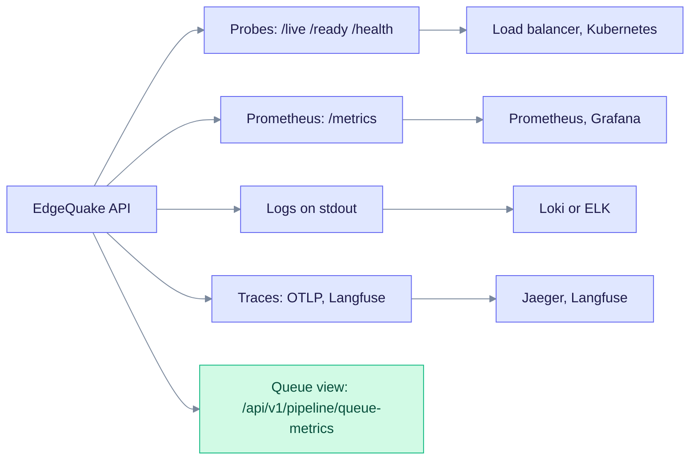
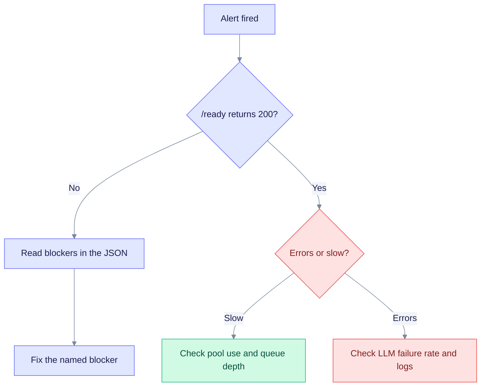

# Monitoring guide

This guide is for operators who watch EdgeQuake in production. It shows what to probe, what to scrape, what to alert on, and how to read the answer when something is wrong. For slow systems, also read [Performance tuning](performance-tuning.md).

## What EdgeQuake exposes



Each box on the left of an arrow is a signal, and the box on the right is its usual consumer. Probes and logs need no extra setup, so start with those.

## Health endpoints

| Endpoint | Meaning | HTTP status | Use it for |
|----------|---------|-------------|-----------|
| `GET /live` | The process is up. | 200 | Liveness probe and the Docker healthcheck. |
| `GET /ready` | The API can take traffic. | 200, or 503 with blockers | Readiness probe and load balancer. |
| `GET /health` | Detailed status. | Always 200 | Dashboards and people. |
| `GET /metrics` | Prometheus metrics. | 200 | Scraping. |
| `GET /api/v1/pipeline/queue-metrics` | Ingest backlog and fairness. | 200 | Capacity checks. |

`/live`, `/ready`, `/health` and `/metrics` are served outside the API login layer. Restrict `/metrics` at your proxy or network. `/api/v1/pipeline/queue-metrics` needs a login when auth is on. Give that scraper an API key or a bearer token.

### /health

```bash
curl -s http://localhost:8080/health | jq .
```

```json
{
  "status": "healthy",
  "version": "0.32.2",
  "storage_mode": "postgresql",
  "workspace_id": "default",
  "components": {"kv_storage": true, "vector_storage": true, "graph_storage": true, "llm_provider": true},
  "llm_provider_name": "ollama"
}
```

`status` is `healthy` or `degraded`. Extra blocks appear when they apply: `schema` (the latest applied migration and the applied count), `providers`, `operational`, `capabilities`, `attribution`, `build_info` and `security_posture`.

`security_posture` shows what the API decided at boot:

| Field | Meaning |
|-------|---------|
| `auth_enabled`, `dev_mode` | Authentication and open mode. |
| `secrets_key_configured` | `EDGEQUAKE_SECRETS_KEY` is set. |
| `jwt_secret_is_default` | You are still on the shipped JWT secret. Fix this before production. |
| `rate_limit_enabled` | Rate limiting is on. |
| `swagger_enabled` | Swagger UI is served. |

When `/health` reports `degraded`, the web UI shows a "Busy" pill and polls every 5 seconds until the state clears.

### /ready

```json
{ "ready": false, "blockers": ["store_contention_critical(pool_util=Some(0.92),quarantine=6)"], "operator_action": "Scale DB pool or reduce ingest; inspect compensation quarantine DLQ" }
```

A ready API returns 200 with `"ready": true` and an empty `blockers` list.

| Blocker | Cause | Fix |
|---------|-------|-----|
| `migration_038`, `migration_042`, `migration_092` and other `migration_NNN` | A schema or index step is missing or degraded. | Run `edgequake migrate` (see [Upgrading](upgrading.md)). |
| `missing_hnsw_index`, `eq_id_schema` | A required index or schema element is missing. | Run `edgequake migrate`. |
| `pgvector_cve_floor` | pgvector is older than 0.8.2. | Upgrade pgvector to 0.8.2 or newer (0.8.5 is the pinned version). |
| `storage_ping_failed(...)` | The KV, vector or graph ping failed or timed out. | Check `DATABASE_URL` and pool saturation. |
| `task_queue_critical(pending=N)` | The backlog is above the critical level. | Raise `WORKER_THREADS` or slow ingestion. |
| `store_contention_critical(...)` | Pool use is above 0.90, or the compensation quarantine is above 5. | Resize the pools. Inspect the quarantine (see [Ingestion cancel and fairness](../ingestion-cancel-and-fairness.md)). |
| `wave2_ann_probe_error(...)` | The vector index check failed. | `POST /api/v1/admin/ann/warmup`, or fix pgvector access. |

With `EDGEQUAKE_SCHEMA_GATE=wait`, `/ready` returns 503 until `migrate` finishes (see [Upgrading](upgrading.md#4-what-happens-at-api-boot)).

An HTTP 503 whose JSON body has `"kind": "read_path_busy"` means an interactive read (for example documents or tenants) hit its wait or work deadline. The body includes `retry_after_ms`. It does not mean `/ready` failed. See [common issues](../troubleshooting/common-issues.md).

### Queue metrics

```bash
curl -s http://localhost:8080/api/v1/pipeline/queue-metrics | jq .
```

| Field | Meaning |
|-------|---------|
| `pressure` | `normal`, `elevated` or `critical`. Matches the `/ready` queue gate. |
| `tenant_park_waiters` | Tasks waiting on the fairness limit. Expected with local LLMs. |
| `cancel_intent_count`, `cancel_intent_total` | Cancels in flight, and the lifetime total. |
| `max_tasks_per_tenant` | The effective cap per tenant. |
| `store_contention.level`, `.db_pool_utilization`, `.compensation_quarantine_total` | Database pressure and failed merge clean-ups. |

Many waiters with a quiet quarantine means fairness is working. A rising quarantine points at AGE or pgvector delete errors.

## Prometheus metrics

Scrape `GET /metrics`. All metric names start with `edgequake_`.

| Metric | Type | Labels | Meaning |
|--------|------|--------|---------|
| `edgequake_http_requests_total` | counter | `method`, `path`, `status` | HTTP requests. IDs in paths become `:id`. |
| `edgequake_http_request_duration_seconds` | histogram | `method`, `path` | HTTP latency. |
| `edgequake_query_requests_total`, `edgequake_query_duration_seconds` | counter, histogram | `mode`, `outcome` | RAG queries. |
| `edgequake_llm_requests_total`, `edgequake_llm_request_duration_seconds` | counter, histogram | `provider`, `operation`, `outcome` | LLM calls. |
| `edgequake_document_processing_total`, `edgequake_document_processing_duration_seconds` | counter, histogram | `task_type`, `stage`, `outcome` | Ingestion work. |
| `edgequake_ingestion_failures_total` | counter | `failure_class`, `workspace` | Failed documents. |
| `edgequake_task_queue_pending`, `_processing`, `_failed` | gauge | none | Task queue sizes. |
| `edgequake_db_pool_connections` | gauge | `role`, `state` (`total`, `idle`, `active`, `max`) | Pool use per role. |
| `edgequake_storage_errors_total`, `edgequake_pipeline_errors_total` | counter | `category`, `error_code` | Errors by class. |
| `edgequake_rate_limit_exceeded_total` | counter | `scope` | Requests answered with 429. |
| `edgequake_compensation_quarantine_total` | counter | `kind` | Merge clean-up failures. |
| `edgequake_vector_ann_index_missing` | gauge | none | Vector tables without an ANN index. |
| `edgequake_storage_drift_violations_total`, `edgequake_storage_drift_critical` | counter, gauge | none | Storage drift checks. |

The list grows with each release, so `GET /metrics` is the authority. Quality metrics (`edgequake_faithfulness_*` and `edgequake_citation_*`) cover answer checks.

### Example alert rules

```yaml
groups:
  - name: edgequake
    rules:
      - alert: EdgeQuakeHighErrorRate
        expr: sum(rate(edgequake_http_requests_total{status=~"5.."}[5m])) / sum(rate(edgequake_http_requests_total[5m])) > 0.01
        for: 5m
        labels: { severity: critical }
        annotations: { summary: "More than 1% of requests fail" }

      - alert: EdgeQuakeSlowRequests
        expr: histogram_quantile(0.99, sum by (le) (rate(edgequake_http_request_duration_seconds_bucket[5m]))) > 2
        for: 10m
        labels: { severity: warning }
        annotations: { summary: "p99 latency above 2 seconds" }

      - alert: EdgeQuakePoolNearlyFull
        expr: max by (role) (edgequake_db_pool_connections{state="active"} / on(role) edgequake_db_pool_connections{state="max"}) > 0.8
        for: 5m
        labels: { severity: warning }
        annotations: { summary: "A connection pool is above 80% use" }

      - alert: EdgeQuakeQueueBacklog
        expr: edgequake_task_queue_pending > 100
        for: 15m
        labels: { severity: warning }
        annotations: { summary: "More than 100 tasks waiting" }

      - alert: EdgeQuakeLlmFailures
        expr: sum(rate(edgequake_llm_requests_total{outcome="failure"}[5m])) / sum(rate(edgequake_llm_requests_total[5m])) > 0.05
        for: 10m
        labels: { severity: warning }
        annotations: { summary: "More than 5% of LLM calls fail" }
```

Also alert on a blackbox probe of `/ready` that returns non-200 for 2 minutes. The pool and quarantine thresholds come from `EDGEQUAKE_DB_POOL_UTIL_WARN` (default 0.75), `EDGEQUAKE_DB_POOL_UTIL_CRITICAL` (0.90), `EDGEQUAKE_COMPENSATION_QUARANTINE_WARN` (default 1) and `EDGEQUAKE_COMPENSATION_QUARANTINE_CRITICAL` (default 5).

## Logs

Logs go to stdout through the `tracing` crate. The default format is plain text. Set `EDGEQUAKE_LOG_FORMAT=json` for structured logs. The Helm chart sets it.

| `RUST_LOG` | Use |
|------------|-----|
| `edgequake=info,tower_http=info,sqlx=warn` | Production. |
| `edgequake=debug,tower_http=debug` | Development. |
| `edgequake_pipeline=debug` | Ingestion. |
| `edgequake_query=debug` | Query engine. |
| `sqlx=debug` | SQL statements. |

Ship stdout to Loki, ELK or your cloud logger with your usual agent (Promtail, Filebeat or Fluent Bit). EdgeQuake needs no specific logging configuration. With Docker, use `docker compose logs -f api`.

## Tracing

OpenTelemetry tracing comes from the `edgequake-observability` crate.

| Capability | How |
|------------|-----|
| HTTP spans | `http_request`. |
| Pipeline spans | `pipeline_chunk_extraction` for chunk extraction. |
| OTLP export | Set `OTEL_EXPORTER_OTLP_ENDPOINT`, or set `EDGEQUAKE_OTEL_ENABLED=1`. The image must be built with OTEL (the Docker build argument `ENABLE_OTEL`, which defaults to `true` in the source Compose file). |
| Correlation | `X-Request-ID` and W3C `traceparent` headers. |
| Langfuse | Set `LANGFUSE_PUBLIC_KEY` and `LANGFUSE_SECRET_KEY`. See [Langfuse 3.1.x](langfuse-3.1.md). |

To run Jaeger with the source Compose stack:

```bash
cd edgequake/docker
docker compose -f docker-compose.yml -f docker-compose.observability.yml --profile observability up --build
# Jaeger UI: http://localhost:16686
```

Production settings: `EDGEQUAKE_LOG_FORMAT=json`, `OTEL_EXPORTER_OTLP_ENDPOINT=http://collector:4317` and `OTEL_SERVICE_NAME=edgequake-api`. Operator guide: [OBSERVABILITY.md](../OBSERVABILITY.md).

## Check configuration with doctor

`edgequake doctor` (add `--json` for JSON output) checks `DATABASE_URL`, the secrets key, `JWT_SECRET` and the bind host, without starting the server. `POST /api/v1/providers/test` tests a provider before you save it. `GET /health` and `GET /api/v1/models/health` probe the live provider.

## PostgreSQL checks

```sql
-- Connections by state
SELECT state, wait_event_type, count(*) FROM pg_stat_activity
WHERE datname = 'edgequake' GROUP BY 1, 2;

-- Connections per EdgeQuake pool role
SELECT application_name, count(*) FROM pg_stat_activity
WHERE application_name LIKE 'edgequake:%' GROUP BY 1;

-- Long-running queries
SELECT pid, now() - query_start AS duration, left(query, 120) AS query
FROM pg_stat_activity
WHERE state <> 'idle' AND now() - query_start > interval '5 minutes';

-- Largest tables
SELECT relname, pg_size_pretty(pg_total_relation_size(relid)) AS size
FROM pg_catalog.pg_statio_user_tables ORDER BY pg_total_relation_size(relid) DESC LIMIT 10;

-- Vector indexes
SELECT indexname, pg_size_pretty(pg_relation_size(indexname::regclass)) AS size
FROM pg_indexes WHERE indexdef LIKE '%hnsw%' OR indexdef LIKE '%ivfflat%';

-- Applied schema
SELECT max(version) FROM public._sqlx_migrations WHERE success;
```

To count graph nodes, query the AGE graph. Use the graph name from `ag_catalog.ag_graph`:

```sql
SELECT * FROM ag_catalog.cypher('<graph>', $$ MATCH (n) RETURN count(n) $$) AS (count agtype);
```

Alert on PostgreSQL itself (connections above 80% of `max_connections`, cache hit ratio under 95%, replication lag) with your usual exporter.

## Troubleshooting



Start with `/ready`, because it names its own cause. If it is green, decide whether the problem is slowness or failures, then follow that branch.

| Symptom | Check | Fix |
|---------|-------|-----|
| High memory | `edgequake_task_queue_processing`, pool sizes, `shared_buffers`, `work_mem` | Lower `EDGEQUAKE_MAX_CONCURRENT_EXTRACTIONS` or the worker count. |
| Slow queries | `RUST_LOG=edgequake_query=debug,sqlx=debug`. PostgreSQL `log_min_duration_statement = 1000`. | See [Performance tuning](performance-tuning.md). |
| LLM errors | `edgequake_llm_requests_total{outcome="failure"}`, the provider status page, `edgequake doctor`, `POST /api/v1/providers/test`. | Check keys, quotas and `OLLAMA_HOST`. |
| Documents stuck | `/api/v1/pipeline/queue-metrics`, logs. | See [Local extract reliability](local-extract-reliability.md). |

## Backups

EdgeQuake has no built-in backup job. Back up PostgreSQL with `pg_dump -Fc` or volume snapshots, and keep `EDGEQUAKE_SECRETS_KEY` safe too. Test restores. Alert from your backup tool, for example when the last successful backup is older than 24 hours.

## See also

- [Deployment](deployment.md)
- [Configuration](configuration.md)
- [Troubleshooting guide](../troubleshooting/common-issues.md)
