## Pre-delivery checklist (v0.19+)

Run these gates **before** you tag a release. Prefer the Makefile targets, because they set the required environment variables.

```mermaid
%%{init: {"theme":"base","themeVariables":{"primaryColor":"#E0E7FF","primaryBorderColor":"#6366F1","primaryTextColor":"#1E1B4B","secondaryColor":"#D1FAE5","secondaryBorderColor":"#10B981","secondaryTextColor":"#064E3B","tertiaryColor":"#FEF3C7","tertiaryBorderColor":"#F59E0B","tertiaryTextColor":"#6B7A90","lineColor":"#7A889C","clusterBkg":"rgba(99,102,241,0.07)","clusterBorder":"#A5B4FC","noteBkgColor":"#FEF9C3","noteTextColor":"#422006","textColor":"#6B7A90","titleColor":"#6B7A90","signalColor":"#7A889C","signalTextColor":"#6B7A90","loopTextColor":"#6B7A90","edgeLabelBackground":"#F1F5F9","actorLineColor":"#94A3B8"}}}%%
%% eq-theme:v1
flowchart LR
  A["Local gates: make release-gates, make spec046-acc"] --> B["SPEC-001 Acc: make bench (local only)"]
  B --> C["CI green: CI, Test Quality Gates, SPEC-046 ACC"]
  C --> D["Tag vX.Y.Z and push"]
  D --> E["Release Docker (GHCR) workflow"]
```



Run the cheap local gates first, then the slow Acc run, and only then push the tag. The tag triggers the image build.

```bash
# Fast local gates (mirrors CI first principles: fail cheap, compile once, then prove)
make ops17-smoke                # PG extension pin SSOT (pg16/17/18)
make spec046-acc                # SPEC-046 ACC + AccReport JSON
make release-gates              # fmt + workspace clippy + SPEC-006/018 + WebUI + version parity
make test-e2e-lint              # Playwright flake anti-patterns
# SPEC-001 LightRAG Acc (local mandatory before tag — not in CI / release_gates.sh):
make bench001-doctor
make bench                      # EQ vs LightRAG Acc n=200 + publish/latest
# Optional UI-only check (no backend): make test-e2e-ui
```

| Gate | What it proves | CI workflow |
|------|----------------|-------------|
| Migration checksum | Migration files match the immutable SQL lockfile | `CI` → migration-checksum-guard |
| fmt + clippy + lib tests | Code quality | `CI` → check / test (nextest) |
| SPEC-006 / SPEC-018 | Resource and observability proofs | `CI` + `Release Gates` |
| Invariants + test floor | Reliability floor (at least 870 lib tests) | `Test Quality Gates` |
| SPEC-046 ACC | Hybrid RAG science ACC | `SPEC-046 ACC` |
| SPEC-001 LightRAG Acc | EQ vs LightRAG GraphRAG-Bench Acc (n=200) | **Local only** (`make bench`) |
| OPS-17 pins | pgvector and AGE pin matrix | `PostgreSQL Matrix Nightly` |

**CI speed principles** (see `.github/workflows/ci.yml`): a shared cargo cache across jobs, `CARGO_INCREMENTAL=0` with the sparse index, `--locked`, cancel-in-progress, and no duplicate workspace lib suite in sibling workflows. The release gates skip per-crate clippy and the lib tests when CI already runs them.

See [AGENTS.md](../../AGENTS.md) for the full developer workflow, and [Release & CD](../operations/release-and-cd.md) for the release process.
