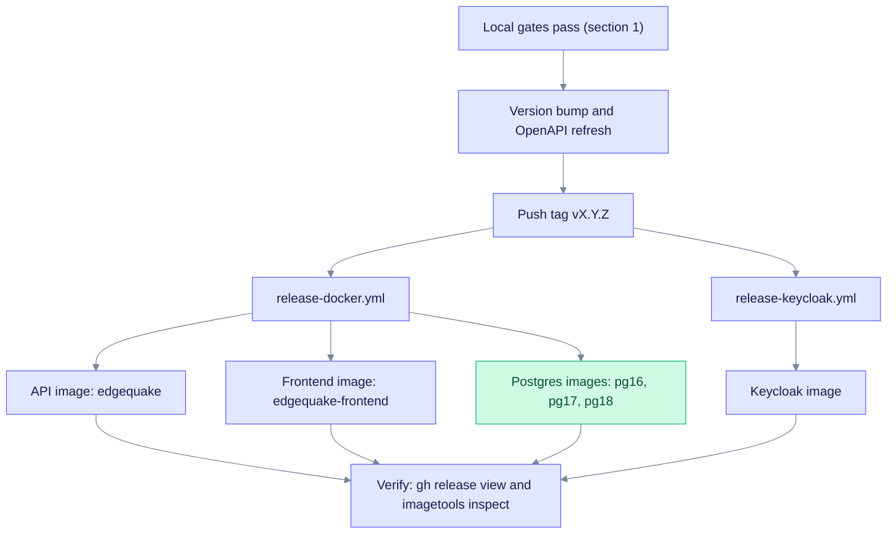

# Release & CD Cycle

This runbook covers cutting a product release: the local quality gates, the tag-triggered Docker publish, and the checks after publish. Workspace crates are **not** published to crates.io. Product delivery is GHCR Docker images, built when you push a `vX.Y.Z` tag.

> **Product: v0.33.0** · Contract: OpenAPI · Spec ops: [Ingestion cancel & fairness](../ingestion-cancel-and-fairness.md)
>
> Upgrade: [upgrade-to-0.33.0.md](upgrade-to-0.33.0.md) (SPEC-163 connections; schema **169**). Earlier guides: [0.32.2](upgrade-to-0.32.2.md) and [0.32.0](upgrade-to-0.32.0.md) (schema **168**), [0.31.0](upgrade-to-0.31.0.md) (schema **166**), [0.30.0](upgrade-to-0.30.0.md) (schema **165**), [0.29.0](upgrade-to-0.29.0.md) (schema **163**), [0.28.5](upgrade-to-0.28.5.md) (schema **162**).
>
> **SPEC-001 Acc (this cut):** attested existing [`publish/latest`](../../specs/001-benchmark/e2e/artifacts/publish/latest/) (`valid: true`, medical-mid, `2026-08-15T11:02:18Z`) — no fresh n=200 run; **connections, schema gating, and the query UI not re-scored**. Decision mode is unscored.
>
> **Pinned crates.io versions** (`edgequake/Cargo.toml`): `edgequake-llm` 0.10.9, `edgequake-pdf2md` 0.9.11, `edgeparse-core` 0.3.2. The Rust SDK in `sdks/rust` is version 0.4.0.

## Release pipeline



One tag push publishes every image. Run the verification step only after both workflows are green.

## 1) Local Release Gates (must pass before tag)

```bash
make ops17-smoke            # PG pin SSOT (fast, no Docker)
make spec046-acc            # SPEC-046 Hybrid RAG ACC + JSON artifact
make codegen-openapi-refresh # OpenAPI snapshot + schema.d.ts from ApiDoc
cd edgequake && cargo test -p edgequake-api --test spec027_api_contract && cd ..
make release-gates          # fmt + workspace clippy + SPEC-006/018 + WebUI + version/OpenAPI parity
                            # + migration checksum lock + epoch coverage + schema train parity
make test-e2e-lint          # Playwright flake anti-patterns
# SPEC-001 LightRAG Acc (local mandatory — see section below; not in release_gates.sh / CI):
make bench001-doctor
make bench                  # or: make bench-warm
# Optional deeper proofs:
make spec020-qc-proof-strict # SPEC-020 E2E (migration-038 strict)
make spec020-qc-proof-full    # SPEC-020 + require Ollama (0 skips)
make spec150-matrix-quick    # key epochs → HEAD on PG16/17/18 (FORCE_REPLAY)
make stop
make spec013-proof-pr
cd edgequake && cargo clippy -p edgequake-pipeline -p edgequake-core -p edgequake-api --all-targets --features postgres -- -D warnings
cd ../edgequake_webui && bunx tsc --noEmit -p tsconfig.release.json
cd .. && make backend-bg frontend-bg && make spec013-proof-ui
```

### Does this release change the schema?

Every upgrade guide and CHANGELOG entry must answer these questions:

| Question | Where to record |
|----------|-----------------|
| New numbered migration(s)? | Highest `NNN_*.sql`; `manifest.toml` `compat_serve_max` |
| Epoch coverage? | Add `[[epoch]]` to `scripts/spec150/epochs.toml` if the migration set is new |
| Operator steps? | Link [upgrading.md](upgrading.md); note if migrate is a no-op |
| Acc re-score needed? | Honest residual in the cut notes |

`scripts/release_gates.sh` fails if checksums drift, if a published tag lacks an epoch, or if the docs claim a schema maximum other than the highest numbered migration.

### Gate options

- **Clippy:** `make release-gates` runs workspace clippy. It also runs a slower per-crate clippy loop unless `RELEASE_SKIP_PER_CRATE_CLIPPY=1` is set.
- **Lib tests:** the script runs the workspace lib tests unless `RELEASE_SKIP_LIB_TESTS=1` is set.
- **CI:** the release workflows set both variables, because `ci.yml` already runs the lib suite and per-crate clippy is redundant with workspace clippy.

**OpenAPI / Swagger (required before tag):** regenerate with `make codegen-openapi-refresh`, then run `cargo test -p edgequake-api --test spec027_api_contract`. On a running API, `curl -s http://localhost:8080/api-docs/openapi.json | jq -r '.info.version'` must equal `VERSION`.

**Package dry-run (not a crates.io upload):**

```bash
cd edgequake
for c in edgequake-observability edgequake-storage edgequake-pdf edgequake-pipeline \
         edgequake-query edgequake-tasks edgequake-auth edgequake-audit \
         edgequake-rate-limiter edgequake-core edgequake-api; do
  cargo package -p "$c" --allow-dirty --no-verify 2>/dev/null || cargo package -p "$c" --list >/dev/null
done
```

## 2) CI Validation (GitHub Actions)

- `CI` (fmt, clippy, nextest lib, docs, build) must be green.
- `Test Quality Gates` (invariants, test-count floor, e2e lint and UI) must be green.
- `Release Gates` must be green, or the tag push runs the same preflight inside `release-docker.yml`.
- `SPEC-046 ACC` must be green when query, storage, or spec paths change.
- `SPEC-013 PR Proof` and the PostgreSQL integration tests must be green when those paths change.
- Ignore unrelated external automation failures (for example Dependabot noise) only when all required project gates are green.

**Speed knobs:** a shared Swatinem cache (`shared-key: edgequake-ci`), sparse crates.io index, no incremental builds, `--locked`, cancel-in-progress, and no duplicate workspace lib compile across Quality Gates and Release Gates.

**Docker CD anti-flake gates** (run by `make release-gates` and `scripts/release_gates.sh`):

- `scripts/check_docker_api_context.sh`: Cargo `[[bench]]` and `[[example]]` paths must exist, the Dockerfile must `COPY` them, and `.dockerignore` must not exclude them.
- `next.config.ts` size-limit guard: `proxyClientMaxBodySize` must be numeric (`DEFAULT_MAX_UPLOAD_BYTES`).
- The README badge version must match `VERSION`, Cargo, and `package.json`.
- Per-crate package versions must be `version.workspace = true` or equal `VERSION`.
- `edgequake_webui/openapi/openapi.snapshot.json` `info.version` must equal `VERSION`.

## 3) Cut the Release

Push the version tag after the local gates pass:

```bash
git tag vX.Y.Z
git push origin vX.Y.Z
```

The tag triggers two workflows:

- `.github/workflows/release-docker.yml` builds multi-arch API, frontend, and triple-track Postgres images. It pushes `:VERSION` and `:latest` tags, plus `:VERSION-pg16`, `:VERSION-pg17`, and `:VERSION-pg18`, to GHCR. It creates or updates the GitHub Release notes for the tag.
- `.github/workflows/release-keycloak.yml` builds the Keycloak image after smoke-testing it with `scripts/keycloak_smoke.py`.

Both `linux/amd64` (ubuntu-latest) and `linux/arm64` (native ARM64 runner, no QEMU) are built in parallel and merged into one multi-arch manifest. The same tag works on x86 servers, Apple Silicon Macs, and AWS Graviton instances.

**Manual run and republish:**

- To run the Docker workflow without a new tag, use **Actions → Release — Docker (GHCR) → Run workflow** and enter `tag_name`.
- To republish after a CD fix on a release branch, run `gh workflow run "Release — Docker (GHCR)" --ref release/vX.Y.Z -f tag_name=vX.Y.Z`. The workflow builds from the branch and still publishes the `X.Y.Z` and `latest` tags.

**Do not use `make version-tag`.** It commits, tags, and pushes in one step, so it skips the review of the local gates. Use the explicit `git tag` and `git push` commands above.

## 4) Post-Publish Verification

```bash
gh release view vX.Y.Z
docker buildx imagetools inspect ghcr.io/raphaelmansuy/edgequake:X.Y.Z
docker buildx imagetools inspect ghcr.io/raphaelmansuy/edgequake-frontend:X.Y.Z
docker buildx imagetools inspect ghcr.io/raphaelmansuy/edgequake-postgres:X.Y.Z
docker buildx imagetools inspect ghcr.io/raphaelmansuy/edgequake-postgres:X.Y.Z-pg16
docker buildx imagetools inspect ghcr.io/raphaelmansuy/edgequake-postgres:X.Y.Z-pg17
docker buildx imagetools inspect ghcr.io/raphaelmansuy/edgequake-postgres:X.Y.Z-pg18
docker buildx imagetools inspect ghcr.io/raphaelmansuy/edgequake-keycloak:X.Y.Z
```

## Docker Images Published Per Release

| Image | Tags | Description |
|-------|------|-------------|
| `ghcr.io/raphaelmansuy/edgequake` | `VERSION`, `latest` | Backend API server |
| `ghcr.io/raphaelmansuy/edgequake-frontend` | `VERSION`, `latest` | Next.js web UI |
| `ghcr.io/raphaelmansuy/edgequake-postgres` | `VERSION`, `VERSION-pg16`, `VERSION-pg17`, `VERSION-pg18`, `latest` | PostgreSQL with pgvector and AGE |
| `ghcr.io/raphaelmansuy/edgequake-keycloak` | `VERSION`, `latest` | Keycloak 26.8 or later, with the EdgeQuake realm (SPEC-158) |

## Building the Image Locally

The Dockerfile is `edgequake/docker/Dockerfile`. It uses a two-stage build (Rust builder, then Debian slim runtime). **The build context is the monorepo root.** `edgequake-pdf2md` is pulled from crates.io at compile time, so no sibling checkout is needed. pdfium is embedded through `pdfium-auto`, so no external shared library is needed.

```bash
# Build for host architecture (from repo root)
docker build -f edgequake/docker/Dockerfile . -t edgequake:local

# Multi-platform build (requires docker buildx)
docker buildx build \
  --platform linux/amd64,linux/arm64 \
  -f edgequake/docker/Dockerfile . \
  -t edgequake:local --load
```

## Development Workflow

See [AGENTS.md](../../AGENTS.md) for the full developer workflow, including Make commands, database migrations, resource safety, and the specification workflow.

## PostgreSQL Version Tiers

| Tier | PostgreSQL | pgvector | Apache AGE | Notes |
|------|-----------|----------|-----------|-------|
| PG16 | 16.x | 0.8.5 | 1.6.0 | Legacy, stable |
| PG17 | 17.x | 0.8.5 | 1.7.0 | Modern supported |
| PG18 | 18.x | 0.8.5 | 1.8.0 | Default and recommended (SPEC-068 pin) |

See the [PostgreSQL migration guide](../../edgequake/docs/migrations/postgres-triple-track-spec042.md) for tier details. The pin matrix lives in `edgequake/docker/extension-pins.sh`.

## SPEC-042 Verification (before tag)

```bash
make check-extension-pins          # pg16 + pg17 + pg18 pin SSOT
make spec042-battle-test-all       # docker battle suite (all tiers + #275)
make dev-e2e-proof-all             # dev-stack /health proof per profile
```

## SPEC-001 LightRAG Acc (before tag)

**Mandatory local gate** before tagging a product cut. Dual-SUT GraphRAG-Bench Acc (EdgeQuake `mix` vs LightRAG `mix`, medical-mid **n=200**) is **not** part of `make release-gates` or GitHub Actions. It needs Mistral keys, Postgres, LightRAG, and roughly 1 to 3 hours or more of wall time. It is the same class as the SPEC-042 battle tests: required at cut time, not in CI.

**Not substitutes:** `make spec046-acc` (deterministic Hybrid ACC, no LightRAG) · `make bench001-smoke-acc` (n=40 daily only; **not** the release Acc score) · an "EQ beats LightRAG" claim (the promote checklist stops it unless CI excludes 0).

### Prerequisites

- `MISTRAL_API_KEY` for the SUT and the judge. Also export `LLM_API_KEY=$MISTRAL_API_KEY` if needed.
- Postgres running, and an Acc-pinned backend (`make bench` starts it through `bench001-acc-backend`).
- LightRAG importable, either as the pip package or through `BENCH001_LIGHTRAG_REPO=/path/to/LightRAG`.
- Optional warm reuse: `BENCH001_EQ_WORKSPACE_ID=<full-corpus-uuid>`.

Protocol: [SPEC-001 index](../../specs/001-benchmark/000-index.md) · runbook [010](../../specs/001-benchmark/010-smoke-then-core-runbook.md) · public source of truth [eq-vs-lightrag-acc-bench](../comparisons/eq-vs-lightrag-acc-bench.md).

### Commands

```bash
export MISTRAL_API_KEY=...
make bench001-doctor          # EQ /health, keys, LightRAG, fixture preflight
make bench                    # Acc backend → doctor → medical-mid n=200 → publish/latest/
# Warm query-only (full-corpus workspace already ingested):
# export BENCH001_EQ_WORKSPACE_ID=<uuid>   # or omit for auto-resolve
# make bench-warm
```

An optional early fail is `make bench001-smoke-acc` (n=40). It does **not** replace `make bench`.

### Pass criteria (fail-closed)

| Check | Requirement |
|-------|-------------|
| Validity | `specs/001-benchmark/e2e/artifacts/publish/latest/scorecard.json` → `valid: true` (dual-SUT, official judge, L2, empty-answer and empty-context rate ≤ 5%) |
| Pins | Fair Acc profile (`P0_mistral_small_mix_chunk1200_*`), EQ and LR `mix`, chunk 1200/100, extract **40/100 + `EDGEQUAKE_EXTRACT_CAPS_SELECTION=fifo`** (SPEC-117), retrieve top-k **30** |
| Artifacts | `publish/latest/`: `BUSINESS_REPORT.md`, `EXEC_SUMMARY.txt`, `SUMMARY.md`, `scorecard.json` |
| Claims | Peer or statistical-tie language only, unless the [080 promote checklist](../../specs/001-benchmark/001-edgquake-improvements/080-phase-g-promote-checklist.md) is green |

After a successful run, refresh [docs/comparisons/eq-vs-lightrag-acc-bench.md](../comparisons/eq-vs-lightrag-acc-bench.md) if the Acc numbers or archive pointers moved. Do **not** tag until this gate is green, or until an explicitly attested, current `valid: true` pack exists for the cut.

## Upgrade notes: SPEC-091 (v0.22.0 to v0.23.0)

Published **v0.22.0** stops at migration **105**. **v0.23.0** adds migrations **106–141**, including irreversible drops (`125` KV, `126` chunk-vector, `131` fleet-vector). Do **not** treat a routine image bump as safe until the soak gate is green.

- Short guide: [migrate-to-0.23.md](./migrate-to-0.23.md)
- Operator runbook: [spec091-upgrade-from-v0.22.0.md](./spec091-upgrade-from-v0.22.0.md)
- Automated multi-tenant soak: `make spec93-migration-assessment` (PG16, 17, and 18 realism; see [`specs/93-migration-assessment/`](../../specs/93-migration-assessment/)). Smoke: `make spec091-upgrade-soak`.
- Spec status: [`specs/091-simplify-data-layer/README.md`](../../specs/091-simplify-data-layer/README.md)
- **Boot migration gating (LD-15, behavior change):** images built from HEAD never auto-migrate at container start. Boot exits **78** with a dry-run or migrate hint when the schema is behind or newer. Release notes must call this out. Deploys need a one-shot migrate step (a Compose service or a Kubernetes Job; examples are in the runbook) before new replicas can start. Spec: [`specs/091-simplify-data-layer/17-boot-migration-gating.md`](../../specs/091-simplify-data-layer/17-boot-migration-gating.md)

## Lessons from past cuts

- **OpenAPI refresh is mandatory** after `version-bump`. `openapi.snapshot.json` `info.version` must equal `VERSION`, or the release gates fail.
- **The workspace is not crates.io.** Bump all members together, dry-run `cargo package`, and ship through the GHCR tag only.
- **Do not use `make version-tag`.** It pushes automatically. Tag explicitly after the local gates pass.
- **Frontend CD** builds [`edgequake_webui/Dockerfile`](../../edgequake_webui/Dockerfile), not `edgequake/docker/Dockerfile.frontend`. It must `COPY openapi/`, and it should prefer relative imports for `schema.d.ts`, because `@/*` shadows `@/openapi/*`.
- **Vision timeouts (X-30):** vision stall messages must carry `Operation timed out` and `failure_class=`. `from_processing_error` must use the timeout factory, or the progress-aware breaker never trips.
- **Benchmark artifacts:** keep scorecards only. The medical-full raw JSON exceeds GitHub's 100 MB limit, so gitignore `artifacts/medical-full*` and `history/medical-full-*`. Smoke artifacts may be committed for reproducibility, but cite publish-pack pointers for Acc claims.
- **Acc language:** cite a statistical tie (about 1.01× on a fair cold run). Do not claim an Acc win. The warm LightRAG speed advantage was cache, not algorithm (see [063](../../specs/001-benchmark/001-edgquake-improvements/063-why-lightrag-faster-cache-fairness.md)).
- **Baseline flakes:** AGE neighbor tests and the SPEC-013 AGE `LOAD` check can stay red when triaged as baseline. Never merge past SPEC-006, clippy, workspace lib, or release-gates failures.
- **Soft labels:** clean opaque AGE node IDs still need a re-ingest.
