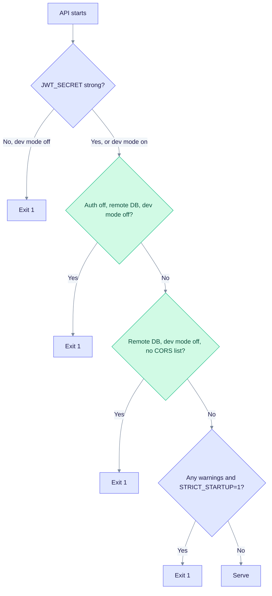

# Runtime config and authentication hardening

This page is for operators who put EdgeQuake on a shared or public network. It explains what the API refuses to start with, the settings to use in production, and how to create the first user. To turn login on for the first time, start with [Enable login](auth-quickstart.md). SSO providers (Keycloak, Entra, Google, GitHub) are covered in [Security: authentication](../security/authentication/index.md).

## What the API checks at startup

The API validates its security settings before it opens a port. Some problems stop the process (exit 1). Others only log a warning.



How to read it: the checks run from top to bottom. The first failing check stops startup. A remote DB means any host other than `localhost` or a loopback address, so the Compose host `postgres` counts as remote.

| Check | Fatal when | Warning when |
|-------|-----------|--------------|
| `JWT_SECRET` | It is the shipped default or shorter than 32 bytes, and dev mode is off. | The same, with dev mode on. |
| Auth off on a remote database | Auth off, dev mode off, remote `DATABASE_URL`. | n/a |
| CORS | `EDGEQUAKE_CORS_ORIGINS` is empty, dev mode off, remote `DATABASE_URL`. | n/a |
| Credentials | n/a | Auth on but no `EDGEQUAKE_API_KEYS` or `EDGEQUAKE_MASTER_API_KEY`. |
| Open registration | n/a | `ALLOW_REGISTRATION` is true (the default) with auth on and dev mode off. |
| Rate limit | n/a | `EDGEQUAKE_RATE_LIMIT_ENABLED` is off and dev mode off. |
| Secrets key | n/a | `EDGEQUAKE_SECRETS_KEY` is unset and dev mode off. Connection API keys cannot be saved. |

Set `EDGEQUAKE_STRICT_STARTUP=1` to turn every warning into a fatal error. Use it in production once the warnings are clean.

## Recommended production settings

```bash
export EDGEQUAKE_AUTH_ENABLED=true
export EDGEQUAKE_DEV_MODE=false                    # or leave unset
export JWT_SECRET="$(openssl rand -hex 32)"        # 32 bytes or more
export EDGEQUAKE_CORS_ORIGINS="https://app.example.com"
export EDGEQUAKE_MASTER_API_KEY="replace-with-a-strong-secret"
export ALLOW_REGISTRATION=false
export EDGEQUAKE_RATE_LIMIT_ENABLED=true
export EDGEQUAKE_SECRETS_KEY="$(openssl rand -base64 32)"   # see Providers > Security
export EDGEQUAKE_STRICT_STARTUP=1
# Web UI
export NEXT_PUBLIC_AUTH_ENABLED=true
export NEXT_PUBLIC_DISABLE_DEMO_LOGIN=true
```

The web UI reads `EDGEQUAKE_API_URL` at request time. `NEXT_PUBLIC_*` values are baked into the image at build time, so prefer the runtime variable for the API URL. Tokens last 15 minutes and refresh tokens last 30 days. Five failed logins lock an account for 15 minutes.

For the full list of variables, see [Configuration](configuration.md). For key format and storage of provider secrets, see [Provider security](../providers/security.md).

## Local development (open API)

`make dev` sets `EDGEQUAKE_DEV_MODE=true` when `DEV_AUTH_ENABLED=false` (the default). The [Docker quickstart](docker-quickstart.md) does the same for container demos. Do not use open mode on a shared network.

```bash
export EDGEQUAKE_DEV_MODE=true   # explicit local open API
```

## Auth precedence

When several settings disagree, the API resolves them in this order:

1. `EDGEQUAKE_AUTH_ENABLED` (or `AUTH_ENABLED`), when set.
2. `EDGEQUAKE_AUTH_DISABLED=true`.
3. `EDGEQUAKE_DEV_MODE=true` (auth off).
4. Default: auth on.

## Bootstrap an admin user

The API creates one admin on startup when all three are true: auth is on, dev mode is off, and no user with a usable password exists. Set the credentials before the first start:

```bash
export EDGEQUAKE_BOOTSTRAP_ADMIN_USERNAME=admin          # default: admin
export EDGEQUAKE_BOOTSTRAP_ADMIN_PASSWORD='a-long-unique-password'
export EDGEQUAKE_BOOTSTRAP_ADMIN_EMAIL=admin@example.com # default: <username>@localhost
```

If the password is not set and no login-capable user exists, the API only logs a warning and nobody can sign in. If a user with that name exists but has no usable password hash, the bootstrap upgrades it to an admin. Upgrades from before v0.15 also import old `auth:user:*` identity rows into PostgreSQL.

### Create a user with the master key

Use this when dev mode is on, or to add users later:

```bash
curl -X POST http://localhost:8080/api/v1/users \
  -H "Content-Type: application/json" \
  -H "X-API-Key: $EDGEQUAKE_MASTER_API_KEY" \
  -d '{
    "username": "admin",
    "email": "admin@example.com",
    "password": "a-long-unique-password",
    "role": "admin"
  }'
```

Passwords must be 8 to 128 characters. You can send the key as `X-API-Key: <key>` or `Authorization: Bearer <key>`.

## Expected behavior

| State | What users see |
|-------|----------------|
| Auth off | Dashboard loads without login. Demo flows work. |
| Auth on | Dashboard routes redirect to the login page. The demo login is hidden when `NEXT_PUBLIC_DISABLE_DEMO_LOGIN=true`. Protected endpoints need a JWT or API key. |

Anonymous chat is a separate switch: `EDGEQUAKE_ALLOW_ANONYMOUS` (default `true`) lets unauthenticated users share a guest user for chat. Set it to `false` to return 401 or 403 instead.

## Troubleshooting

See the table in [Enable login](auth-quickstart.md#troubleshooting). To see what the API decided at boot, run `edgequake doctor` and read the `security_posture` block of `GET /health` (see [Monitoring](monitoring.md)).
