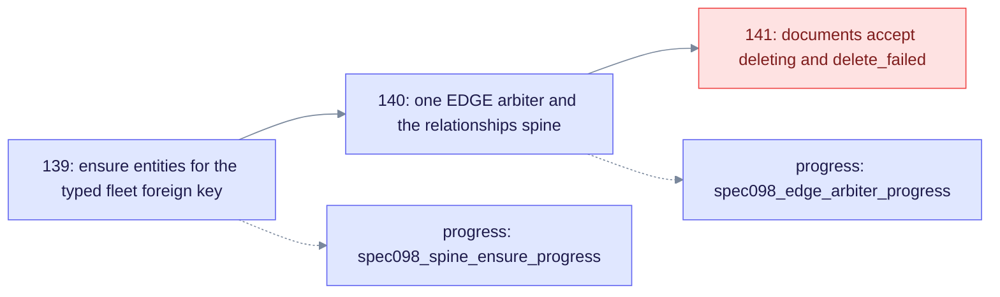
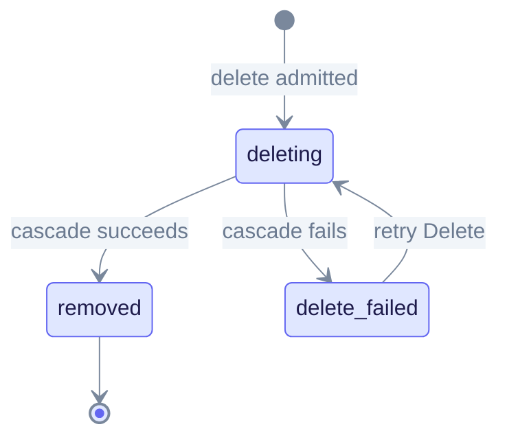

# SPEC-098 — Entity spine and EDGE arbiter (operator)

Typed fleet embeddings need relational spine rows. Migrations **139** (entities), **140** (EDGE arbiter and relationships) and **141** (document lifecycle statuses) fix the spine and the edge index. Run them on PostgreSQL **16, 17 or 18**. Use this page when reprocess or delete fails with the errors listed below.

## Migration chain



Each migration adds one piece of the spine. Migrations 139 and 140 also have manual `apply.sql` scripts in `edgequake/migrations/support/`, which the re-run steps below use.

## Hot path

1. A saturated `SOURCE_IDS` KEEP still upserts the relational spine. The AGE description mutation is skipped. Reprocess should not fail with `typed fleet mirror resolved 0/N`.
2. Native AGE edge upserts use a **single** arbiter, `idx_edge_eq_source_target_rel (eq_source_id, eq_target_id, eq_rel_type)`. A reprocess of a multi-chunk extract must not fail with `ON CONFLICT DO UPDATE command cannot affect row a second time`.
3. With `EDGEQUAKE_NATIVE_GRAPH_WRITES=0` (debug mode), Cypher `MERGE` also keys edges on `(source_id, target_id, relation_type)`. The multigraph semantics stay the same.
4. **Near-complete mirror misses (`999/1000`).** If the SPEC-098 miss samples look like `NAME_WITH_->_ARROW->OTHER:REL`, the cause is usually the legacy-key parse, not a missing spine. Entity names that contain `->` break it. The parser first tries index-guided splits (SPEC-133: both endpoints must resolve in `entities`). It then falls back to the last `->` (`parse_relationship_legacy_key`). Reprocess after the upgrade. Do not re-run 139 or 140 only for this error. Pathological names with several resolvable splits or a `:` remain a known limit (SPEC-133 LAW-133-9).

## Manual re-run

```bash
# Entity spine (AGE vertices to entities)
psql "$DATABASE_URL" -f edgequake/migrations/support/139/apply.sql

# EDGE arbiter hygiene and AGE edges to relationships
psql "$DATABASE_URL" -f edgequake/migrations/support/140/apply.sql
```

Check the progress keys:

```sql
SELECT value FROM server_config WHERE key = 'spec098_spine_ensure_progress';
SELECT value FROM server_config WHERE key = 'spec098_edge_arbiter_progress';
```

## EDGE index checklist

```sql
-- Replace 'edgequake' with your graph name (server_config.age_graph_name).
SELECT indexname
FROM pg_indexes
WHERE schemaname = 'edgequake' AND tablename = 'EDGE'
ORDER BY 1;
```

| Index | Required |
|-------|----------|
| `idx_edge_eq_source_target_rel` | **Yes** (the 3-column multigraph arbiter) |
| `idx_edge_eq_source_target` | **No**; must be dropped |
| `idx_edge_source_target_unique` | **No**; must be dropped |

The runtime bootstrap (`ensure_eq_id_columns` and `reconcile_legacy_graph_arbiters`) also drops legacy UNIQUE constraints, even when the schema already looks ready.

## Migration reference

| Migration | Progress key | Role |
|-----------|--------------|------|
| 040 | (see `support/040`) | Historical CQRS entity dual-write backfill |
| 139 | `spec098_spine_ensure_progress` | Ensures bare `entities` for the typed fleet foreign key |
| 140 | `spec098_edge_arbiter_progress` | One EDGE arbiter and the `relationships` spine |
| 141 | `spec098_document_lifecycle_status` | `documents_valid_status` accepts `deleting` and `delete_failed` |

## Document delete lifecycle

Notice that a failed cascade parks the document in `delete_failed` until you retry the delete.



Both projections must agree during the delete (LAW-098-9). Check the SQL side, then the KV side:

```sql
-- Both projections must agree (LAW-098-9)
SELECT id, status FROM documents WHERE status IN ('deleting', 'delete_failed');
```

The KV `*-metadata` entry for the same ID must also show `"status":"deleting"`. After a successful delete, the ID must be absent from SQL `documents`, from KV `*-metadata`, and from `GET /documents`.

Apply migration 141 before you rely on these statuses:

```bash
psql "$DATABASE_URL" -f edgequake/migrations/support/141/apply.sql
```

## Delete failure messages

- **`event=spec098_sql_deleting_mirror_failed` in the admit log.** The SQL `CHECK` still rejects `deleting` and `delete_failed` (before migration 141). KV admit still succeeds and the delete task runs. Re-apply `support/141` so the list dual-write can mirror the lifecycle statuses.
- **`Post-proof failed: N nodes and M edges still reference document sources`.** Deploy the cascade Replace write-mode fix, then **retry Delete** on the `delete_failed` rows. Shared-entity pruning must persist without `eq_merge_graph_properties` re-adding the pruned `source_ids`.
- Failed cascades leave `status=delete_failed`, not the pipeline `failed` status. Batch task results list each failed document with a reason, for root-cause analysis.
