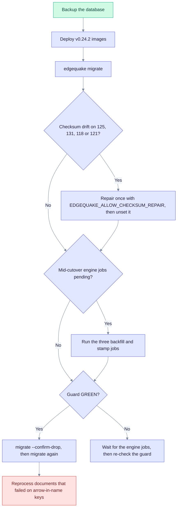

# Upgrade to EdgeQuake v0.24.2

> **From:** v0.24.0 / v0.24.1 · **To:** v0.24.2 · **CD:** GHCR (`edgequake`, `edgequake-frontend`, `edgequake-postgres`)

This release is a runbook release. It fixes the Cluster A drop-readiness work, adds Clear All (#366), runs schema migrations 118, 121 and 143 to 144, and makes entity names that contain `->` persist correctly. Confirm-drop stays consent-gated, so nothing drops without an explicit flag. Follow the steps in order and read the checksum step only if you see drift.

## Highlights

| Area | What changed |
|------|----------------|
| SPEC-111 Cluster A | Drop readiness = coverage; fleet = provenance-only; KV residue cast; iw2 normalize |
| Clear All / #366 | Authoritative empty membership; wipe purges residual KV list ghosts |
| SPEC-110 | Migrations **118**/**121** `DISTINCT ON` (checksum repair allowlist for already-applied bodies) |
| SPEC-109 | Configurable `reasoning_effort` (API + WebUI + cache key) |
| SPEC-091/098 | Relationship legacy key uses **last** `->` (fixes `999/1000` KG persist) |
| Migration **143** | `legacy_vector_id` columns for provenance stamp |
| Cancel/purge | Worker persist tolerates task-row purge races (no false ERROR) |

## Sequence

1. Take a backup (`pg_dump -Fc` or a volume snapshot).
2. Deploy the v0.24.2 images (API and frontend; the postgres image too if you pin it).
3. Run `edgequake migrate`. The expandable path includes 143 and 144 (workspace-scoped `legacy_vector_id` unique).
4. If you see checksum drift on 125 or 131 (or on 118 or 121 after the SPEC-110 body repair), repair once and unset the variable:

   ```bash
   EDGEQUAKE_ALLOW_CHECKSUM_REPAIR=125,131,118,121 DATABASE_URL=… edgequake migrate
   ```

5. If the cutover is still running, run the engine jobs: `w3-chunk-embedding-backfill`, `iw2-fleet-embedding-backfill`, `iw2-fleet-provenance-stamp`.
6. When the guard is ready, run `edgequake migrate --confirm-drop`.
7. Run `edgequake migrate` once more to clear the deferred 142 emptiness assert.
8. Reprocess any document that failed with a typed fleet mirror `999/N` or an arrow-in-name miss.



The diagram shows the order of the steps. Steps 4 and 5 apply only when their condition is true. The rest of the detail is in [`specs/111-issues/09-ops-runbook.md`](../../specs/111-issues/09-ops-runbook.md) and [`specs/111-issues/11-release-partner-notes.md`](../../specs/111-issues/11-release-partner-notes.md).

Near-miss KG persist (`999/1000`): [`spec098-entity-spine-ensure.md`](spec098-entity-spine-ensure.md) § Hot path item 4. Reprocess the documents after the upgrade. Do not re-run spine ensure only for that class.

## Verify

```bash
curl -s http://localhost:8080/health | jq -r '.version'   # expect 0.24.2
curl -s http://localhost:8080/api-docs/openapi.json | jq -r '.info.version'
```

- Clear All on a workspace with residual KV ghosts: the list stays at **0**.
- A document with `->` in entity names: KG persist completes after reprocessing.

## Out of scope in this cut

- #361 bulk-upload concurrency
- Auto confirm-drop
- Full rewrite of vector id delimiters (target names with `->` remain ambiguous)
