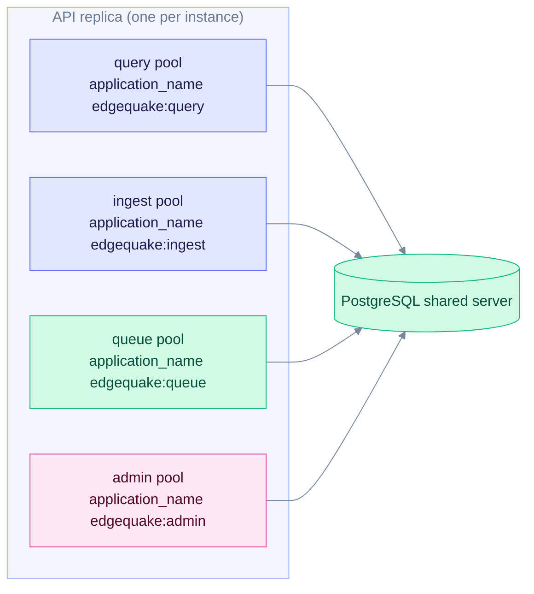

# Upgrade to EdgeQuake v0.24.3

> **From:** v0.24.2 · **To:** v0.24.3 · **CD:** GHCR (`edgequake`, `edgequake-frontend`, `edgequake-postgres`)

This is an operations patch. It hardens the PostgreSQL connection pools (SPEC-112) and makes UTF-8 truncation safe. Use it if your EdgeQuake instances share a PostgreSQL server with other applications. It adds no migrations, so the schema does not change.

Cluster A and Clear All stay on v0.24.2 ([upgrade-to-0.24.2.md](upgrade-to-0.24.2.md)).

## Highlights

| Area | What changed |
|------|----------------|
| Pool identity | `application_name=edgequake:<role>` (`query` / `ingest` / `queue` / `admin`) |
| Reaping | Explicit sqlx idle (600s) and max lifetime (1800s); env overrides |
| Budget | Startup check: `instances × pool_sum` against PG capacity (`warn` default, or `fail`) |
| Shutdown | Graceful HTTP drain, then `pool.close()` on all role pools |
| Health | `/health` includes per-role `db_pools` utilisation |
| UTF-8 | One truncation routine. No mid-codepoint panics on span or LLM previews |

Each API instance keeps four pools. The startup budget check multiplies the pool sizes by the number of instances, so set the instance count correctly.



Each role has its own pool, so `pg_stat_activity` shows which part of EdgeQuake holds each connection.

## Sequence

1. Take a backup. This is optional for this patch because there is no schema change.
2. Deploy the v0.24.3 API (and the frontend if you pin it).
3. On a shared PostgreSQL server, set the pool sizes before the restart:

   ```bash
   export EDGEQUAKE_DB_POOL_SIZE_QUERY=8
   export EDGEQUAKE_DB_POOL_SIZE_INGEST=6
   export EDGEQUAKE_DB_POOL_SIZE_QUEUE=2
   export EDGEQUAKE_DB_POOL_SIZE_ADMIN=1
   export EDGEQUAKE_DB_POOL_INSTANCE_COUNT=<replicas including rollout overlap>
   # optional: EDGEQUAKE_DB_POOL_BUDGET_MODE=fail
   ```

4. Stop the old instances with SIGTERM, not SIGKILL. SIGTERM drains requests and closes the pools. SIGKILL skips the close.
5. Verify the attribution and the health output (see below).

The pool variables and their defaults are listed in [configuration.md](configuration.md) under **Database**. The detailed ops guide is [`specs/112-connection-pool/07-ops-runbook.md`](../../specs/112-connection-pool/07-ops-runbook.md).

## Verify

```bash
curl -s http://localhost:8080/health | jq -r '.version'          # expect 0.24.3
curl -s http://localhost:8080/health | jq '.db_pools'            # per-role max and util
```

On a shared PostgreSQL server, check the attribution:

```sql
SELECT application_name, state, count(*) FROM pg_stat_activity
WHERE backend_type = 'client backend' GROUP BY 1, 2;
-- Expect edgequake:query, edgequake:ingest, edgequake:queue, edgequake:admin (not empty)
```

## Out of scope in this cut

- Raising PostgreSQL `max_connections` as the product fix
- Mandatory PgBouncer (recommended for shared fleets; see the ops runbook)
- #361 bulk-upload concurrency
- SPEC-111 Cluster A and Clear All (already in v0.24.2)
