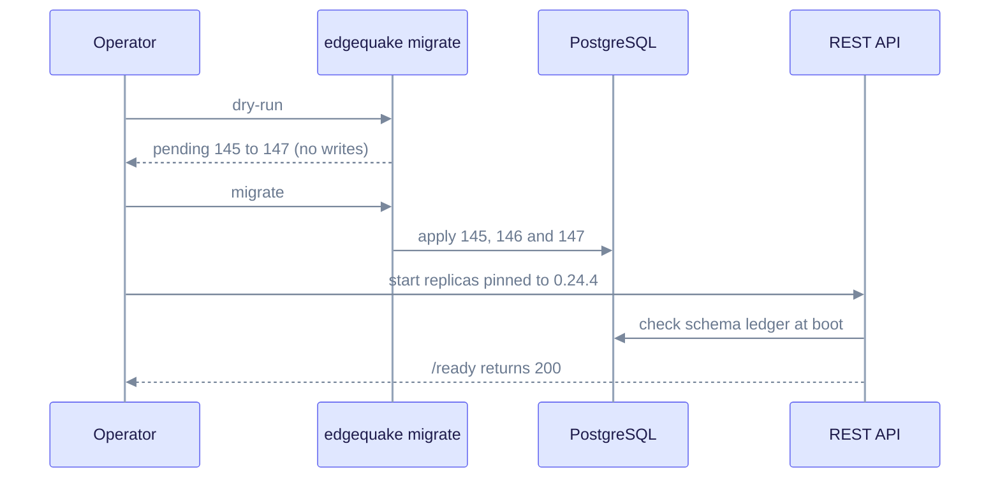

# Upgrade to EdgeQuake v0.24.4

> **From:** v0.24.3 · **To:** v0.24.4 · **CD:** GHCR (`edgequake`, `edgequake-frontend`, `edgequake-postgres`)

This patch release improves ingest and delete reliability for partner workloads. It also adds the format matrix and the configuration cascade. It adds three migrations (145 to 147), so you must run `edgequake migrate` before you start the API. The API never migrates at boot (LD-15).

Previous release: [upgrade-to-0.24.3.md](upgrade-to-0.24.3.md) (SPEC-112 pools).

## Highlights

| Area | What changed |
|------|----------------|
| Migration **145** | SPEC-119 AGE singular edge citation indexes (`source_chunk_id` / `source_document_id`) |
| Migration **146** | `conversations.mode = 'bypass'` (chat bypass) |
| Migration **147** | `messages.llm_provider` / `llm_model` lineage columns |
| #376 / SPEC-118 | `injection::` doc IDs under relational chunk authority |
| #375 / SPEC-119 | Delete and reprocess no longer time out on sequential scans of singular citations |
| #374 / SPEC-120 | Same-workspace `legacy_vector_id` race absorbed |
| #370 / SPEC-121 | Format matrix honesty: PDF supported, DOCX not supported |
| SPEC-123 | Request > Workspace > Tenant > Env cascade for parser and models |

## Sequence

Migrations 145 to 147 are additive (indexes, a CHECK change and new columns). They need no `--confirm-drop`.

1. Take a backup. This is recommended because the schema changes.
2. Deploy the v0.24.4 images or binary, but hold the API replicas until migrate has run.
3. Run migrate against the target database:

   ```bash
   edgequake migrate dry-run
   edgequake migrate
   ```

4. Start the API and frontend, pinned to 0.24.4.
5. Verify the health and OpenAPI versions, then run a PDF upload and a delete or reprocess smoke test.



The API waits for migrate. It checks the ledger at boot and never changes the schema itself.

Compose or quickstart pin:

```bash
EDGEQUAKE_VERSION=0.24.4 docker compose -f docker-compose.quickstart.yml up -d
```

## Format matrix (SPEC-121 / #370)

| Format | Supported |
|--------|-----------|
| PDF, TXT, MD, JSON, images | Yes |
| DOCX, Excel and other Office formats | **No** (product lock, not a regression) |

See the [FAQ](../faq.md#what-document-formats-are-supported) and the [document upload quick reference](../api-reference/document-upload-quick-reference.md).

## Verify

```bash
curl -s http://localhost:8080/health | jq -r '.version'                      # expect 0.24.4
curl -s http://localhost:8080/api-docs/openapi.json | jq -r '.info.version'  # 0.24.4
```

## Out of scope in this cut

- DOCX and Excel ingest (tracked as future study under SPEC-121)
- #361 and #365 bulk-upload wall-clock target (SPEC-122 is admit honesty, not a throughput claim)
- crates.io publish of the workspace crates (GHCR-only CD)
