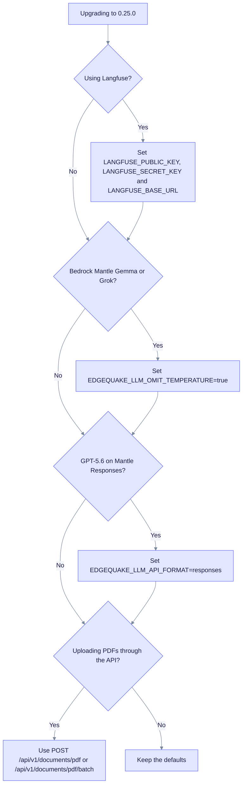

# Upgrade to EdgeQuake v0.25.0

> **From:** v0.24.4 · **To:** v0.25.0 · **CD:** GHCR (`edgequake`, `edgequake-frontend`, `edgequake-postgres`)

This minor release adds Langfuse observability, a structure-aware Markdown chunker, a provider prompt cache, PDF layout overlays and new LLM transport options. It also includes partner reliability fixes. It adds migration 148, so run `edgequake migrate` before you start the API. The API never migrates at boot (LD-15).

**Crates.io dependencies:** pin `edgequake-llm` **0.10.8** and `edgequake-pdf2md` **0.9.11** (no path patches).

Previous release: [upgrade-to-0.24.4.md](upgrade-to-0.24.4.md) (SPEC-118 to 123 and migrations 145 to 147).

**SPEC-001 Acc:** this cut **attests** the existing [`publish/latest`](../../specs/001-benchmark/e2e/artifacts/publish/latest/) result (`valid: true`, medical-mid, `2026-08-15T11:02:18Z`). It does not include a fresh n=200 Acc run.

## Highlights

| Area | What changed |
|------|----------------|
| Migration **148** | SPEC-128 `document_pages` and `page_layout_regions` (PDF user-space layout, with RLS) |
| SPEC-124 | Langfuse OTLP/HTTP, Settings deep-link, and local `make langfuse-up` |
| SPEC-125 | Structure-aware Markdown pack (no orphan heading chunks) |
| SPEC-126 | Provider KV and prompt cache (`EDGEQUAKE_PROMPT_CACHE`, default on) |
| SPEC-128 | PDF layout overlay UI and figure prune. Needs pdf2md **0.9.11** |
| SPEC-131 / #379 | `EDGEQUAKE_LLM_OMIT_*` and `EDGEQUAKE_LLM_API_FORMAT=responses` (llm **0.10.8**) |
| #381 / SPEC-129 | CHECK-safe document status SSOT (`re_embedding` becomes `processing`) |
| #380 / SPEC-130 | Sink-to-fleet-mirror relationship UUIDs |
| #378 / SPEC-132 | Multi-PDF admit honesty (PDF routes only; non-blocking wake) |
| SPEC-133 | Fleet-mirror target `->` parse (diagram and handwriting PDFs) |

## Sequence

1. Take a backup. This is recommended because the schema changes.
2. Deploy the v0.25.0 images or binary, but hold the API replicas until migrate has run.
3. Run migrate against the target database:

   ```bash
   edgequake migrate dry-run
   edgequake migrate
   # No --confirm-drop is required for 148 (additive tables and RLS)
   ```

4. Start the API and frontend, pinned to 0.25.0.
5. Verify the health and OpenAPI versions, a PDF overlay smoke test, and (optionally) the Langfuse card in Settings.

Compose or quickstart pin:

```bash
EDGEQUAKE_VERSION=0.25.0 docker compose -f docker-compose.quickstart.yml up -d
```

## Which operator steps apply to you?

Most changes are opt-in. Use this tree to find the settings you need.



### Langfuse (SPEC-124)

Set `LANGFUSE_PUBLIC_KEY`, `LANGFUSE_SECRET_KEY` and `LANGFUSE_BASE_URL`. See [OBSERVABILITY.md](../OBSERVABILITY.md). For a local stack, run `make langfuse-up` and restart the backend. Secrets stay in environment variables; Settings shows only the status and a deep-link.

### LLM transport (SPEC-131 / #379)

For Bedrock Mantle Gemma or Grok models that reject sampling parameters:

```bash
EDGEQUAKE_LLM_OMIT_TEMPERATURE=true
# optional:
EDGEQUAKE_LLM_OMIT_REASONING_EFFORT=true
# GPT-5.6 Mantle Responses:
EDGEQUAKE_LLM_API_FORMAT=responses
```

### Multi-PDF upload (SPEC-132 / #378)

Admit PDFs only through `POST /api/v1/documents/pdf` or `POST /api/v1/documents/pdf/batch`. The generic multipart `/documents/upload` route does not accept them.

### Fleet mirror (SPEC-130 / SPEC-133)

Relationship UUIDs pass through unchanged. The API parses the entity names by index when a name contains `->`, either in the source or the target. No operator flag is needed.

## Verify

```bash
curl -s http://localhost:8080/health | jq -r '.version'                      # expect 0.25.0
curl -s http://localhost:8080/api-docs/openapi.json | jq -r '.info.version'  # 0.25.0
edgequake migrate dry-run   # 148 applied, no pending additive steps
```

## Out of scope in this cut

- A fresh Acc n=200 run (the existing pack is attested)
- DOCX and Excel ingest (SPEC-121 product lock)
- crates.io publish of the EdgeQuake workspace crates (GHCR-only CD; the sibling `edgequake-llm` and `edgequake-pdf2md` crates are published separately)
