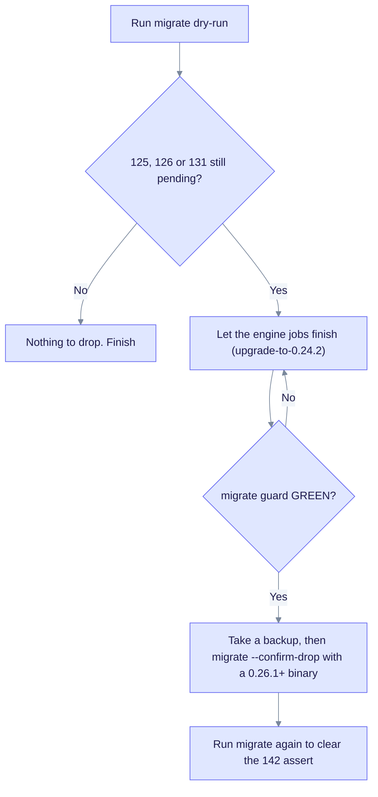

# Upgrade to EdgeQuake v0.26.0

> **From:** v0.25.0 · **To:** v0.26.0 · **CD:** GHCR (`edgequake`, `edgequake-frontend`, `edgequake-postgres`)

This minor release changes how PDFs are chunked, adds page-as-unit conversion for manuscripts and improves partner reliability. It adds migration 149, so run `edgequake migrate` before you start the API. The API never migrates at boot (LD-15).

> **CLI honesty (SPEC-137) ships in [v0.26.1](upgrade-to-0.26.1.md).** Use the 0.26.1+ binary for leftover DROP OLD (`--drop-confirm` alias). The schema train stays at **149**, and 0.26.1 adds no migrations.

**Crates.io dependencies:** pin `edgequake-llm` **0.10.8**, `edgequake-pdf2md` **0.9.11**, `edgeparse-core` **0.2.5**, and `edgequake-sdk` **0.4.0** (no path patches).

Previous release: [upgrade-to-0.25.0.md](upgrade-to-0.25.0.md) (SPEC-124 to 133 and migration 148).

**SPEC-001 Acc:** this cut **attests** the existing [`publish/latest`](../../specs/001-benchmark/e2e/artifacts/publish/latest/) result (`valid: true`, medical-mid, `2026-08-15T11:02:18Z`). It does not include a fresh n=200 Acc run, and PDF geometry was not re-scored.

## Highlights

| Area | What changed |
|------|----------------|
| Migration **149** | `tasks.document_id` column, index and backfill (#384) |
| SPEC-135 | PDF pack-to-budget (on by default). Page span `page_start` and `page_end`; multimodal index once; citation `p.N–M` |
| SPEC-134 | Manuscript page-as-unit conversion. Lifts extraction off disabled reasoning |
| SPEC-124 | `make dev-langfuse` and `make dev-bg-langfuse`, plus `make spec124-langfuse-e2e` |
| #377 / SPEC-136 | Absorb stamp-once `legacy_vector_id` unique violations |
| #383 to #386 | Saga compensation, in-flight task honesty, reprocess metadata rollback |
| SPEC-101 | Wizard persist honesty (create and reconfigure embedding overrides) |

## Sequence

1. Take a backup. This is recommended because the schema changes, and it is required before any DROP OLD.
2. Deploy the v0.26.0 images or binary, but hold the API replicas until migrate has run.
3. Run migrate against the target database:

   ```bash
   edgequake migrate dry-run
   edgequake migrate
   # Applies safe schema 149 if pending. No confirmation is needed for 149.
   ```

4. Start the API and frontend, pinned to 0.26.0.
5. Verify the health and OpenAPI versions, then run a PDF ingest smoke test.

### Leftover SPEC-091 DROP OLD (125, 126, 131)

Serving on 0.25 with pending KV or vector drops is **allowed**. Those migrations are not part of the 149 train. If `dry-run` or preflight still lists 125, 126 or 131, you are in the mid-cutover ladder. Follow the flow below. The steps reference [spec091-upgrade-from-v0.22.0.md](spec091-upgrade-from-v0.22.0.md) and [upgrade-to-0.24.2.md](upgrade-to-0.24.2.md) (engine jobs and a GREEN guard). Run the confirm step with a **v0.26.1+** binary ([upgrade-to-0.26.1.md](upgrade-to-0.26.1.md)).



The guard must be green before any drop. SQL that finds uncovered rows aborts on purpose. Do not skip the guards. Details are in [`specs/137-issue-migration-25-to-26/09-ops-runbook.md`](../../specs/137-issue-migration-25-to-26/09-ops-runbook.md).

Unknown apply flags fail closed (for example `--confirm-drp`). Do **not** set `EDGEQUAKE_MIGRATION_CONFIRM_DROP=1` in a shared env file.

Compose or quickstart pin (0.26.4 is the preferred image for the leftover SPEC-091 CLI):

```bash
EDGEQUAKE_VERSION=0.26.4 docker compose -f docker-compose.quickstart.yml up -d
```

## Operator notes

### PDF chunking (SPEC-135)

Product PDF ingest now **packs** converted Markdown to the workspace tiktoken budget (on by default). Two kill switches are available:

| Variable | Set to | Effect |
|----------|--------|--------|
| `EDGEQUAKE_PDF_PACK` | `0` | Roll back to the pre-135 Recursive chunker |
| `EDGEQUAKE_PDF_CROSS_PAGE_PACK` | `0` | Stop packing across pages (hard page boundaries only) |

- The change applies to **future ingestions only**. Existing workspaces are not rebuilt automatically.
- Historical `chunks.page_start` and `page_end` stay NULL until you run **Rebuild KG**.
- PDF geometry (Acc) was **not** re-scored for this cut.

### Langfuse (SPEC-124)

Unchanged from 0.25.0 for production. For local development:

```bash
make dev-langfuse          # isolated Langfuse v4 and EdgeQuake stack
make spec124-langfuse-e2e  # one-command Settings and sessions proof
```

### Manuscript PDF (SPEC-134)

Manuscript-class pages use page-as-unit conversion. See [specs/134-manuscrit/](../../specs/134-manuscrit/).

## Verify

```bash
curl -s http://localhost:8080/health | jq -r '.version'                      # expect 0.26.0
curl -s http://localhost:8080/api-docs/openapi.json | jq -r '.info.version'  # 0.26.0
```

## Out of scope

- crates.io publish of the EdgeQuake workspace crates (GHCR-only CD)
- Automatic rebuild of the KG on upgrade
- A fresh Acc n=200 medical-mid run
