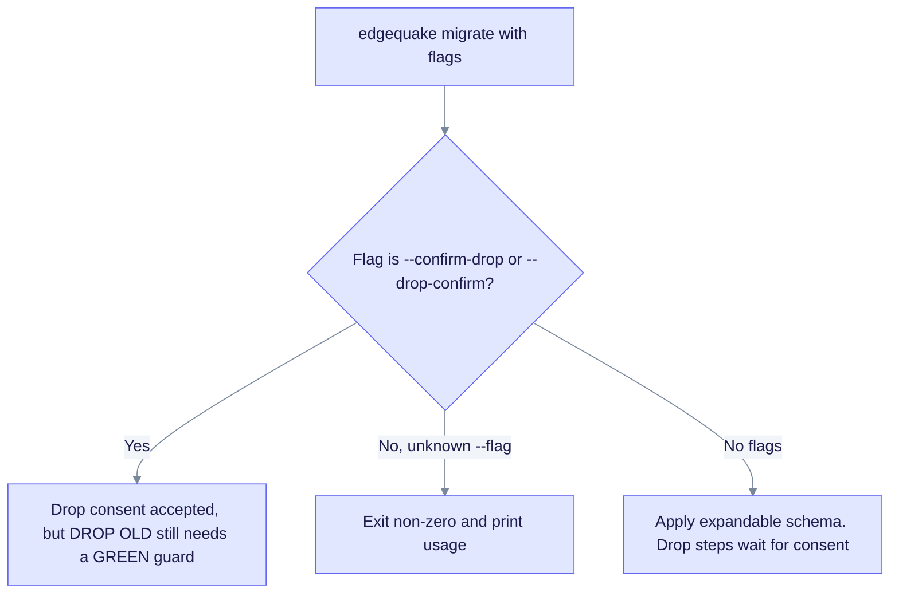

# Upgrade to EdgeQuake v0.26.1

> **From:** v0.26.0 · **To:** v0.26.1 · **CD:** GHCR (`edgequake`, `edgequake-frontend`, `edgequake-postgres`)

This is an operations patch for the `edgequake migrate` command. It makes the consent flag clearer, rejects unknown flags, and gives better failure hints. It adds no migrations, so the schema train stays at **149** from [upgrade-to-0.26.0.md](upgrade-to-0.26.0.md). Upgrade if you run leftover DROP OLD steps.

## Highlights

| Area | What changed |
|------|----------------|
| Consent | `--confirm-drop` is canonical. `--drop-confirm` is accepted as the same consent |
| Unknown flags | `edgequake migrate --*` with a flag that is not known exits non-zero |
| Abort hints | Wave D, W4, IW2, 142, checksum and lock failures are classified (not always `pg_locks`) |
| Preflight | Migrations 144 to 149 are tagged SAFE SCHEMA |

This cut does **not** weaken the DROP OLD SQL (125, 126, 131, 142). Uncovered KV or vector rows still abort. You still need `migrate guard` to be GREEN before `--confirm-drop`.

The flag handling works like this:



## Sequence

1. Take a backup. This is optional for this patch because there is no schema change.
2. Deploy the v0.26.1 API (and the frontend if you pin it).
3. If migrations 125, 126 or 131 are still pending, follow the leftover SPEC-091 flow in [upgrade-to-0.26.0.md](upgrade-to-0.26.0.md). Use this 0.26.1+ binary, not the 0.26.0 image.
4. Verify the health version and that `migrate --help` lists `--drop-confirm`.

Compose or quickstart pin:

```bash
EDGEQUAKE_VERSION=0.26.1 docker compose -f docker-compose.quickstart.yml up -d
```

## Verify

```bash
curl -s http://localhost:8080/health | jq -r '.version'                      # expect 0.26.1
curl -s http://localhost:8080/api-docs/openapi.json | jq -r '.info.version'  # 0.26.1
docker run --rm ghcr.io/raphaelmansuy/edgequake:0.26.1 migrate --help
# Prints the usage text, which lists --confirm-drop and --drop-confirm
```

## Out of scope in this cut

- Weakening the fail-closed DROP OLD guards (the Track B residue still needs engine jobs)
- A fresh Acc n=200 medical-mid run (the existing `publish/latest` is attested)
- crates.io publish of the EdgeQuake workspace crates (GHCR-only CD)
- Automatic `--confirm-drop`

Detail: [`specs/137-issue-migration-25-to-26/09-ops-runbook.md`](../../specs/137-issue-migration-25-to-26/09-ops-runbook.md).
