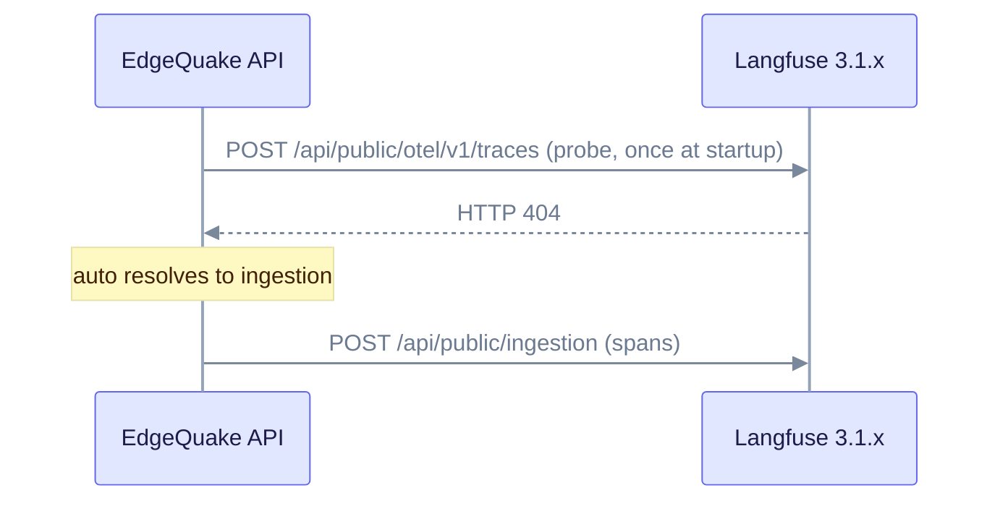

# Upgrade to EdgeQuake v0.26.2

> **From:** v0.26.1 · **To:** v0.26.2 · **CD:** GHCR (`edgequake`, `edgequake-frontend`, `edgequake-postgres`)

This is an operations and product patch. It makes Langfuse work with the 3.1.x ingestion API, adds the Kubernetes Helm proof, and fixes SSE and conversation restore. It adds no migrations, so the schema train stays at **149** from [upgrade-to-0.26.0.md](upgrade-to-0.26.0.md). Read the Langfuse section if you point EdgeQuake at a self-hosted Langfuse 3.1.x.

## Highlights

| Area | What changed |
|------|----------------|
| Langfuse 3.1.x | `EDGEQUAKE_LANGFUSE_API=auto` probes OTLP once. An HTTP 404 switches to native `/api/public/ingestion` |
| Kubernetes | Helm `edgequake-stack` and a kind proof. Pin `global.edgequakeVersion: "0.26.2"` |
| SSE | `text/event-stream` is not gzip-compressed. Conversation identity is shared |
| Workspace list | Opt-in `?include_stats=true` (default off) |

This cut does **not** add schema. Leftover DROP OLD steps (125, 126, 131) still follow the SPEC-091 flow in [upgrade-to-0.26.0.md](upgrade-to-0.26.0.md). Use a **0.26.1+** binary for that flow ([upgrade-to-0.26.1.md](upgrade-to-0.26.1.md) covers the CLI changes).

## Langfuse 3.1.x ingestion fallback

With `auto` (the default), EdgeQuake sends one empty POST to `/api/public/otel/v1/traces` at startup. An HTTP 404 means native ingestion. Any other result means OTLP.



Check the result in the Settings API (see Verify). Do not force `EDGEQUAKE_LANGFUSE_API=otlp` against 3.1.x.

## Sequence

1. Take a backup. This is optional for this patch because there is no schema change.
2. Deploy the v0.26.2 API (and the frontend if you pin it).
3. If migrations 125, 126 or 131 are still pending, follow [upgrade-to-0.26.0.md](upgrade-to-0.26.0.md) with this 0.26.2 binary, not the 0.26.0 image.
4. Verify that the health version is 0.26.2.
5. If you point at a self-hosted Langfuse 3.1.x, confirm that `api_resolved` is `ingestion`.

Compose or quickstart pin:

```bash
EDGEQUAKE_VERSION=0.26.2 docker compose -f docker-compose.quickstart.yml up -d
```

Kubernetes:

```bash
EDGEQUAKE_VERSION=0.26.2 make k8s-install
# or set global.edgequakeVersion: "0.26.2" in values
```

## Verify

```bash
curl -s http://localhost:8080/health | jq -r '.version'                      # expect 0.26.2
curl -s http://localhost:8080/api-docs/openapi.json | jq -r '.info.version'  # 0.26.2
```

For Langfuse 3.1.x only (use the keys and `LANGFUSE_BASE_URL` of that instance):

```bash
curl -sS http://localhost:8080/api/v1/settings/langfuse \
  | jq '{export_active, base_url, api, api_resolved}'
# api_resolved must be "ingestion" on 3.1.x (never force EDGEQUAKE_LANGFUSE_API=otlp)
```

Operator guide: [langfuse-3.1.md](langfuse-3.1.md). Kubernetes: [deploy/kubernetes/README.md](../../deploy/kubernetes/README.md#existing-langfuse-31x).

## Out of scope in this cut

- A new schema or migrate step (the train stays at **149**)
- A fresh Acc n=200 medical-mid run (the existing `publish/latest` is attested)
- crates.io publish of the EdgeQuake workspace crates (GHCR-only CD)
- Forcing OTLP against Langfuse 3.1.x (use `auto`, or upgrade Langfuse to 3.22 or later)

Detail: [`specs/124-langfuse-support/`](../../specs/124-langfuse-support/) and [`specs/138-kubernetes/`](../../specs/138-kubernetes/).
