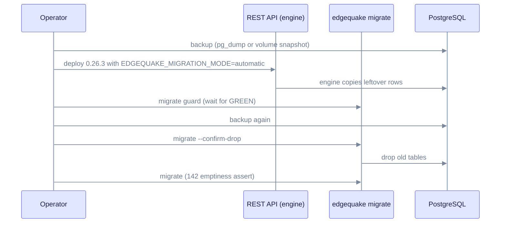

# Upgrade to EdgeQuake v0.26.3

> **From:** v0.26.1 / v0.26.2 · **To:** v0.26.3 · **CD:** GHCR (`edgequake`, `edgequake-frontend`, `edgequake-postgres`)

This is an operations patch for the mid-cutover migration engine (SPEC-139). It fixes how the engine finishes the leftover DROP OLD work on 125, 126 and 131. It also updates the Langfuse OTLP proofs. It adds no migrations, so the schema train stays at **149** from [upgrade-to-0.26.0.md](upgrade-to-0.26.0.md). Use this release if the engine is still draining a mid-cutover database.

## Highlights

| Area | What changed |
|------|----------------|
| iw2 | Within-batch last-write-wins on arbiter keys. `ON CONFLICT DO UPDATE` keeps COALESCE provenance |
| W3 | Per-table coverage SUM (equivalent to the 126 UUID-shaped `-chunk-` ids). Reclaims `verify_failed` |
| Remainder | `w2-dedup-remainder`, `wc-shell-remainder` and `w5-artifact-remainder` run as engine jobs, not sqlx migration 150 |
| Engine | `run_engine` continues after one job returns an error |
| Langfuse | Isolated 3.22.0 and 3.225.5 Compose stacks for the OTLP proofs |

This cut does **not** weaken the DROP OLD SQL (125, 126, 131, 142). Uncovered KV or vector rows still abort. You still need `migrate guard` to be GREEN before `--confirm-drop`. Remainder orphans that are left over stay RED on the advisor, because the job verifies copy completion and does not loop on failure.

## Sequence

The engine runs inside the API when `EDGEQUAKE_MIGRATION_MODE=automatic` is set. The CLI then confirms the drop.



The steps in order:

1. Take a backup (required if 125, 126 or 131 is still pending).
2. Deploy the v0.26.3 API. Do not use 0.26.1.
3. Set `EDGEQUAKE_MIGRATION_MODE=automatic` and start the API.
4. Follow the leftover SPEC-091 copy steps in [upgrade-to-0.26.0.md](upgrade-to-0.26.0.md). The engine does the copy, not the CLI.
5. Run `edgequake migrate guard` and wait for GREEN.
6. Take a second backup, then run `edgequake migrate --confirm-drop`.
7. Run `edgequake migrate`. This runs the 142 emptiness assert.
8. Verify that `/health` reports version 0.26.3.

Compose or quickstart pin:

```bash
EDGEQUAKE_VERSION=0.26.3 docker compose -f docker-compose.quickstart.yml up -d
```

Kubernetes:

```bash
EDGEQUAKE_VERSION=0.26.3 make k8s-install
# or set global.edgequakeVersion: "0.26.3" in values
```

## Verify

```bash
curl -s http://localhost:8080/health | jq -r '.version'                      # expect 0.26.3
curl -s http://localhost:8080/api-docs/openapi.json | jq -r '.info.version'  # 0.26.3
edgequake migrate status
edgequake migrate guard
```

Developer proof: `make spec139-migrate-engine-proof`.

## Out of scope in this cut

- A new schema or migrate step (the train stays at **149**)
- A fresh Acc n=200 medical-mid run
- Automatic `--confirm-drop`
- Editing the applied 117 to 122 and 125 to 131 SQL bodies

Detail: [`specs/139-issue-migration/`](../../specs/139-issue-migration/). Field runbook: [`09-ops-runbook.md`](../../specs/139-issue-migration/09-ops-runbook.md).
