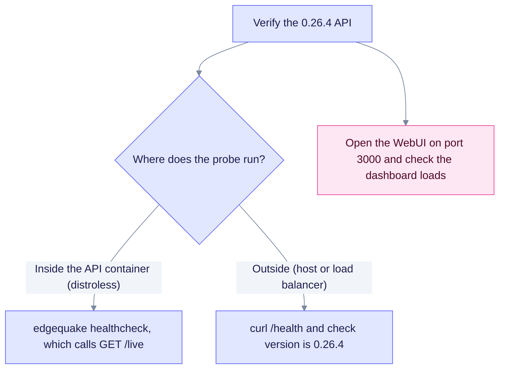

# Upgrade to EdgeQuake v0.26.4

> **From:** v0.26.3 · **To:** v0.26.4 · **CD:** GHCR (`edgequake`, `edgequake-frontend`, `edgequake-postgres`)

This is an operations and security patch. It upgrades the WebUI to Next.js **16.3.3** to fix the August 2026 critical advisories, and it changes the API image to distroless. It also fixes list completeness and bulk-ingest reporting. It adds no migrations, so the schema train stays at **149** from [upgrade-to-0.26.0.md](upgrade-to-0.26.0.md). Read the probe note before you change any health check.

## Highlights

| Area | What changed |
|------|----------------|
| Next.js | `next` and `eslint-config-next` **16.3.3** (was 16.2.11). Fixes the August Critical GHSAs |
| Proxy | One `src/proxy.ts` owns auth and Swagger. The root `middleware.ts` is removed |
| Docker WebUI | `next build --webpack`, the same as the local safe build |
| Lists | SPEC-140 and 141: honest `total`, plus catalog exhaustion and the documents pager |
| Bulk ingest | SPEC-122: honest reporting of bulk-ingest admission |
| Health poll | Off by default. Set `EDGEQUAKE_HEALTH_POLL_MS=10000` to restore it |
| API image | Distroless: no `curl` or `sh` in the container. Use `edgequake healthcheck` |

Instant Navigations (`cacheComponents` and `partialPrefetching`) stay **off**. A React postpone blocker on webpack prerender is documented. The other Next 16.3 fixes still apply without those flags.

## Probing the API

The API image has no shell and no `curl`, so do not run `docker exec ... curl` inside it. Probe from outside, or use the built-in check.



## Sequence

1. Pull the GHCR images for 0.26.4. Pull `edgequake-frontend` in particular, because it carries Next 16.3.3.
2. Deploy the v0.26.4 API and frontend. No migrate step is needed, because the schema is still 149.
3. Verify that `/health` and OpenAPI both report 0.26.4.
4. Confirm that the WebUI boots on the Next 16.3.3 image.

If you still have leftover SPEC-091 DROP OLD steps (125, 126, 131) in a mid-cutover database, follow [upgrade-to-0.26.3.md](upgrade-to-0.26.3.md) and [upgrade-to-0.26.0.md](upgrade-to-0.26.0.md) with the 0.26.4 API image. That image includes the engine fixes from 0.26.3.

Compose or quickstart pin:

```bash
EDGEQUAKE_VERSION=0.26.4 docker compose -f docker-compose.quickstart.yml up -d
```

Kubernetes:

```bash
EDGEQUAKE_VERSION=0.26.4 make k8s-install
# or set global.edgequakeVersion: "0.26.4" in values
```

## Verify

```bash
curl -s http://localhost:8080/health | jq -r '.version'                      # expect 0.26.4
curl -s http://localhost:8080/api-docs/openapi.json | jq -r '.info.version'  # 0.26.4
# WebUI: open http://localhost:3000 and check that the dashboard chrome is visible
```

## Out of scope in this cut

- A new schema or migrate step (the train stays at **149**)
- A fresh Acc n=200 medical-mid run
- Instant Navigations flags
- Turbopack production builds and NFT retry

Detail: [`specs/144-update-nextjs/`](../../specs/144-update-nextjs/). Next.js security release: [next@16.3.3](https://github.com/vercel/next.js/releases/tag/v16.3.3).
