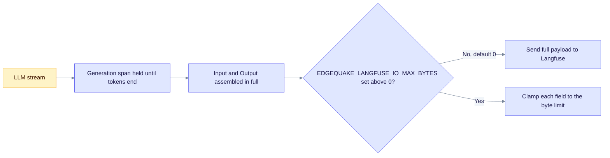

# Upgrade to EdgeQuake v0.26.5

> **From:** v0.26.4 · **To:** v0.26.5 · **CD:** GHCR (`edgequake`, `edgequake-frontend`, `edgequake-postgres`)

This is an observability patch. Langfuse generation spans now record the full LLM prompt and completion, with no length cut by default. Secrets stay redacted, and ingested document content stays in preview. It adds no migrations, so the schema train stays at **149** from [upgrade-to-0.26.0.md](upgrade-to-0.26.0.md). Restart the API after the deploy so new traces pick up the full content.

## Highlights

| Area | What changed |
|------|----------------|
| Langfuse I/O | Generation Input and Output hold the full LLM payload (Complete class) |
| Default ceiling | `EDGEQUAKE_LANGFUSE_IO_MAX_BYTES=0` (unlimited). A positive value sets a clamp |
| Stream | The generation span stays open until the tokens end. I/O is recorded once it is assembled |
| Helm | `api.langfuse.ioMaxBytes` is written to the ConfigMap |

Only the API restarts for this cut. The frontend image is unchanged.



The default sends the full payload. Set a positive `EDGEQUAKE_LANGFUSE_IO_MAX_BYTES` only when you need a hard ceiling on trace size.

## Sequence

1. Pull the GHCR images for 0.26.5. The `edgequake` API image is the one that changed.
2. Deploy the v0.26.5 API and frontend. No migrate step is needed, because the schema is still 149.
3. Verify that `/health` and OpenAPI both report 0.26.5.
4. Run a long Mix query and check that the Langfuse generation Input and Output are complete.

Compose or quickstart pin:

```bash
EDGEQUAKE_VERSION=0.26.5 docker compose -f docker-compose.quickstart.yml up -d
```

Kubernetes:

```bash
EDGEQUAKE_VERSION=0.26.5 make k8s-install
# or set global.edgequakeVersion: "0.26.5" in values
```

The API image has no shell, so probe it from outside the container (or use `edgequake healthcheck` inside it). See [upgrade-to-0.26.4.md](upgrade-to-0.26.4.md).

## Verify

```bash
curl -s http://localhost:8080/health | jq -r '.version'                      # expect 0.26.5
curl -s http://localhost:8080/api-docs/openapi.json | jq -r '.info.version'  # 0.26.5
# Optional: make spec145-langfuse-e2e (live OTLP and tail marker)
```

## Out of scope in this cut

- A new schema or migrate step (the train stays at **149**)
- A fresh Acc n=200 medical-mid run (the existing `publish/latest` is attested)
- Dumping ingest document bodies into Langfuse

Detail: [`specs/145-fix-truncated-logs/`](../../specs/145-fix-truncated-logs/). Observability guide: [`docs/OBSERVABILITY.md`](../OBSERVABILITY.md).
