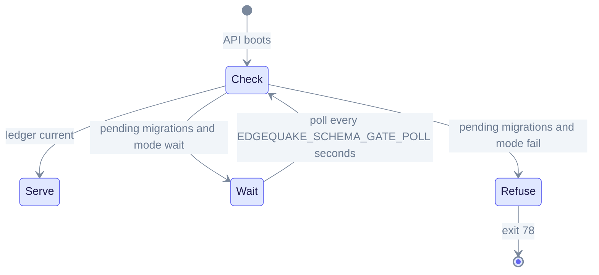
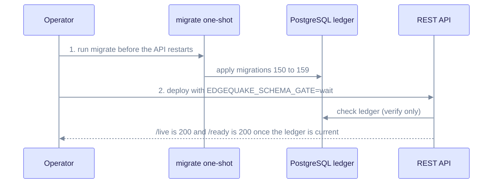

# Upgrade to EdgeQuake v0.27.0

> **From:** v0.26.x · **To:** v0.27.0 · **CD:** GHCR (`edgequake`, `edgequake-frontend`, `edgequake-postgres`)

This minor release ships SPEC-149 (provider access and projection authority) and SPEC-150 (a reliable migration lifecycle). The schema moves from 149 to 159. The API no longer applies migrations at boot, so run `edgequake migrate` before `/ready` returns 200.

## Highlights

| Area | What changed |
|------|--------------|
| Schema | Migrations **150–159** (provider-access ledger to `migration_run` telemetry) |
| Migrate vs. serve | `edgequake migrate` owns DDL and support reconcile; serve only verifies the ledger |
| Schema gate | `EDGEQUAKE_SCHEMA_GATE=wait\|fail`. The code default is **fail**; the Compose file sets **wait** |
| Projections | P0 graph and vector projection deliveries; stage `projecting` in the WebUI |

## Migrate before serve

The schema gate decides at boot whether the API serves, waits, or exits.



The gate reads the ledger; it never runs DDL. Run migrate first, then start the API.

## Upgrade sequence



The API waits for the ledger instead of applying migrations itself.

1. Pull the GHCR images for 0.27.0.
2. Run the migrate one-shot before you restart the API. Compose and the Helm pre-hook both do this.
3. Deploy the API and frontend with `EDGEQUAKE_SCHEMA_GATE=wait` (the Compose default).
4. Smoke-test `/live` (200 during wait), then `/ready` (200 when the ledger is current).
5. Confirm `health.version` is `0.27.0` and `schema.latest_version` is `159`.

```bash
# One-shot migrate (the compose overlay already wires this for GCP)
docker compose run --rm migrate

# Or on the VM install path (script source: deploy/gcp/scripts/install-release.sh)
sudo /opt/edgequake/scripts/install-release.sh 0.27.0
```

Do **not** rely on API boot to apply pending migrations. The escape hatch `EDGEQUAKE_SERVE_RECONCILE=1` is for one release only.

### Exit codes

| Exit code | Meaning |
|-----------|---------|
| 75 | Migrate lock busy past `EDGEQUAKE_MIGRATE_LOCK_DEADLINE` (default 60s) |
| 65 | Unknown fossil checksum (data error) |
| 78 | Schema pending in fail mode, or the database is newer than the binary |

### Distroless API note

Do **not** `docker exec … curl` inside the API container. Probe from outside:

```bash
curl -sS https://demo.edgequake.com/live
curl -sS https://demo.edgequake.com/ready
curl -sS http://localhost:8080/health | jq '{version, schema}'
```

### Pin the version

```bash
# Compose / quickstart
EDGEQUAKE_VERSION=0.27.0 docker compose -f docker-compose.quickstart.yml up -d

# Kubernetes
EDGEQUAKE_VERSION=0.27.0 make k8s-install
# or set global.edgequakeVersion: "0.27.0" in the Helm values
```

## Verify

```bash
curl -s http://localhost:8080/health | jq -r '.version'                    # expect 0.27.0
curl -s http://localhost:8080/health | jq '.schema.latest_version'         # expect 159
curl -s http://localhost:8080/api-docs/openapi.json | jq -r '.info.version' # expect 0.27.0
```

## Out of scope in this cut

- Closing #396 / SPEC-091 guard RED
- Fresh Acc n=200 medical-mid against schema 159 (the existing `publish/latest` from 2026-08-15 is reused; same pattern as 0.26.4 and 0.26.5)
- Nightly epoch-matrix image-mode first green (local FORCE_REPLAY 56/56 attested)

Detail: [`specs/150-reliable-migration-system/`](../../specs/150-reliable-migration-system/) · [`specs/149-data-access-improvements/`](../../specs/149-data-access-improvements/) · Prior pin: [upgrade-to-0.26.5.md](upgrade-to-0.26.5.md).
