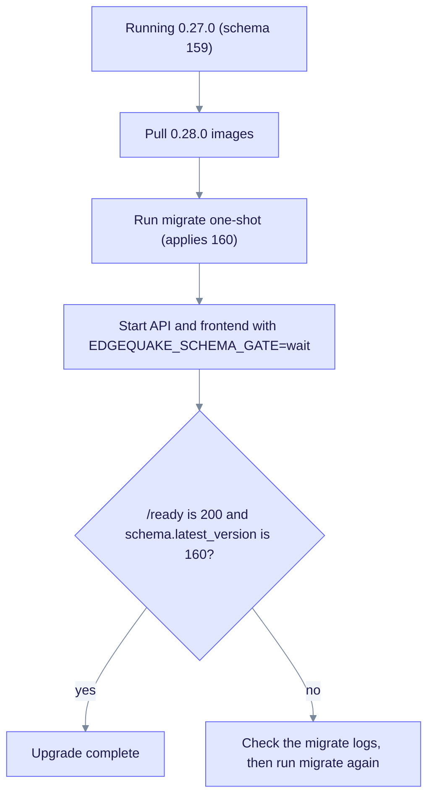

# Upgrade to EdgeQuake v0.28.0

> **From:** v0.27.0 · **To:** v0.28.0 · **CD:** GHCR (`edgequake`, `edgequake-frontend`, `edgequake-postgres`)

This minor release adds directional PDF and Markdown page sync (SPEC-143) and partial page reprocess (SPEC-151). It also hardens the interactive read path and fixes community and full-text search storage. The schema moves from 159 to 160. As in 0.27.0, run `edgequake migrate` before `/ready` returns 200.

## Highlights

| Area | What changed |
|------|--------------|
| Schema | Migration **160** (`document_page_states` for partial page reprocess) |
| SPEC-143 | Side-by-side sync modes: `none`, `pdf-to-md` (default), `md-to-pdf` |
| SPEC-151 | `GET /api/v1/documents/{id}/pages/health` and `POST /api/v1/documents/{id}/pages/reprocess` (`dry_run` previews) |
| #400 | Catalog lists return 503 `read_path_busy` under load; the WebUI retries once |
| #404 | Community refresh uses keyset scans and a statement timeout; size gates skip large graphs |
| #405 | Default typed FTS and ANN never read the retired `eq_*_vectors` tables |

## Upgrade path



Notice that migrate must finish before the API starts, because the API never applies migrations itself.

## Sequence

1. Pull the GHCR images for 0.28.0.
2. Run the migrate one-shot before you restart the API (Compose migrate service or Helm pre-hook).
3. Deploy the API and frontend with `EDGEQUAKE_SCHEMA_GATE=wait`.
4. Smoke-test `/live` (200 during wait), then `/ready` (200 when the ledger is current).
5. Confirm `health.version` is `0.28.0` and `schema.latest_version` is `160`.

```bash
# One-shot migrate (the compose overlay already wires this for GCP)
docker compose run --rm migrate

# Or on the VM install path (script source: deploy/gcp/scripts/install-release.sh)
sudo /opt/edgequake/scripts/install-release.sh 0.28.0
```

Do **not** rely on API boot to apply pending migrations. The escape hatch `EDGEQUAKE_SERVE_RECONCILE=1` is for one release only.

### Distroless API note

Do **not** `docker exec … curl` inside the API container. Probe from outside:

```bash
curl -sS https://demo.edgequake.com/live
curl -sS https://demo.edgequake.com/ready
curl -sS http://localhost:8080/health | jq '{version, schema}'
```

### Pin the version

```bash
# Compose / quickstart
EDGEQUAKE_VERSION=0.28.0 docker compose -f docker-compose.quickstart.yml up -d

# Kubernetes
EDGEQUAKE_VERSION=0.28.0 make k8s-install
# or set global.edgequakeVersion: "0.28.0" in the Helm values
```

## Verify

```bash
curl -s http://localhost:8080/health | jq -r '.version'                     # expect 0.28.0
curl -s http://localhost:8080/health | jq '.schema.latest_version'          # expect 160
curl -s http://localhost:8080/api-docs/openapi.json | jq -r '.info.version' # expect 0.28.0
```

## Out of scope in this cut

- Fresh Acc n=200 medical-mid against schema 160 (the existing `publish/latest` from 2026-08-15 is reused; same pattern as 0.27.0)
- The Helm chart default pin was still `0.26.4` at this release; set `EDGEQUAKE_VERSION` or `global.edgequakeVersion` explicitly

Detail: [`specs/151-partial-preprocess/`](../../specs/151-partial-preprocess/) · [`specs/143-view-pdf-markdown-sync-view/`](../../specs/143-view-pdf-markdown-sync-view/) · Prior pin: [upgrade-to-0.27.0.md](upgrade-to-0.27.0.md).
