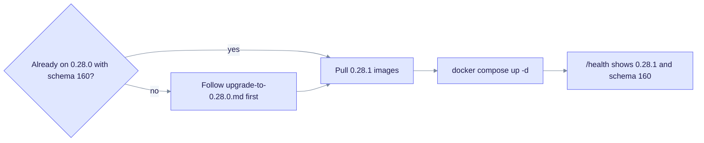

# Upgrade to EdgeQuake v0.28.1

> **From:** v0.28.0 · **To:** v0.28.1 · **CD:** GHCR (`edgequake`, `edgequake-frontend`, `edgequake-postgres`)

This patch cleans up CI, docs and compose settings after v0.28.0. It adds no migration, so the schema stays at **160**. If you already migrated to 0.28.0, you do not need `edgequake migrate` for this bump.

## Highlights

| Area | What changed |
|------|--------------|
| Schema | Unchanged (**160**) |
| CI | Postgres-gated search unit tests; rustdoc private-link fix; invariant FAILED grep |
| Website | Starlight `title` frontmatter so the GitHub Pages Astro build passes |
| Quickstart | No fixed `container_name`; the API accepts the opt-in `EDGEQUAKE_ALLOW_MOCK_PROVIDER` |

## Upgrade path



The schema is unchanged, so restarting the stack is enough once you are on 0.28.0.

## Steps

```bash
# Already on 0.28.0 with schema 160
docker compose pull        # or set EDGEQUAKE_VERSION=0.28.1
docker compose up -d

# Fresh install, or coming from before 0.28.0:
# follow upgrade-to-0.28.0.md first (migrate to 160), then pull 0.28.1 images.
```

## Verify

```bash
curl -sf localhost:8080/health | jq '{version, schema}'
# expect version "0.28.1" and schema.latest_version 160
```

## Notes

- The default LLM path is still Ollama or OpenAI. Set `EDGEQUAKE_LLM_PROVIDER=mock EDGEQUAKE_ALLOW_MOCK_PROVIDER=1` only for smoke tests and CI.
- Issues [#400](https://github.com/raphaelmansuy/edgequake/issues/400), [#404](https://github.com/raphaelmansuy/edgequake/issues/404) and [#405](https://github.com/raphaelmansuy/edgequake/issues/405) were closed against the v0.28.0 pin. This patch does not reopen them.
