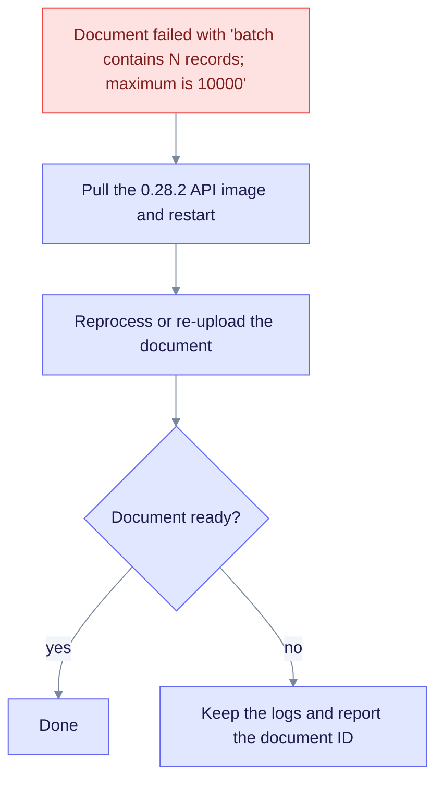

# Upgrade to EdgeQuake v0.28.2

> **From:** v0.28.1 · **To:** v0.28.2 · **CD:** GHCR (`edgequake`, `edgequake-frontend`, `edgequake-postgres`)

This patch changes how dense documents are persisted (SPEC-149 bounded multi-batch staging). The fix splits chunk-aligned batches below the record limit. It adds no migration, so the schema stays at **160**. Pull the new API and frontend images, then reprocess any document that failed with the 10 000-record error.

## Highlights

| Area | What changed |
|------|--------------|
| Schema | Unchanged (**160**) |
| Ingest | Chunk-aligned `PreparedIngestionBatch` packs stay under `MAX_BATCH_RECORDS` (10 000) |
| Deploy | GCP Caddy `/api/*` and Caddy recreate fixes from the 0.28.1 era remain |

## Recovery path

Documents that hit the limit show this error:

```text
batch contains N records; maximum is 10000
```



Notice that the fix ships in the image, because `MAX_BATCH_RECORDS` is a code constant that you cannot change with configuration.

## Sequence

```bash
# Already on 0.28.x with schema 160
docker compose pull        # or set EDGEQUAKE_VERSION=0.28.2
docker compose up -d
# Then reprocess documents that failed with the batch limit error.
```

## Verify

```bash
curl -sf localhost:8080/health | jq '{version, schema}'
# expect version "0.28.2" and schema.latest_version 160
```

## Notes

- Do **not** raise `MAX_BATCH_RECORDS` as a workaround. The product fix is multi-batch staging (SPEC-149 contracts).
- Full `FinalizeIngestion` publication CAS is still a SPEC-149 follow-up. Each staging `commit_batch` still advances the document revision and projection events, as in 0.28.1.
