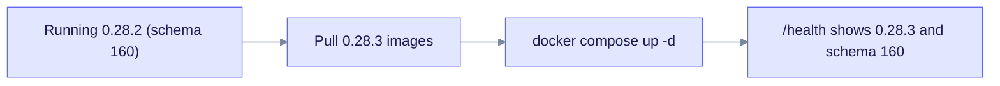

# Upgrade to EdgeQuake v0.28.3

> **From:** v0.28.2 · **To:** v0.28.3 · **CD:** GHCR (`edgequake`, `edgequake-frontend`, `edgequake-postgres`)

This patch adds the EQ-MCP-1.0 AgentView and an OAuth authorization server (AS) for MCP clients (SPEC-152). It also cleans up image pulls on GCP. The schema stays at **160**, so you only need to pull the new API and frontend images.

## Highlights

| Area | What changed |
|------|--------------|
| Schema | Unchanged (**160**) |
| MCP | EQ-MCP-1.0 AgentView and the AS surface (SPEC-152) |
| Deploy | Image prune and cache reclaim before `compose pull` |

## Upgrade path



Notice that the schema is unchanged, so pulling the new images is the whole upgrade.

## Steps

```bash
docker compose pull        # or set EDGEQUAKE_VERSION=0.28.3
docker compose up -d
```

## Verify

```bash
curl -sf localhost:8080/health | jq '{version, schema}'
# expect version "0.28.3" and schema.latest_version 160
```
