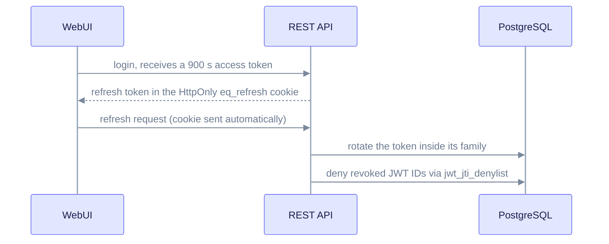

# Upgrade to EdgeQuake v0.28.4

> **From:** v0.28.3 · **To:** v0.28.4 · **CD:** GHCR (`edgequake`, `edgequake-frontend`, `edgequake-postgres`)

This patch hardens authentication (SPEC-154): refresh-token families, a durable JWT denylist, WebSocket JWT auth and scoped API keys. The schema moves from 160 to **162**. Run migrate before you rely on token revocation or family rotation.

## Highlights

| Area | What changed |
|------|--------------|
| Schema | **162**: `jwt_jti_denylist` table and refresh `family_id` and `status` columns (161 adds OAuth refresh grants) |
| Auth | Access-token TTL defaults to **900 s**; the SPA refreshes with a cookie; WebSocket clients send the JWT in the `Sec-WebSocket-Protocol` header |
| API keys | `EDGEQUAKE_API_KEYS` grant read and query; `master_api_key` is the break-glass key |
| Startup | Auth off with a non-local database is **fatal** |

## Auth flow after the upgrade



Notice that refresh tokens sit in an HttpOnly cookie that page scripts cannot read.

## Upgrade steps

1. Run migrate to **162** before you start the new API. From 0.28.3 or older, this step is required.
2. Pull the 0.28.4 images and start the stack.
3. In each browser, clear any pre-154 `access` and `refresh` keys from `localStorage` once.

```bash
# Compose / Helm: migrate job first, then the API
docker compose pull
EDGEQUAKE_VERSION=0.28.4 docker compose up -d
# or run migrate by hand, then restart the API:
#   edgequake migrate && restart the API
```

## Verify

```bash
curl -sf localhost:8080/health | jq '{version, schema}'
# expect version "0.28.4", schema.latest_version 162, pending_count 0
```

## Notes

- Residual: Next.js may set a non-HttpOnly `edgequake_access_token` cookie for middleware (Secure on HTTPS). The refresh cookie `eq_refresh` stays HttpOnly.
- Security details: [docs/security/best-practices.md](../security/best-practices.md) (SPEC-154).
