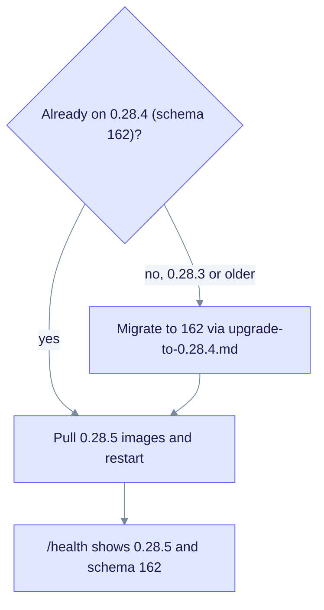

# Upgrade to EdgeQuake v0.28.5

> **From:** v0.28.4 · **To:** v0.28.5 · **CD:** GHCR (`edgequake`, `edgequake-frontend`, `edgequake-postgres`)

This patch syncs the docs and runs the SPEC-154 WebUI vitest suite in the release gates. The schema stays at **162**. If you run 0.28.3 or older, first migrate to 162 by following [upgrade-to-0.28.4.md](upgrade-to-0.28.4.md).

## Highlights

| Area | What changed |
|------|--------------|
| Schema | Unchanged (**162**) if you are already on 0.28.4 |
| CI | `release_gates.sh` runs the SPEC-154 WebUI vitest suite |
| Docs | CHANGELOG, upgrade guides and binding pins are in sync |

## Upgrade path



Notice that installs older than 0.28.4 must pass through schema 162 before this patch.

## Steps

```bash
# Already on 0.28.4 (schema 162)
EDGEQUAKE_VERSION=0.28.5 docker compose pull && docker compose up -d
```

## Verify

```bash
curl -sf localhost:8080/health | jq '{version, schema}'
# expect version "0.28.5" and schema.latest_version 162
```
