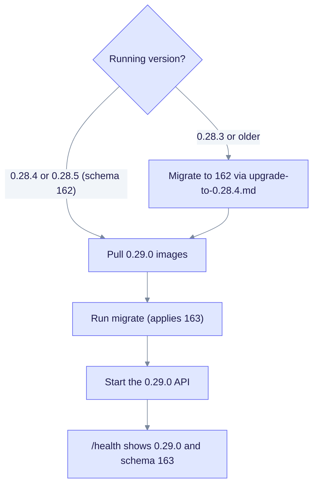

# Upgrade to EdgeQuake v0.29.0

> **From:** v0.28.5 · **To:** v0.29.0 · **CD:** GHCR (`edgequake`, `edgequake-frontend`, `edgequake-postgres`)

This minor release adds the side-by-side query companion (SPEC-157), the documents workspace and query composer (SPEC-155), ingestion changes (SPEC-156) and the `edgeparse-ocr` PDF backend. The schema moves from 162 to **163**. Run migrate before `/ready` returns 200.

## Highlights

| Area | What changed |
|------|--------------|
| Schema | **163**: feedback and finish-reason columns on `messages` (`feedback_rating`, `feedback_reason`, `finish_reason`) |
| Query | Companion pane with PDF citations and an answer graph |
| Documents | Docking workspace, intake strip and layout modes (SPEC-155) |
| Ingestion | Cloud fan-out honesty, a `run_progress` ledger, gleaning and embed join (SPEC-156) |
| PDF | `edgeparse-ocr` backend; Tesseract and tessdata are copied into the distroless API image |
| Dependencies | `edgequake-llm` **0.10.9**, `edgeparse-core` **0.3.2** |

## Upgrade path



Notice that 0.28.3 and older installs need the 162 step before the 163 step.

## Steps

```bash
# Already on 0.28.4 or 0.28.5 (schema 162)
EDGEQUAKE_VERSION=0.29.0 docker compose pull
# migrate job or `edgequake migrate` (applies 163), then the API
EDGEQUAKE_VERSION=0.29.0 docker compose up -d

# From 0.28.3 or older: follow upgrade-to-0.28.4.md (migrate to 162) first, then run the steps above
```

The query companion can be hidden for a build with `NEXT_PUBLIC_QUERY_COMPANION=0`. Next.js inlines `NEXT_PUBLIC_*` values at build time, so set it before you build the WebUI.

## Verify

```bash
curl -sf localhost:8080/health | jq '{version, schema}'
# expect version "0.29.0", schema.latest_version 163 and pending_count 0
```
