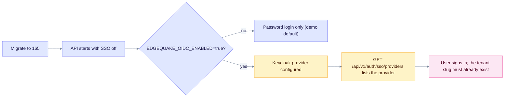

# Upgrade to EdgeQuake v0.30.0

> **From:** v0.29.0 · **To:** v0.30.0 · **CD:** GHCR (`edgequake`, `edgequake-frontend`, `edgequake-postgres`, `edgequake-keycloak`)

This minor release adds enterprise single sign-on (SPEC-158) through Keycloak. SSO is off until you set `EDGEQUAKE_OIDC_ENABLED=true` and the provider variables. The schema moves from 163 to **165**. Run migrate before `/ready` returns 200.

From 0.28.5 or older, migrate to 163 first ([upgrade-to-0.29.0.md](upgrade-to-0.29.0.md)), then apply this release.

**demo.edgequake.com:** this cut installs the 0.30.0 API and WebUI with **password auth only**. It does not run Keycloak and does not set OIDC variables. Operators who want SSO should follow the [Keycloak production configuration](../security/authentication/keycloak-quickstart.md#production-configuration-https-hostname).

## Highlights

| Area | What changed |
|------|--------------|
| Schema | **164** federation tables; **165** `federated_access_jti` |
| Auth | Keycloak Organizations map to a tenant slug; BFF session; opaque handoff `?code=` |
| Image | `ghcr.io/raphaelmansuy/edgequake-keycloak` ships with the same tag |
| Documents | The list returns KV rows when the 2.5 s interactive budget is nearly spent |
| Benchmark | Same 2026-08-15 medical-mid attestation as 0.29.0; retrieval was not re-scored |

## How SSO is enabled



Notice that the flag alone is not enough: a provider must also be configured.

Create the tenant slugs (for example `acme`) before the first SSO login, so the organization claim has a tenant to map to.

## Upgrade sequence

```text
# Already on 0.29.0 (schema 163)
EDGEQUAKE_VERSION=0.30.0 docker compose pull
# migrate job or `edgequake migrate` (applies 164, then 165), then the API
EDGEQUAKE_VERSION=0.30.0 docker compose up -d
```

To run the Keycloak overlay locally, add `127.0.0.1 keycloak` to `/etc/hosts`, then run:

```bash
make dev-sso
make keycloak-smoke
```

When port `:8080` belongs to another product, use `make spec158-proof-e2e`. It uses API `:18080`, Keycloak `:18081` and WebUI `:13010`.

## Verify

```bash
curl -sf localhost:8080/health | jq '{version, schema}'
# expect version "0.30.0", schema.latest_version 165 and pending_count 0
curl -sf localhost:8080/api/v1/auth/sso/providers
# [] until OIDC is configured; non-empty once a provider is set up
```

## Residuals (not release blockers)

- `scripts/keycloak_smoke.py --broker` stops at the Keycloak first-broker login when the client requests Organizations scopes. The email-link policy is covered by the Rust federation tests.
- Live Playwright SSO (`E2E_SSO=1`) is opt-in.
- Access tokens that cannot be mapped stay valid until their TTL (LAW-158-10). Logout revokes tokens recorded in `federated_access_jti`.
