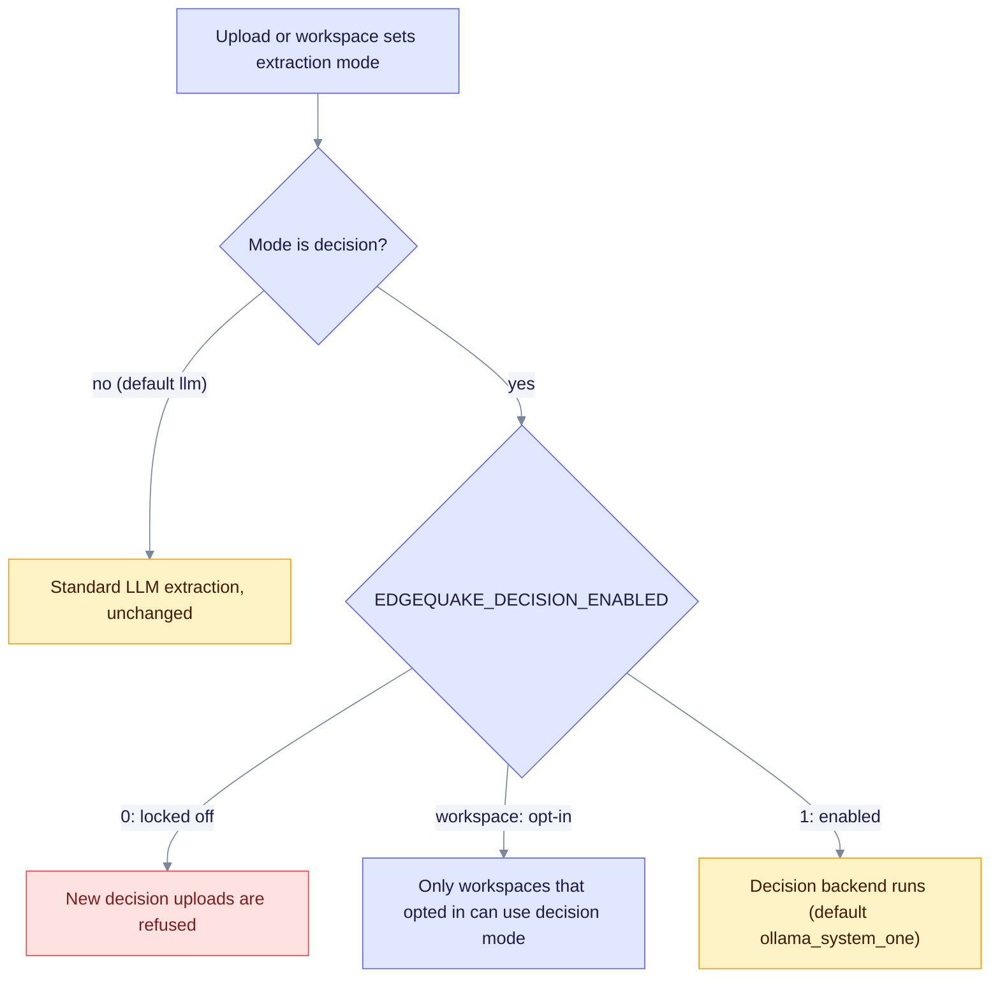

# Upgrade to EdgeQuake v0.31.0

> **From:** v0.30.0 · **To:** v0.31.0 · **CD:** GHCR (`edgequake`, `edgequake-frontend`, `edgequake-postgres`, `edgequake-keycloak`)

This minor release adds decision extraction (SPEC-160) as a **preview**. The schema moves from 165 to **166**. Run migrate before `/ready` returns 200.

From 0.29.0 or older, migrate to 165 first ([upgrade-to-0.30.0.md](upgrade-to-0.30.0.md)), then apply this release.

The default extractor is still `llm`. Decision mode is chosen per upload or as a workspace default. The two new tables are additive, and existing decision graph rows stay in place.

**demo.edgequake.com:** this cut installs the 0.31.0 API and WebUI. Decision mode is a preview with uncalibrated gates. Password auth remains the demo default. SSO stays opt-in from 0.30.0.

## Highlights

| Area | What changed |
|------|--------------|
| Schema | **166**: `decision_cache` and `decision_review` tables |
| Extraction | `decision` extraction mode on upload and per workspace; the chat LLM is unchanged |
| Status | `GET /api/v1/decision/status` and `GET /api/v1/decision/models` (3 s probe) |
| Benchmark | Same 2026-08-15 medical-mid attestation as 0.30.0; the default `llm` path was not re-scored and decision mode is unscored |

## How the decision mode is chosen



Notice that the environment setting gates every workspace opt-in.

## Upgrade sequence

```text
# Already on 0.30.0 (schema 165)
EDGEQUAKE_VERSION=0.31.0 docker compose pull
# migrate job or `edgequake migrate` (applies 166), then the API
EDGEQUAKE_VERSION=0.31.0 docker compose up -d
```

## Verify

```bash
curl -sf localhost:8080/health | jq '{version, schema}'
# expect version "0.31.0", schema.latest_version 166 and pending_count 0
curl -sf localhost:8080/api/v1/decision/status
# shows the host and model fields; the probe never waits past 3 s
```

## Residuals (not release blockers)

- The `openai_logprobs` backend is not available in this release and is refused by settings validation.
- There is no review screen. Review rows are stored and counted.
- Gate presets are **uncalibrated**. The two-document probe is in [w8-report.md](../../specs/160-tev1/measurements/w8-report.md). Treat `tev1:0.8b` at `balanced` as a smoke-test option only.
- SPEC-001 Acc was not re-run for this cut.

Guide: [Decision extraction](../concepts/decision-extraction.md).
