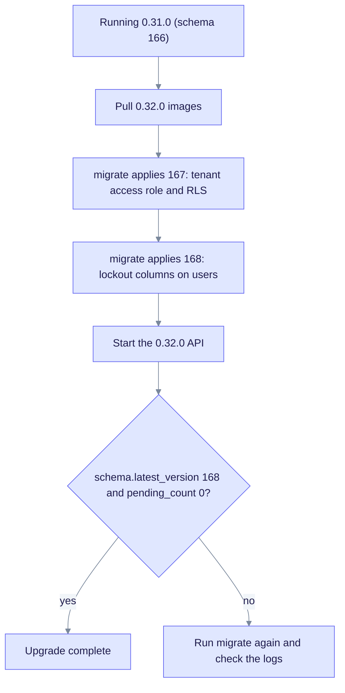

# Upgrade to EdgeQuake v0.32.0

> **From:** v0.31.0 · **To:** v0.32.0 · **CD:** GHCR (`edgequake`, `edgequake-frontend`, `edgequake-postgres`, `edgequake-keycloak`)

This minor release hardens tenant-scoped data access and improves query and convert reliability. The schema moves from 166 to **168**. Run migrate before `/ready` returns 200.

From 0.30.0 or older, migrate to 166 first ([upgrade-to-0.31.0.md](upgrade-to-0.31.0.md)), then apply this release.

Both new migrations are additive (expand phase):

- **167** creates the `edgequake_tenant_access` role (`NOLOGIN`, `NOBYPASSRLS`) and turns on `FORCE ROW LEVEL SECURITY` for content tables.
- **168** adds `users.failed_login_attempts` and `users.locked_until` with `IF NOT EXISTS`.

**demo.edgequake.com:** this cut installs the 0.32.0 API and WebUI. Decision mode stays a preview with uncalibrated gates. Password auth remains the demo default. SSO stays opt-in from 0.30.0.

## Highlights

| Area | What changed |
|------|--------------|
| Schema | **167**: tenant RLS role and policies; **168**: identity lockout columns |
| Query | Scoped graph-read timeouts; incremental RAG streaming |
| Convert | Reliability fixes for vision and PDF convert timeouts |
| Benchmark | Same 2026-08-15 medical-mid attestation as 0.31.0; query deadlines, graph-read scope and streaming were not re-scored |

## Upgrade path



Notice that the final check confirms both migrations applied before you call the upgrade done.

## Upgrade sequence

```text
# Already on 0.31.0 (schema 166)
EDGEQUAKE_VERSION=0.32.0 docker compose pull
# migrate job or `edgequake migrate` (applies 167 and 168), then the API
EDGEQUAKE_VERSION=0.32.0 docker compose up -d
```

## Verify

```bash
curl -sf localhost:8080/health | jq '{version, schema}'
# expect version "0.32.0", schema.latest_version 168 and pending_count 0
```

## Residuals (not release blockers)

- SPEC-001 Acc was not re-run. Query deadlines, graph-read scope and streaming changed after the 2026-08-15 pack.
- Decision extraction is still a preview with uncalibrated gates. See [upgrade-to-0.31.0.md](upgrade-to-0.31.0.md).
