# Upgrade to EdgeQuake v0.32.1

> **From:** v0.32.0 · **To:** v0.32.1 · **CD:** GHCR (`edgequake`, `edgequake-frontend`, `edgequake-postgres`, `edgequake-keycloak`)

This patch fixes how Ask and named-entity queries find workspace embeddings. Typed ANN now uses only the preferred workspace or lineage model, and graph seeds are admitted before popular hub entities. It adds **no migrations**, so the schema stays at **168**.

**demo.edgequake.com:** this cut installs the 0.32.1 API and WebUI. Password auth remains the demo default. After deploy, audit `embedding_models` for workspace `…0003` as described in [embedding-registry-backfill](embedding-registry-backfill.md). Do not silently rename stamps to another model.

## Highlights

| Area | What changed |
|------|--------------|
| Typed ANN | Uses the preferred workspace or lineage model only; no fallthrough to the env model |
| Graph admit | Exact labels and seeds are admitted before popular hubs (local and global Mix arms) |
| Ingest and projection | Lineage `model_id` on manifests; projection upserts per model |
| Chat and WebUI | Companion `seed_entity_ids` pass through chat to the engine |
| Schema | Still **168**; no migrate needed from 0.32.0 |
| Benchmark | Same 2026-08-15 medical-mid attestation; ANN and admit changes were **not** re-scored |

## Upgrade path

```mermaid
%%{init: {"theme":"base","themeVariables":{"primaryColor":"#E0E7FF","primaryBorderColor":"#6366F1","primaryTextColor":"#1E1B4B","secondaryColor":"#D1FAE5","secondaryBorderColor":"#10B981","secondaryTextColor":"#064E3B","tertiaryColor":"#FEF3C7","tertiaryBorderColor":"#F59E0B","tertiaryTextColor":"#6B7A90","lineColor":"#7A889C","clusterBkg":"rgba(99,102,241,0.07)","clusterBorder":"#A5B4FC","noteBkgColor":"#FEF9C3","noteTextColor":"#422006","textColor":"#6B7A90","titleColor":"#6B7A90","signalColor":"#7A889C","signalTextColor":"#6B7A90","loopTextColor":"#6B7A90","edgeLabelBackground":"#F1F5F9","actorLineColor":"#94A3B8"}}}%%
%% eq-theme:v1
flowchart LR
    A["Running 0.32.0 (schema 168)"] --> B["Pull 0.32.1 images and restart"]
    B --> C["migrate is a no-op"]
    C --> D["Audit embedding_models for workspace 0003"]
    D --> E["Backfill only after you confirm the producer embedder"]
%% eq-classes
classDef eqLlm fill:#FEF3C7,stroke:#F59E0B,color:#451A03
class D eqLlm
```



Notice that the only data action is the audit, and any backfill waits until you confirm the embedder.

## Upgrade sequence

```text
# Already on 0.32.0 (schema 168)
EDGEQUAKE_VERSION=0.32.1 docker compose pull
EDGEQUAKE_VERSION=0.32.1 docker compose up -d
# migrate is a no-op when already at 168
```

## Verify

```bash
curl -sf localhost:8080/health | jq '{version, schema}'
# expect version "0.32.1", schema.latest_version 168 and pending_count 0
```

## Residuals (not release blockers)

- SPEC-001 Acc was not re-run. The ANN keying and graph admit changed after the 2026-08-15 pack.
- Migration backfill and verify jobs still read the process environment (ops residual).
- The demo registry may show `text-embedding-3-small` rows at 1024 dimensions. Rebuild or backfill only after you confirm the producer embedder.
