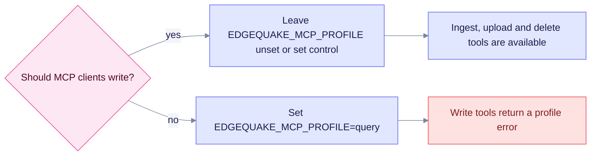

# Upgrade to EdgeQuake v0.32.2

> **From:** v0.32.1 · **To:** v0.32.2 · **CD:** GHCR (`edgequake`, `edgequake-frontend`, `edgequake-postgres`, `edgequake-keycloak`)

This patch fixes blank PDF pages in the viewer, adds the SPEC-161 MCP control surface (EQ-MCP-1.1) and cleans up clippy and rustfmt across the workspace. It adds **no migrations**, so the schema stays at **168**.

**demo.edgequake.com:** this cut installs the 0.32.2 API and WebUI. Password auth remains the demo default.

## Highlights

| Area | What changed |
|------|--------------|
| PDF viewer | Sheets reserve their height, and the paint window covers the overscan plus the scrollport. Long PDFs no longer show out-of-window "Page N" placeholders |
| MCP | SPEC-161 async control: ingest, upload, delete, `task_get`, download and graph image. The default profile is `control` |
| Lint | Workspace `clippy -D warnings` and rustfmt are clean |
| Schema | Still **168**; no migrate needed from 0.32.1 |
| Benchmark | Same 2026-08-15 medical-mid attestation; MCP and PDF UI changes were **not** re-scored |

## MCP profile choice

Write tools need the `control` profile, which is the default, so they are **on** unless you change the profile.



Notice that write tools are on by default, so a query-only host needs the explicit setting.

## Upgrade sequence

```text
# Already on 0.32.1 (schema 168)
EDGEQUAKE_VERSION=0.32.2 docker compose pull
EDGEQUAKE_VERSION=0.32.2 docker compose up -d
# migrate is a no-op when already at 168
```

## Verify

```bash
curl -sf localhost:8080/health | jq '{version, schema}'
# expect version "0.32.2", schema.latest_version 168 and pending_count 0
```

Open the demo PDF viewer and confirm that page 1 paints a canvas, not a "Page 4" label.

## Residuals (not release blockers)

- SPEC-001 Acc was not re-run. This cut changes the UI, MCP and lint only.
- Set `EDGEQUAKE_MCP_PROFILE=query` on hosts where MCP clients must not write (see above).
