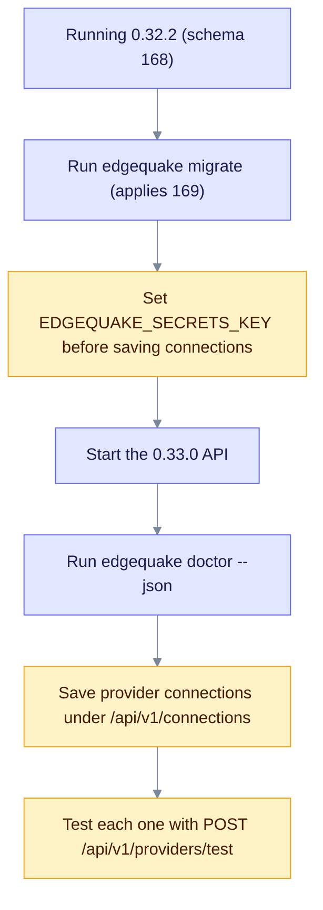

# Upgrade to EdgeQuake v0.33.0

> **From:** v0.32.2 · **To:** v0.33.0 · **Schema:** **168 → 169** (expand-only)

This release adds onboarding and provider configuration (SPEC-163). Provider connections are stored encrypted, health reports real probe results, and the new `edgequake doctor` command checks the setup. The schema moves to **169** with one additive table.

**Product crate pin on this branch may still read 0.32.2 until the tagged cut.** Schema **169** is already on HEAD. Run `edgequake migrate` before you expect stored connections to work.

## Highlights

| Area | What changed |
|------|--------------|
| Connections | `provider_connections` table; admin CRUD at `/api/v1/connections` |
| Secrets | `EDGEQUAKE_SECRETS_KEY` for AES-256-GCM; keys are write-only and masked |
| Health | Live probes in `/health` and `/models/health`; `POST /api/v1/providers/test` |
| Doctor | `edgequake doctor [--json]` |
| Quickstart | `quickstart.sh --yes --provider --base-url`; binds to `127.0.0.1`; generates the JWT secret |
| Docs | `docs/providers/` and a generated env reference |
| Schema | **169**, expand-only |

## Upgrade path



Notice that the secrets key must be set before you save any connection.

Keep the key with your backups, because encrypted connection secrets cannot be read without it.

## Steps

```bash
# From v0.32.2 (schema 168)
edgequake migrate                 # expect: applied 169_spec163_provider_connections.sql
export EDGEQUAKE_SECRETS_KEY="$(openssl rand -base64 32)"
```

## Verify

```bash
edgequake doctor --json
curl -sf localhost:8080/health | jq '{status, security_posture, components}'
```

## Residuals (not release blockers)

- The full `make spec150-matrix` through 169 is run by operators, as for other specs.
- Real oMLX, MLX and LM Studio servers are checked with `make spec163-local-matrix`. This is not part of CI.
- Upstream `edgequake-llm` 0.11.0 is not published yet, so `from_connection` uses the in-tree public constructors.
- The Anthropic runtime still sends `x-api-key`. Bearer is used only on the test-connection probe.
